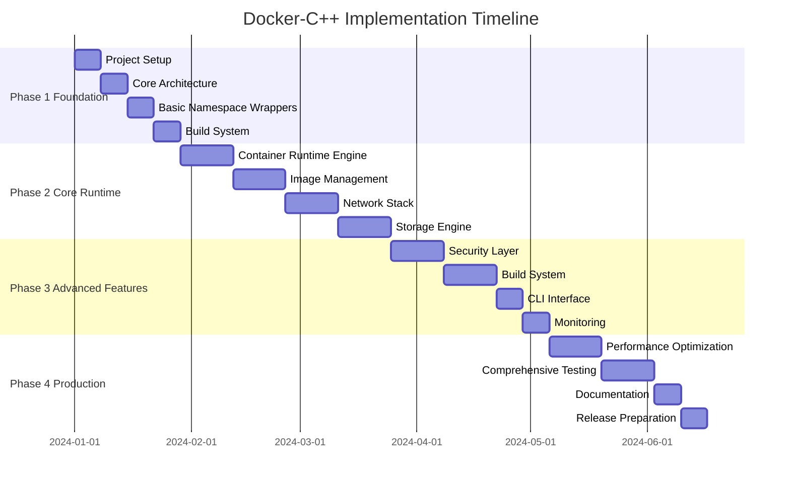

# Docker C++ Implementation Roadmap

## Executive Summary

This document provides a detailed implementation roadmap for building docker-cpp, a C++ reimplementation of Docker/Moby container runtime. The roadmap is organized into distinct phases, each with clear milestones, deliverables, and technical requirements.

## Project Overview

**Target**: Production-grade container runtime with Docker CLI compatibility
**Language**: C++20/23 with modern features
**Architecture**: Component-based with plugin system
**Timeline**: 24 weeks across 4 major phases

## Phase Structure Overview



## Phase 1: Foundation (Weeks 1-4)

### Week 1: Project Setup and Infrastructure

**Objectives**:
- Establish development environment
- Set up build system and CI/CD
- Create project structure

**Technical Tasks**:
```cmake
# CMakeLists.txt structure
project(docker-cpp VERSION 1.0.0 LANGUAGES CXX)

set(CMAKE_CXX_STANDARD 20)
set(CMAKE_CXX_STANDARD_REQUIRED ON)
set(CMAKE_CXX_EXTENSIONS OFF)

# Core dependencies
find_package(PkgConfig REQUIRED)
find_package(OpenSSL REQUIRED)
find_package(Boost REQUIRED COMPONENTS system filesystem program_options)

# Conan package management
include(conan_toolchain)
conan_install()
```

**Deliverables**:
- [ ] CMake configuration with Conan package management
- [ ] GitHub Actions CI/CD pipeline
- [ ] Code formatting and linting configuration
- [ ] Basic project structure with proper headers organization
- [ ] Unit testing framework integration (Google Test)

**Success Criteria**:
- Build system compiles on Linux, macOS, and Windows
- CI/CD pipeline runs successfully
- Code formatting checks pass
- Basic test framework executes

### Week 2: Core Architecture Components

**Objectives**:
- Implement fundamental architecture patterns
- Create plugin system foundation
- Establish error handling framework

**Technical Tasks**:
```cpp
// Core interfaces and patterns
class IPlugin {
public:
    virtual ~IPlugin() = default;
    virtual std::string getName() const = 0;
    virtual std::string getVersion() const = 0;
    virtual bool initialize(const PluginConfig& config) = 0;
    virtual void shutdown() = 0;
};

class PluginRegistry {
public:
    template<typename PluginType>
    void registerPlugin(std::unique_ptr<PluginType> plugin);

    template<typename PluginType>
    PluginType* getPlugin(const std::string& name) const;

    void loadPluginsFromDirectory(const std::string& plugin_dir);
};

// Error handling framework
class ContainerError : public std::exception {
public:
    ContainerError(ErrorCode code, const std::string& message);
    const char* what() const noexcept override;
    ErrorCode getErrorCode() const;
};
```

**Deliverables**:
- [ ] Plugin registry and interface definitions
- [ ] Error handling framework with comprehensive error codes
- [ ] Configuration management system
- [ ] Logging infrastructure
- [ ] Event system foundation

**Success Criteria**:
- Plugin system can dynamically load and unload components
- Error handling provides comprehensive error information
- Configuration system supports hierarchical configs
- Logging provides structured output with multiple levels

### Week 3: Linux Namespace Wrappers

**Objectives**:
- Implement RAII wrappers for all Linux namespaces
- Create namespace management utilities
- Establish secure namespace handling

**Technical Tasks**:
```cpp
// Namespace implementation
class NamespaceManager {
public:
    enum class Type {
        PID = CLONE_NEWPID,
        NETWORK = CLONE_NEWNET,
        MOUNT = CLONE_NEWNS,
        UTS = CLONE_NEWUTS,
        IPC = CLONE_NEWIPC,
        USER = CLONE_NEWUSER,
        CGROUP = CLONE_NEWCGROUP
    };

    explicit NamespaceManager(Type type);
    ~NamespaceManager();

    static void join(pid_t pid, Type type);

    // Non-copyable, movable
    NamespaceManager(const NamespaceManager&) = delete;
    NamespaceManager& operator=(const NamespaceManager&) = delete;
    NamespaceManager(NamespaceManager&& other) noexcept;

private:
    Type type_;
    int fd_;
};

// Process lifecycle management
class ContainerProcess {
public:
    auto start(const ProcessConfig& config) -> std::expected<pid_t, ProcessError>;
    void stop(int timeout = 10);
    bool isRunning() const;
    int getExitCode() const;
};
```

**Deliverables**:
- [ ] Complete namespace wrapper implementations
- [ ] Process management utilities
- [ ] Secure namespace creation and joining
- [ ] Namespace testing framework
- [ ] Documentation for namespace usage

**Success Criteria**:
- All namespace types are properly isolated
- Resource cleanup happens correctly on errors
- Namespace operations are secure and reliable
- Comprehensive test coverage for namespace operations

### Week 4: Cgroup Management System

**Objectives**:
- Implement cgroup v2 management
- Create resource control interfaces
- Establish performance monitoring

**Technical Tasks**:
```cpp
class CgroupManager {
public:
    enum class Controller {
        CPU = 0x01,
        MEMORY = 0x02,
        BLKIO = 0x04,
        CPUSET = 0x08,
        FREEZER = 0x10,
        DEVICES = 0x20
    };

    explicit CgroupManager(const std::string& group_name, Controller controllers);
    ~CgroupManager();

    void addProcess(pid_t pid);
    void setCpuLimit(double cpu_shares);
    void setMemoryLimit(size_t memory_bytes);
    std::vector<size_t> getCpuUsage();
    std::vector<size_t> getMemoryUsage();

private:
    std::string group_name_;
    Controller controllers_;
    void createCgroup();
    void destroyCgroup();
};
```

**Deliverables**:
- [ ] Cgroup v2 manager implementation
- [ ] Resource limit enforcement
- [ ] Performance monitoring interfaces
- [ ] Cgroup hierarchy management
- [ ] Resource usage statistics

**Success Criteria**:
- Cgroup operations work reliably across different kernel versions
- Resource limits are properly enforced
- Performance monitoring provides accurate metrics
- Cgroup cleanup works correctly

## Phase 2: Core Runtime Implementation (Weeks 5-12)

### Weeks 5-6: Container Runtime Engine

**Objectives**:
- Implement core container lifecycle management
- Create container state machine
- Establish container configuration system

**Technical Tasks**:
```cpp
class ContainerRuntime {
public:
    struct Config {
        std::string id;
        std::string image;
        std::vector<std::string> command;
        std::vector<std::string> env;
        std::map<std::string, std::string> labels;
        std::string working_dir;
        bool interactive = false;
        bool tty = false;
        size_t memory_limit = 0;
        double cpu_shares = 1.0;
    };

    std::string createContainer(const Config& config);
    void startContainer(const std::string& container_id);
    void stopContainer(const std::string& container_id, int timeout = 10);
    void removeContainer(const std::string& container_id, bool force = false);
    ContainerInfo inspectContainer(const std::string& container_id) const;
    std::vector<std::string> listContainers(bool all = false) const;

private:
    std::shared_ptr<PluginRegistry> plugin_registry_;
    std::shared_ptr<ContainerRegistry> running_containers_;
    void setupContainerEnvironment(Container* container, const Config& config);
    void executeContainer(Container* container);
};
```

**Deliverables**:
- [ ] Container runtime core implementation
- [ ] Container state management system
- [ ] Container configuration parsing
- [ ] Container lifecycle events
- [ ] Container registry and lookup

**Success Criteria**:
- Container lifecycle operations work correctly
- State transitions are atomic and consistent
- Configuration validation is comprehensive
- Event system tracks all container operations

### Weeks 7-8: Image Management System

**Objectives**:
- Implement OCI image specification compliance
- Create layer management system
- Establish image distribution system

**Technical Tasks**:
```cpp
class ImageManager {
public:
    struct ImageInfo {
        std::string id;
        std::vector<std::string> repo_tags;
        size_t size_bytes;
        std::string created;
        std::vector<std::string> layer_ids;
    };

    std::string pullImage(const std::string& repository, const std::string& tag = "latest");
    void pushImage(const std::string& image_id, const std::string& repository, const std::string& tag);
    void removeImage(const std::string& image_id, bool force = false);
    std::vector<ImageInfo> listImages() const;
    ImageInfo inspectImage(const std::string& image_id) const;

private:
    LayerManager layer_manager_;
    RegistryClient registry_client_;
    std::string downloadLayer(const std::string& layer_digest);
    void verifyLayerIntegrity(const std::string& layer_path, const std::string& expected_digest);
};
```

**Deliverables**:
- [ ] OCI image format implementation
- [ ] Layer management system
- [ ] Image registry client
- [ ] Image pull/push operations
- [ ] Image storage and retrieval

**Success Criteria**:
- OCI specification compliance
- Efficient layer storage and deduplication
- Reliable image distribution
- Image integrity verification

### Weeks 9-10: Network Stack

**Objectives**:
- Implement virtual network management
- Create bridge and overlay networks
- Establish port mapping system

**Technical Tasks**:
```cpp
class NetworkManager {
public:
    struct NetworkConfig {
        std::string name;
        std::string driver; // bridge, overlay, macvlan
        std::string subnet;
        std::string gateway;
        std::map<std::string, std::string> options;
    };

    std::string createNetwork(const NetworkConfig& config);
    void deleteNetwork(const std::string& network_id);
    std::string connectContainer(const std::string& network_id, const std::string& container_id);
    void disconnectContainer(const std::string& network_id, const std::string& container_id);
    void exposePorts(const std::string& container_id, const std::vector<PortMapping>& ports);

private:
    std::unique_ptr<IBridgeDriver> bridge_driver_;
    std::unique_ptr<IOverlayDriver> overlay_driver_;
    IPAManager ipam_manager_;
};
```

**Deliverables**:
- [ ] Bridge network driver
- [ ] Overlay network support
- [ ] IP address management
- [ ] Port mapping and NAT
- [ ] Network isolation and security

**Success Criteria**:
- Network isolation works correctly
- IP address assignment is reliable
- Port mapping functions properly
- Multi-container networking works

### Weeks 11-12: Storage Engine

**Objectives**:
- Implement union filesystem management
- Create volume management system
- Establish snapshot capabilities

**Technical Tasks**:
```cpp
class StorageEngine {
public:
    std::string createContainerFilesystem(const std::vector<std::string>& layer_ids);
    void destroyContainerFilesystem(const std::string& container_id);
    std::string createVolume(const VolumeConfig& config);
    void deleteVolume(const std::string& volume_id);
    std::string mountVolume(const std::string& volume_id);
    void unmountVolume(const std::string& volume_id);
    void createSnapshot(const std::string& container_id, const std::string& snapshot_name);

private:
    std::unique_ptr<OverlayFSManager> overlay_manager_;
    std::unique_ptr<LayerManager> layer_manager_;
    std::unique_ptr<VolumeManager> volume_manager_;
};
```

**Deliverables**:
- [ ] OverlayFS implementation
- [ ] Volume management system
- [ ] Snapshot functionality
- [ ] Filesystem cleanup and maintenance
- [ ] Storage performance optimization

**Success Criteria**:
- Filesystem operations are reliable and efficient
- Volume management works correctly
- Snapshots provide point-in-time consistency
- Storage cleanup works properly

## Phase 3: Advanced Features (Weeks 13-18)

### Weeks 13-14: Security Layer

**Objectives**:
- Implement security hardening features
- Create capability management system
- Establish seccomp filtering

**Technical Tasks**:
```cpp
class SecurityManager {
public:
    struct SecurityProfile {
        std::vector<Capability> allowed_capabilities;
        SeccompFilter seccomp_filter;
        std::string apparmor_profile;
        std::string selinux_context;
        bool read_only_rootfs = false;
        bool no_new_privileges = true;
    };

    void applySecurityProfile(pid_t pid, const SecurityProfile& profile);
    void dropCapabilities(pid_t pid, const std::vector<Capability>& capabilities);
    void applySeccompFilter(pid_t pid, const SeccompFilter& filter);
    void enableAppArmorProfile(pid_t pid, const std::string& profile);

private:
    CapabilityManager capability_manager_;
    SeccompManager seccomp_manager_;
    AppArmorManager apparmor_manager_;
};
```

**Deliverables**:
- [ ] Capability management system
- [ ] Seccomp filter implementation
- [ ] AppArmor integration
- [ ] Security profile management
- [ ] Default secure configurations

**Success Criteria**:
- Security policies are correctly enforced
- Capability dropping works properly
- Seccomp filtering provides protection
- Integration with Linux security frameworks

### Weeks 15-16: Build System

**Objectives**:
- Implement Dockerfile processing
- Create build context management
- Establish build caching system

**Technical Tasks**:
```cpp
class BuildEngine {
public:
    struct BuildConfig {
        std::string dockerfile_path;
        std::string build_context;
        std::string tag;
        std::map<std::string, std::string> build_args;
        bool no_cache = false;
        std::vector<std::string> target_stages;
    };

    std::string buildImage(const BuildConfig& config);
    void cancelBuild(const std::string& build_id);
    BuildProgress getBuildProgress(const std::string& build_id);

private:
    DockerfileParser dockerfile_parser_;
    BuildCache build_cache_;
    std::unordered_map<std::string, std::thread> active_builds_;
};
```

**Deliverables**:
- [ ] Dockerfile parser and processor
- [ ] Build step execution engine
- [ ] Build cache system
- [ ] Multi-stage build support
- [ ] Build progress reporting

**Success Criteria**:
- Dockerfile processing matches Docker behavior
- Build caching improves performance
- Multi-stage builds work correctly
- Build progress is accurately reported

### Week 17: CLI Interface

**Objectives**:
- Implement Docker-compatible CLI
- Create command parsing and validation
- Establish output formatting

**Technical Tasks**:
```cpp
class DockerCLI {
public:
    int run(int argc, char* argv[]);

private:
    void registerCommands();
    int handleRunCommand(const CommandArgs& args);
    int handleBuildCommand(const CommandArgs& args);
    int handlePullCommand(const CommandArgs& args);
    int handlePsCommand(const CommandArgs& args);
    int handleImagesCommand(const CommandArgs& args);

    std::shared_ptr<ContainerRuntime> runtime_;
    std::shared_ptr<ImageManager> image_manager_;
    std::shared_ptr<NetworkManager> network_manager_;
};
```

**Deliverables**:
- [ ] Docker-compatible CLI implementation
- [ ] Command argument parsing
- [ ] Output formatting and tables
- [ ] Progress bars and status updates
- [ ] Help system and documentation

**Success Criteria**:
- CLI matches Docker command structure
- Output format is compatible with Docker
- Error messages are helpful and clear
- Command completion works correctly

### Week 18: Monitoring and Observability

**Objectives**:
- Implement container monitoring
- Create metrics collection system
- Establish logging infrastructure

**Technical Tasks**:
```cpp
class MonitoringSystem {
public:
    struct ContainerMetrics {
        double cpu_usage_percent;
        size_t memory_usage_bytes;
        size_t memory_limit_bytes;
        size_t network_rx_bytes;
        size_t network_tx_bytes;
        size_t block_read_bytes;
        size_t block_write_bytes;
    };

    void startMonitoring(const std::string& container_id);
    void stopMonitoring(const std::string& container_id);
    ContainerMetrics getMetrics(const std::string& container_id);
    void exportMetrics(const std::string& format); // prometheus, json

private:
    MetricsCollector metrics_collector_;
    LogCollector log_collector_;
    std::unordered_map<std::string, std::thread> monitoring_threads_;
};
```

**Deliverables**:
- [ ] Resource usage monitoring
- [ ] Metrics collection system
- [ ] Log collection and aggregation
- [ ] Performance profiling
- [ ] Export capabilities (Prometheus format)

**Success Criteria**:
- Resource monitoring is accurate
- Metrics collection has minimal overhead
- Log collection captures all container output
- Export formats are compatible with monitoring tools

## Phase 4: Production Readiness (Weeks 19-24)

### Weeks 19-20: Performance Optimization

**Objectives**:
- Optimize container startup performance
- Improve memory efficiency
- Enhance I/O performance

**Technical Tasks**:
```cpp
class PerformanceOptimizer {
public:
    void optimizeStartup(const ContainerConfig& config);
    void optimizeMemoryUsage();
    void optimizeIOPaths();
    void enableZeroCopyOperations();
    void implementMemoryPooling();

private:
    MemoryPool memory_pool_;
    ZeroCopyManager zero_copy_manager_;
    StartupCache startup_cache_;
};
```

**Deliverables**:
- [ ] Container startup optimization
- [ ] Memory usage optimization
- [ ] I/O path optimization
- [ ] Zero-copy operations
- [ ] Performance benchmarking suite

**Success Criteria**:
- Container startup time < 500ms
- Memory overhead < 50MB per container
- I/O performance within 90% of native
- Benchmark suite shows improvements

### Weeks 21-22: Comprehensive Testing

**Objectives**:
- Implement comprehensive test suite
- Create integration tests
- Establish performance benchmarks

**Technical Tasks**:
```cpp
// Test framework structure
class TestSuite {
public:
    void runUnitTests();
    void runIntegrationTests();
    void runPerformanceTests();
    void runCompatibilityTests(); // Docker compatibility
    void runSecurityTests();
    void generateTestReport();
};
```

**Deliverables**:
- [ ] Unit test suite (>80% coverage)
- [ ] Integration test framework
- [ ] Performance benchmark suite
- [ ] Docker compatibility tests
- [ ] Security validation tests
- [ ] Stress testing framework

**Success Criteria**:
- All tests pass consistently
- Code coverage > 80%
- Performance benchmarks meet targets
- Docker compatibility > 80% for common commands

### Week 23: Documentation and Examples

**Objectives**:
- Create comprehensive documentation
- Develop usage examples
- Establish API documentation

**Deliverables**:
- [ ] User manual and guide
- [ ] API reference documentation
- [ ] Configuration guide
- [ ] Troubleshooting guide
- [ ] Migration guide from Docker
- [ ] Example applications and demos

**Success Criteria**:
- Documentation is comprehensive and clear
- Examples work correctly
- API documentation is complete
- Migration guide helps Docker users

### Week 24: Release Preparation

**Objectives**:
- Prepare for initial release
- Create packaging and distribution
- Establish release process

**Deliverables**:
- [ ] Release candidate build
- [ ] Package management (apt, yum, brew)
- [ ] Installation scripts
- [ ] Release notes and changelog
- [ ] Website and landing page
- [ ] Community contribution guidelines

**Success Criteria**:
- Release candidate passes all tests
- Packages install correctly on target platforms
- Documentation is complete and accurate
- Community guidelines are established

## Technical Requirements

### Core Dependencies

| Component | Library | Version | Purpose |
|-----------|---------|---------|---------|
| Build System | CMake | >= 3.20 | Build configuration |
| Package Management | Conan | >= 1.50 | Dependency management |
| JSON Parsing | nlohmann/json | >= 3.9 | Configuration and API |
| YAML Parsing | yaml-cpp | >= 0.7 | Dockerfile parsing |
| HTTP Client | cpp-httplib | >= 0.10 | Registry communication |
| Cryptography | OpenSSL | >= 1.1 | Security and verification |
| Testing | Google Test | >= 1.11 | Unit and integration tests |
| Logging | spdlog | >= 1.9 | Structured logging |
| Command Line | CLI11 | >= 2.1 | CLI argument parsing |

### Platform Support

**Primary Platform**: Linux (Ubuntu 20.04+, RHEL 8+, Debian 11+)
**Secondary Platforms**: macOS 11+, Windows 10+ (WSL2)
**Minimum Kernel**: 4.15 (for cgroup v2 support)
**Minimum Compiler**: GCC 10+, Clang 12+, MSVC 2022+

### Performance Targets

| Metric | Target | Measurement Method |
|--------|--------|-------------------|
| Container Startup | < 500ms | Time from docker run to process ready |
| Memory Overhead | < 50MB | RSS memory per idle container |
| Image Pull Speed | >= 90% of Docker | Layer download and extraction |
| CLI Response Time | < 100ms | Command execution latency |
| Concurrent Containers | 100+ | Simultaneous running containers |
| API Throughput | 1000 req/s | HTTP API performance |

### Security Requirements

- **Container Isolation**: Complete namespace and cgroup isolation
- **Rootless Support**: Run without root privileges where possible
- **Security Scanning**: Vulnerability scanning for images and dependencies
- **Secure Defaults**: Default configurations maximize security
- **Audit Trail**: Comprehensive logging of security-relevant events

## Quality Assurance

### Testing Strategy

1. **Unit Tests**: Test individual components in isolation
2. **Integration Tests**: Test component interactions
3. **End-to-End Tests**: Test complete workflows
4. **Performance Tests**: Validate performance targets
5. **Security Tests**: Validate security measures
6. **Compatibility Tests**: Ensure Docker compatibility

### Code Quality Standards

- **Code Coverage**: Minimum 80% line coverage
- **Static Analysis**: Use clang-tidy and cppcheck
- **Memory Safety**: Valgrind and AddressSanitizer
- **Thread Safety**: ThreadSanitizer for race condition detection
- **Documentation**: Doxygen for API documentation

### Continuous Integration

```yaml
# GitHub Actions workflow example
name: CI
on: [push, pull_request]

jobs:
  build:
    strategy:
      matrix:
        os: [ubuntu-20.04, ubuntu-22.04, macos-11, windows-2022]
        compiler: [gcc-10, gcc-11, clang-12, clang-14]

    runs-on: ${{ matrix.os }}

    steps:
    - uses: actions/checkout@v3
    - name: Setup Conan
      run: pip install conan
    - name: Install dependencies
      run: conan install . --build=missing
    - name: Build
      run: cmake --build build --target all
    - name: Test
      run: ctest --output-on-failure
    - name: Coverage
      run: gcov && codecov
```

## Risk Mitigation

### Technical Risks

1. **Linux Kernel Dependencies**
   - Risk: Kernel API changes break compatibility
   - Mitigation: Version detection and compatibility layers
   - Monitoring: Automated testing on multiple kernel versions

2. **Security Vulnerabilities**
   - Risk: Container escape vulnerabilities
   - Mitigation: Security reviews, regular audits, secure defaults
   - Monitoring: Automated security scanning and penetration testing

3. **Performance Bottlenecks**
   - Risk: C++ implementation slower than Go version
   - Mitigation: Profiling, optimization, zero-copy techniques
   - Monitoring: Continuous performance benchmarking

### Project Risks

1. **Scope Creep**
   - Risk: Feature expansion beyond core Docker compatibility
   - Mitigation: Strict MVP definition and phase gates
   - Monitoring: Regular scope reviews and stakeholder alignment

2. **Complexity Management**
   - Risk: Codebase becomes too complex to maintain
   - Mitigation: Clean architecture, comprehensive tests, documentation
   - Monitoring: Code quality metrics and regular refactoring

## Success Metrics

### Functional Metrics

- [ ] Docker CLI compatibility: >80% of commonly used commands
- [ ] OCI runtime specification compliance: 100%
- [ ] Image format compatibility: Docker Hub images run without modification
- [ ] Platform support: Linux primary, Windows/macOS secondary

### Performance Metrics

- [ ] Container startup time: < 500ms (target: < 300ms)
- [ ] Memory overhead: < 50MB per container (target: < 30MB)
- [ ] Image pull performance: Within 90% of Docker (target: 95%)
- [ ] Concurrent container support: 100+ simultaneous containers

### Quality Metrics

- [ ] Code coverage: >80% (target: 90%)
- [ ] Memory safety: Zero memory leaks in production
- [ ] Security audit: Pass independent security review
- [ ] Documentation: Complete API reference and user guide

### Adoption Metrics

- [ ] GitHub stars: 1000+ within 6 months
- [ ] Community contributors: 10+ active contributors
- [ ] Production deployments: 5+ known production users
- [ ] Issue resolution: < 48 hour response time

## Conclusion

This implementation roadmap provides a comprehensive, phased approach to building docker-cpp, a production-grade container runtime in C++. The plan balances technical excellence with practical considerations, ensuring we create a robust, performant, and maintainable system.

Key success factors include:

1. **Strong Foundation**: Proper project setup and architecture from the beginning
2. **Incremental Development**: Each phase builds upon previous work
3. **Quality Focus**: Comprehensive testing and code quality standards
4. **Performance Awareness**: Continuous optimization and benchmarking
5. **Security First**: Security considerations integrated throughout development
6. **Community Building**: Open source practices and community engagement

Following this roadmap will result in a container runtime that not only matches Docker's functionality but leverages C++'s performance advantages and systems programming capabilities to create a superior alternative for specific use cases.

---

**Related Documents**:
- [Project Plan](./docker-cpp-plan.md)
- [Technical Blog Series](./tech-blog/)
- [Architecture Overview](./tech-blog/01-project-vision-and-architecture.md)