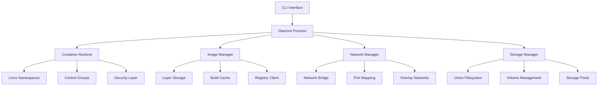

# Reinventing Docker in C++: Project Vision and Architecture

## Introduction

Containerization has revolutionized software development and deployment, with Docker leading the charge since 2013. However, Docker's Go-based implementation, while productive, leaves room for performance optimization and deeper systems integration. This project, **docker-cpp**, aims to reimplement Docker from scratch using modern C++, leveraging the language's performance advantages and systems programming capabilities.

## Why Reimplement Docker in C++?

### Performance Advantages
C++ offers several advantages over Go for systems programming:

- **Zero-cost abstractions**: Modern C++ provides high-level constructs without runtime overhead
- **Memory efficiency**: Precise control over memory layout and allocation patterns
- **System-level integration**: Direct access to Linux kernel APIs without CGO overhead
- **Compile-time optimization**: Template metaprogramming and constexpr for performance-critical paths

### Systems Programming Excellence
C++ is uniquely positioned for container runtime development:

- **RAII and deterministic resource management**: Perfect for handling kernel resources
- **Exception safety**: Robust error handling in complex system interactions
- **Template metaprogramming**: Compile-time generation of specialized code
- **Modern concurrency**: std::thread, std::async, and lock-free data structures

## Project Goals

### Primary Objectives
1. **Docker CLI Compatibility**: Support 80%+ of commonly used Docker commands
2. **OCI Specification Compliance**: Full compliance with Open Container Initiative standards
3. **Performance Leadership**: Outperform Docker in startup time and resource efficiency
4. **Production Readiness**: Enterprise-grade reliability and security

### Secondary Goals
- **Educational Value**: Comprehensive documentation explaining container internals
- **C++ Best Practices**: Showcase modern C++ patterns in systems programming
- **Community Contribution**: Advance open-source container ecosystem

## System Architecture Overview



## Core Components

### 1. Container Runtime Engine
The heart of the system, responsible for:
- Process lifecycle management
- Linux namespace isolation
- Cgroup resource control
- Security policy enforcement

**C++ Implementation Highlights**:
```cpp
class ContainerRuntime {
public:
    ContainerRuntime();
    ~ContainerRuntime();

    ContainerHandle createContainer(const ContainerConfig& config);
    void startContainer(const ContainerHandle& handle);
    void stopContainer(const ContainerHandle& handle);
    void removeContainer(const ContainerHandle& handle);

private:
    std::unique_ptr<NamespaceManager> namespace_manager_;
    std::unique_ptr<CgroupController> cgroup_controller_;
    std::unique_ptr<SecurityManager> security_manager_;
};
```

### 2. Image Management System
Handles container images with:
- Layered filesystem abstraction
- Content-addressable storage
- Registry integration
- Build caching

**Key C++ Features**:
- Smart pointers for automatic memory management
- Template-based content addressing
- RAII for resource cleanup

### 3. Network Stack
Provides container networking:
- Virtual network interfaces
- Bridge and overlay networks
- Port mapping and NAT
- Service discovery

### 4. Storage Engine
Manages container storage:
- Union filesystem implementation
- Volume management
- Snapshots and cloning
- Performance optimization

## Modern C++ Patterns in Systems Programming

### RAII for Kernel Resources
```cpp
class Namespace {
public:
    Namespace(NamespaceType type) : type_(type), fd_(-1) {
        fd_ = open_namespace_fd(type_);
        if (fd_ < 0) {
            throw std::system_error(errno, std::system_category());
        }
    }

    ~Namespace() {
        if (fd_ >= 0) {
            close(fd_);
        }
    }

    // Non-copyable, movable
    Namespace(const Namespace&) = delete;
    Namespace& operator=(const Namespace&) = delete;
    Namespace(Namespace&& other) noexcept : fd_(other.fd_) {
        other.fd_ = -1;
    }

private:
    NamespaceType type_;
    int fd_;
};
```

### Template Metaprogramming for Type Safety
```cpp
template<typename T>
struct ResourceTypeTraits;

template<>
struct ResourceTypeTraits<CpuResource> {
    static constexpr const char* name = "cpu";
    using ValueType = double;
    static constexpr ValueType default_limit = 1.0;
};

template<typename ResourceType>
class ResourceLimiter {
public:
    void setLimit(typename ResourceTypeTraits<ResourceType>::ValueType limit) {
        // Implementation using traits
    }
};
```

### Exception Safety and Error Handling
```cpp
class ContainerProcess {
public:
    auto start(const ProcessConfig& config) -> std::expected<pid_t, ProcessError> {
        try {
            auto namespaces = setupNamespaces(config);
            auto cgroups = setupCgroups(config);

            pid_t pid = fork();
            if (pid == 0) {
                // Child process
                namespaces.apply();
                cgroups.apply();
                execve(config.executable.c_str(), config.argv.data(), config.envp.data());
                _exit(127); // exec failed
            } else if (pid > 0) {
                return pid;
            } else {
                return std::unexpected(ProcessError::ForkFailed);
            }
        } catch (const std::system_error& e) {
            return std::unexpected(ProcessError::SystemError);
        }
    }
};
```

## Performance Optimization Strategies

### 1. Zero-Copy Operations
- Memory-mapped files for image layer access
- splice() for efficient data transfer
- Shared memory for daemon communication

### 2. Compile-Time Optimization
- Template specialization for common operations
- constexpr for configuration validation
- Inline functions for hot paths

### 3. Memory Efficiency
- Custom allocators for frequently allocated objects
- Memory pools for container metadata
- Copy-on-write for shared data structures

## Security Architecture

### 1. Principle of Least Privilege
```cpp
class SecurityProfile {
public:
    SecurityProfile() : default_capabilities_(), seccomp_filter_() {
        // Default secure configuration
        dropAllCapabilities();
        addDefaultSeccompRules();
    }

    void applyToProcess(pid_t pid) const {
        applyCapabilities(pid);
        applySeccompFilter(pid);
        applyNamespaceIsolation(pid);
    }

private:
    std::vector<Capability> allowed_capabilities_;
    SeccompFilter seccomp_filter_;
    NamespaceConfig namespace_config_;
};
```

### 2. Sandboxing and Isolation
- User namespace mapping
- Mount namespace restrictions
- Network namespace isolation
- Read-only filesystem layers

## Development Approach

### Phase 1: Foundation (Weeks 1-4)
- Core architecture setup
- Basic namespace wrappers
- Build system configuration
- Initial testing framework

### Phase 2: Core Features (Weeks 5-12)
- Container runtime implementation
- Image management system
- Basic networking
- CLI interface

### Phase 3: Advanced Features (Weeks 13-18)
- Security hardening
- Performance optimization
- Monitoring and observability
- Plugin system

### Phase 4: Production Readiness (Weeks 19-24)
- Comprehensive testing
- Documentation
- Performance benchmarking
- Release preparation

## Conclusion

This project represents an ambitious endeavor to advance container technology through modern C++ systems programming. By combining C++'s performance capabilities with comprehensive architectural design, we aim to create a container runtime that not only matches Docker's functionality but exceeds it in performance and efficiency.

The journey will be documented through this blog series, providing deep insights into both container technology and advanced C++ programming techniques. Whether you're interested in systems programming, container technology, or high-performance software design, this series will offer valuable knowledge and practical examples.

## Next Steps

In our next article, we'll dive deep into Linux container fundamentals, exploring namespaces, cgroups, and the kernel mechanisms that make containers possible. We'll provide practical C++ examples and discuss the security implications of each isolation mechanism.

---

**Project Repository**: [docker-cpp](https://github.com/your-org/docker-cpp)
**Blog Series**: [Table of Contents](./00-table-of-contents.md)
**Next Article**: [Linux Container Fundamentals](./02-linux-container-fundamentals.md)