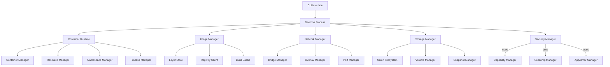

# Building a Container Runtime: Core Architecture Patterns

## Introduction

Designing a container runtime requires careful consideration of system architecture, component interaction, and extensibility. This article explores the core architectural patterns and design principles that will guide our docker-cpp implementation, focusing on component design, plugin architecture, and concurrency patterns.

## System Architecture Overview

### High-Level Component Diagram



## Core Component Design

### 1. Container Runtime Engine

The Container Runtime is the heart of the system, responsible for the complete lifecycle management of containers.

```cpp
#include <memory>
#include <string>
#include <unordered_map>
#include <functional>
#include <future>
#include <atomic>

class ContainerRuntime {
public:
    struct Config {
        std::string id;
        std::string image;
        std::vector<std::string> command;
        std::vector<std::string> env;
        std::map<std::string, std::string> labels;
        std::string working_dir;
        bool interactive = false;
        bool tty = false;
        bool auto_remove = false;

        // Resource limits
        size_t memory_limit = 0;
        double cpu_shares = 1.0;
        std::vector<std::string> bind_mounts;
        std::vector<std::string> port_mappings;
    };

    explicit ContainerRuntime(std::shared_ptr<PluginRegistry> plugin_registry)
        : plugin_registry_(std::move(plugin_registry)),
          running_containers_(std::make_shared<ContainerRegistry>()) {}

    // Container lifecycle management
    std::string createContainer(const Config& config);
    void startContainer(const std::string& container_id);
    void stopContainer(const std::string& container_id, int timeout = 10);
    void removeContainer(const std::string& container_id, bool force = false);

    // Container inspection
    ContainerInfo inspectContainer(const std::string& container_id) const;
    std::vector<std::string> listContainers(bool all = false) const;

    // Event handling
    void subscribeToEvents(std::function<void(const ContainerEvent&)> callback);
    void publishEvent(const ContainerEvent& event);

private:
    std::shared_ptr<PluginRegistry> plugin_registry_;
    std::shared_ptr<ContainerRegistry> running_containers_;
    std::vector<std::function<void(const ContainerEvent&)>> event_callbacks_;
    mutable std::shared_mutex callbacks_mutex_;

    // Internal helper methods
    std::unique_ptr<Container> createContainerInstance(const Config& config);
    void setupContainerEnvironment(Container* container, const Config& config);
    void executeContainer(Container* container);
};
```

### 2. Plugin Architecture

A flexible plugin system allows extending the runtime with additional functionality without modifying the core code.

```cpp
// Plugin interface definitions
class IPlugin {
public:
    virtual ~IPlugin() = default;
    virtual std::string getName() const = 0;
    virtual std::string getVersion() const = 0;
    virtual bool initialize(const PluginConfig& config) = 0;
    virtual void shutdown() = 0;
};

class INetworkPlugin : public IPlugin {
public:
    virtual ~INetworkPlugin() = default;
    virtual std::string createNetwork(const NetworkConfig& config) = 0;
    virtual void deleteNetwork(const std::string& network_id) = 0;
    virtual std::string connectContainer(const std::string& network_id,
                                       const std::string& container_id) = 0;
    virtual void disconnectContainer(const std::string& network_id,
                                   const std::string& container_id) = 0;
};

class IStoragePlugin : public IPlugin {
public:
    virtual ~IStoragePlugin() = default;
    virtual std::string createVolume(const VolumeConfig& config) = 0;
    virtual void deleteVolume(const std::string& volume_id) = 0;
    virtual std::string mountVolume(const std::string& volume_id) = 0;
    virtual void unmountVolume(const std::string& volume_id) = 0;
};

class PluginRegistry {
public:
    template<typename PluginType>
    void registerPlugin(std::unique_ptr<PluginType> plugin) {
        static_assert(std::is_base_of_v<IPlugin, PluginType>,
                     "Plugin must inherit from IPlugin");

        const std::string& name = plugin->getName();
        plugins_[name] = std::move(plugin);

        // Type-specific registration
        if constexpr (std::is_same_v<PluginType, std::unique_ptr<INetworkPlugin>>) {
            network_plugins_[name] = static_cast<INetworkPlugin*>(plugins_[name].get());
        }
    }

    template<typename PluginType>
    PluginType* getPlugin(const std::string& name) const {
        auto it = plugins_.find(name);
        if (it != plugins_.end()) {
            return dynamic_cast<PluginType*>(it->second.get());
        }
        return nullptr;
    }

    std::vector<std::string> getPluginNames() const {
        std::vector<std::string> names;
        names.reserve(plugins_.size());

        for (const auto& [name, plugin] : plugins_) {
            names.push_back(name);
        }

        return names;
    }

    void loadPluginsFromDirectory(const std::string& plugin_dir);
    void unloadAllPlugins();

private:
    std::unordered_map<std::string, std::unique_ptr<IPlugin>> plugins_;
    std::unordered_map<std::string, INetworkPlugin*> network_plugins_;
    std::unordered_map<std::string, IStoragePlugin*> storage_plugins_;
    mutable std::shared_mutex plugins_mutex_;
};
```

### 3. Container State Management

Robust state management ensures container operations are atomic and consistent.

```cpp
enum class ContainerState {
    CREATED,
    RUNNING,
    PAUSED,
    STOPPED,
    REMOVING,
    DEAD,
    RESTARTING
};

class ContainerStateManager {
public:
    explicit ContainerStateManager(const std::string& container_id)
        : container_id_(container_id), current_state_(ContainerState::CREATED) {}

    bool transitionTo(ContainerState new_state) {
        std::unique_lock lock(state_mutex_);

        if (isValidTransition(current_state_, new_state)) {
            ContainerState old_state = current_state_;
            current_state_ = new_state;

            // Record state transition
            recordStateTransition(old_state, new_state);

            // Notify state change listeners
            notifyStateChange(old_state, new_state);

            return true;
        }

        return false;
    }

    ContainerState getCurrentState() const {
        std::shared_lock lock(state_mutex_);
        return current_state_;
    }

    std::chrono::system_clock::time_point getStateStartTime() const {
        std::shared_lock lock(state_mutex_);
        return state_start_time_;
    }

    void addStateChangeListener(std::function<void(ContainerState, ContainerState)> listener) {
        std::unique_lock lock(listeners_mutex_);
        state_change_listeners_.push_back(std::move(listener));
    }

private:
    std::string container_id_;
    std::atomic<ContainerState> current_state_;
    std::chrono::system_clock::time_point state_start_time_;
    mutable std::shared_mutex state_mutex_;

    std::vector<std::function<void(ContainerState, ContainerState)>> state_change_listeners_;
    mutable std::shared_mutex listeners_mutex_;

    bool isValidTransition(ContainerState from, ContainerState to) const {
        // Define valid state transitions
        switch (from) {
            case ContainerState::CREATED:
                return to == ContainerState::RUNNING || to == ContainerState::REMOVING;
            case ContainerState::RUNNING:
                return to == ContainerState::PAUSED || to == ContainerState::STOPPED ||
                       to == ContainerState::RESTARTING || to == ContainerState::REMOVING;
            case ContainerState::PAUSED:
                return to == ContainerState::RUNNING || to == ContainerState::STOPPED ||
                       to == ContainerState::REMOVING;
            case ContainerState::STOPPED:
                return to == ContainerState::RUNNING || to == ContainerState::REMOVING ||
                       to == ContainerState::DEAD;
            case ContainerState::RESTARTING:
                return to == ContainerState::RUNNING || to == ContainerState::STOPPED ||
                       to == ContainerState::DEAD || to == ContainerState::REMOVING;
            case ContainerState::DEAD:
                return to == ContainerState::REMOVING;
            case ContainerState::REMOVING:
                return false; // Terminal state
        }
        return false;
    }

    void recordStateTransition(ContainerState from, ContainerState to) {
        state_start_time_ = std::chrono::system_clock::now();
        // Log state transition
        LOG_INFO("Container " + container_id_ + " transitioned from " +
                stateToString(from) + " to " + stateToString(to));
    }

    void notifyStateChange(ContainerState from, ContainerState to) {
        std::shared_lock lock(listeners_mutex_);
        for (const auto& listener : state_change_listeners_) {
            try {
                listener(from, to);
            } catch (const std::exception& e) {
                LOG_ERROR("State change listener failed: " + std::string(e.what()));
            }
        }
    }

    std::string stateToString(ContainerState state) const {
        switch (state) {
            case ContainerState::CREATED: return "created";
            case ContainerState::RUNNING: return "running";
            case ContainerState::PAUSED: return "paused";
            case ContainerState::STOPPED: return "stopped";
            case ContainerState::REMOVING: return "removing";
            case ContainerState::DEAD: return "dead";
            case ContainerState::RESTARTING: return "restarting";
            default: return "unknown";
        }
    }
};
```

## Concurrency and Threading Patterns

### 1. Actor Model for Container Management

```cpp
#include <actor/actor_system.hpp>

class ContainerActor : public Actor {
public:
    explicit ContainerActor(const ContainerRuntime::Config& config)
        : config_(config), state_manager_(generateContainerId()) {}

    void start() override {
        become([this](const Message& msg) {
            handleMessage(msg);
        });
    }

private:
    ContainerRuntime::Config config_;
    ContainerStateManager state_manager_;
    std::unique_ptr<ContainerProcess> container_process_;

    void handleMessage(const Message& msg) {
        try {
            if (msg.type == "start") {
                handleStartMessage(msg);
            } else if (msg.type == "stop") {
                handleStopMessage(msg);
            } else if (msg.type == "status") {
                handleStatusMessage(msg);
            } else if (msg.type == "remove") {
                handleRemoveMessage(msg);
            }
        } catch (const std::exception& e) {
            sendError(msg.sender, e.what());
        }
    }

    void handleStartMessage(const Message& msg) {
        if (state_manager_.transitionTo(ContainerState::RUNNING)) {
            container_process_ = std::make_unique<ContainerProcess>(config_);
            container_process_->start();

            Message response;
            response.type = "started";
            response.data["container_id"] = config_.id;
            send(msg.sender, response);
        } else {
            sendError(msg.sender, "Invalid state transition");
        }
    }

    void handleStopMessage(const Message& msg) {
        if (state_manager_.transitionTo(ContainerState::STOPPED)) {
            if (container_process_) {
                container_process_->stop();
                container_process_.reset();
            }

            Message response;
            response.type = "stopped";
            response.data["container_id"] = config_.id;
            send(msg.sender, response);
        } else {
            sendError(msg.sender, "Invalid state transition");
        }
    }

    void sendError(const std::string& recipient, const std::string& error) {
        Message error_msg;
        error_msg.type = "error";
        error_msg.data["error"] = error;
        send(recipient, error_msg);
    }
};
```

### 2. Thread Pool for Parallel Operations

```cpp
#include <vector>
#include <queue>
#include <thread>
#include <condition_variable>
#include <future>
#include <functional>

class ThreadPool {
public:
    explicit ThreadPool(size_t num_threads = std::thread::hardware_concurrency())
        : stop_(false) {

        for (size_t i = 0; i < num_threads; ++i) {
            workers_.emplace_back([this] {
                workerThread();
            });
        }
    }

    ~ThreadPool() {
        {
            std::unique_lock lock(queue_mutex_);
            stop_ = true;
        }

        condition_.notify_all();

        for (auto& worker : workers_) {
            if (worker.joinable()) {
                worker.join();
            }
        }
    }

    template<typename F, typename... Args>
    auto submit(F&& f, Args&&... args) -> std::future<std::invoke_result_t<F, Args...>> {
        using ReturnType = std::invoke_result_t<F, Args...>;

        auto task = std::make_shared<std::packaged_task<ReturnType()>>(
            std::bind(std::forward<F>(f), std::forward<Args>(args)...)
        );

        std::future<ReturnType> result = task->get_future();

        {
            std::unique_lock lock(queue_mutex_);

            if (stop_) {
                throw std::runtime_error("ThreadPool is stopped");
            }

            tasks_.emplace([task]() { (*task)(); });
        }

        condition_.notify_one();
        return result;
    }

private:
    std::vector<std::thread> workers_;
    std::queue<std::function<void()>> tasks_;
    std::mutex queue_mutex_;
    std::condition_variable condition_;
    bool stop_;

    void workerThread() {
        while (true) {
            std::function<void()> task;

            {
                std::unique_lock lock(queue_mutex_);

                condition_.wait(lock, [this] {
                    return stop_ || !tasks_.empty();
                });

                if (stop_ && tasks_.empty()) {
                    return;
                }

                task = std::move(tasks_.front());
                tasks_.pop();
            }

            task();
        }
    }
};
```

### 3. Lock-Free Container Registry

```cpp
#include <atomic>
#include <shared_mutex>
#include <unordered_map>

class ConcurrentContainerRegistry {
public:
    struct ContainerInfo {
        std::string id;
        ContainerState state;
        pid_t pid;
        std::chrono::system_clock::time_point created_at;
        std::string image_id;
        std::map<std::string, std::string> labels;
    };

    bool addContainer(const ContainerInfo& info) {
        std::unique_lock lock(registry_mutex_);
        auto [it, inserted] = containers_.emplace(info.id, info);
        return inserted;
    }

    bool removeContainer(const std::string& container_id) {
        std::unique_lock lock(registry_mutex_);
        return containers_.erase(container_id) > 0;
    }

    std::optional<ContainerInfo> getContainer(const std::string& container_id) const {
        std::shared_lock lock(registry_mutex_);
        auto it = containers_.find(container_id);
        if (it != containers_.end()) {
            return it->second;
        }
        return std::nullopt;
    }

    std::vector<ContainerInfo> listContainers() const {
        std::shared_lock lock(registry_mutex_);
        std::vector<ContainerInfo> result;
        result.reserve(containers_.size());

        for (const auto& [id, info] : containers_) {
            result.push_back(info);
        }

        return result;
    }

    bool updateContainerState(const std::string& container_id, ContainerState new_state) {
        std::unique_lock lock(registry_mutex_);
        auto it = containers_.find(container_id);
        if (it != containers_.end()) {
            it->second.state = new_state;
            return true;
        }
        return false;
    }

private:
    mutable std::shared_mutex registry_mutex_;
    std::unordered_map<std::string, ContainerInfo> containers_;
};
```

## Event-Driven Architecture

### 1. Event System Implementation

```cpp
#include <vector>
#include <functional>
#include <unordered_map>
#include <mutex>
#include <queue>
#include <thread>

class EventSystem {
public:
    enum class EventType {
        ContainerCreated,
        ContainerStarted,
        ContainerStopped,
        ContainerRemoved,
        ImagePulled,
        NetworkCreated,
        VolumeCreated
    };

    struct Event {
        EventType type;
        std::string timestamp;
        std::map<std::string, std::string> data;
    };

    using EventListener = std::function<void(const Event&)>;

    void subscribe(EventType type, EventListener listener) {
        std::lock_guard lock(listeners_mutex_);
        listeners_[type].push_back(std::move(listener));
    }

    void publish(const Event& event) {
        {
            std::lock_guard lock(event_queue_mutex_);
            event_queue_.push(event);
        }
        event_condition_.notify_one();
    }

    void startEventDispatcher() {
        event_dispatcher_thread_ = std::thread([this] {
            dispatchEvents();
        });
    }

    void stopEventDispatcher() {
        {
            std::lock_guard lock(event_queue_mutex_);
            stop_dispatcher_ = true;
        }
        event_condition_.notify_one();

        if (event_dispatcher_thread_.joinable()) {
            event_dispatcher_thread_.join();
        }
    }

private:
    std::unordered_map<EventType, std::vector<EventListener>> listeners_;
    std::mutex listeners_mutex_;

    std::queue<Event> event_queue_;
    std::mutex event_queue_mutex_;
    std::condition_variable event_condition_;
    std::atomic<bool> stop_dispatcher_{false};
    std::thread event_dispatcher_thread_;

    void dispatchEvents() {
        while (!stop_dispatcher_) {
            std::unique_lock lock(event_queue_mutex_);
            event_condition_.wait(lock, [this] {
                return !event_queue_.empty() || stop_dispatcher_;
            });

            while (!event_queue_.empty()) {
                Event event = std::move(event_queue_.front());
                event_queue_.pop();
                lock.unlock();

                // Dispatch to listeners
                dispatchToListeners(event);

                lock.lock();
            }
        }
    }

    void dispatchToListeners(const Event& event) {
        std::lock_guard lock(listeners_mutex_);
        auto it = listeners_.find(event.type);
        if (it != listeners_.end()) {
            for (const auto& listener : it->second) {
                try {
                    listener(event);
                } catch (const std::exception& e) {
                    LOG_ERROR("Event listener failed: " + std::string(e.what()));
                }
            }
        }
    }
};
```

## Configuration Management

### 1. Hierarchical Configuration System

```cpp
#include <variant>
#include <yaml-cpp/yaml.h>

class ConfigManager {
public:
    using ConfigValue = std::variant<
        std::string,
        int,
        double,
        bool,
        std::vector<std::string>,
        std::map<std::string, std::string>
    >;

    explicit ConfigManager(const std::string& config_file_path) {
        loadConfiguration(config_file_path);
    }

    template<typename T>
    std::optional<T> getValue(const std::string& key) const {
        auto it = config_.find(key);
        if (it != config_.end()) {
            if (auto value = std::get_if<T>(&it->second)) {
                return *value;
            }
        }
        return std::nullopt;
    }

    template<typename T>
    T getValue(const std::string& key, const T& default_value) const {
        if (auto value = getValue<T>(key)) {
            return *value;
        }
        return default_value;
    }

    template<typename T>
    void setValue(const std::string& key, const T& value) {
        config_[key] = value;
    }

    void saveConfiguration(const std::string& config_file_path) const {
        YAML::Node yaml;

        for (const auto& [key, value] : config_) {
            std::visit([&yaml, &key](const auto& v) {
                yaml[key] = v;
            }, value);
        }

        std::ofstream file(config_file_path);
        file << yaml;
    }

    void mergeConfiguration(const std::string& config_file_path) {
        YAML::Node yaml = YAML::LoadFile(config_file_path);

        for (const auto& node : yaml) {
            std::string key = node.first.as<std::string>();

            if (node.second.IsScalar()) {
                std::string value_str = node.second.as<std::string>();

                // Try to parse as different types
                if (auto int_value = tryParse<int>(value_str)) {
                    config_[key] = *int_value;
                } else if (auto double_value = tryParse<double>(value_str)) {
                    config_[key] = *double_value;
                } else if (auto bool_value = tryParseBool(value_str)) {
                    config_[key] = *bool_value;
                } else {
                    config_[key] = value_str;
                }
            }
        }
    }

private:
    std::unordered_map<std::string, ConfigValue> config_;

    void loadConfiguration(const std::string& config_file_path) {
        YAML::Node yaml = YAML::LoadFile(config_file_path);

        for (const auto& node : yaml) {
            std::string key = node.first.as<std::string>();

            if (node.second.IsScalar()) {
                std::string value_str = node.second.as<std::string>();

                // Parse based on content
                if (auto int_value = tryParse<int>(value_str)) {
                    config_[key] = *int_value;
                } else if (auto double_value = tryParse<double>(value_str)) {
                    config_[key] = *double_value;
                } else if (auto bool_value = tryParseBool(value_str)) {
                    config_[key] = *bool_value;
                } else {
                    config_[key] = value_str;
                }
            } else if (node.second.IsSequence()) {
                std::vector<std::string> values;
                for (const auto& item : node.second) {
                    values.push_back(item.as<std::string>());
                }
                config_[key] = values;
            }
        }
    }

    template<typename T>
    std::optional<T> tryParse(const std::string& str) const {
        try {
            if constexpr (std::is_same_v<T, int>) {
                return std::stoi(str);
            } else if constexpr (std::is_same_v<T, double>) {
                return std::stod(str);
            }
        } catch (...) {
            return std::nullopt;
        }
        return std::nullopt;
    }

    std::optional<bool> tryParseBool(const std::string& str) const {
        std::string lower_str = str;
        std::transform(lower_str.begin(), lower_str.end(), lower_str.begin(), ::tolower);

        if (lower_str == "true" || lower_str == "1" || lower_str == "yes") {
            return true;
        } else if (lower_str == "false" || lower_str == "0" || lower_str == "no") {
            return false;
        }

        return std::nullopt;
    }
};
```

## Error Handling and Recovery

### 1. Comprehensive Error Handling

```cpp
enum class ErrorCode {
    Success = 0,
    ContainerNotFound,
    ContainerAlreadyRunning,
    InsufficientResources,
    NetworkError,
    StorageError,
    SecurityError,
    ConfigurationError,
    SystemError
};

class ContainerError : public std::exception {
public:
    ContainerError(ErrorCode code, const std::string& message)
        : code_(code), message_(message) {}

    const char* what() const noexcept override {
        return message_.c_str();
    }

    ErrorCode getErrorCode() const { return code_; }
    const std::string& getMessage() const { return message_; }

private:
    ErrorCode code_;
    std::string message_;
};

class ErrorHandler {
public:
    template<typename F>
    auto safeExecute(F&& func) -> std::invoke_result_t<F> {
        using ReturnType = std::invoke_result_t<F>;

        try {
            return func();
        } catch (const ContainerError& e) {
            LOG_ERROR("Container error: " + std::string(e.what()));
            throw;
        } catch (const std::system_error& e) {
            LOG_ERROR("System error: " + std::string(e.what()));
            throw ContainerError(ErrorCode::SystemError, e.what());
        } catch (const std::exception& e) {
            LOG_ERROR("Unexpected error: " + std::string(e.what()));
            throw ContainerError(ErrorCode::SystemError, e.what());
        }
    }

    bool attemptRecovery(ErrorCode error, const std::string& container_id) {
        switch (error) {
            case ErrorCode::NetworkError:
                return recoverNetworkError(container_id);
            case ErrorCode::StorageError:
                return recoverStorageError(container_id);
            case ErrorCode::InsufficientResources:
                return recoverResourceError(container_id);
            default:
                return false;
        }
    }

private:
    bool recoverNetworkError(const std::string& container_id) {
        // Attempt network reconnection
        return true;
    }

    bool recoverStorageError(const std::string& container_id) {
        // Attempt storage repair
        return true;
    }

    bool recoverResourceError(const std::string& container_id) {
        // Attempt resource reallocation
        return true;
    }
};
```

## Conclusion

The architecture patterns presented in this article provide a solid foundation for building a robust, scalable container runtime. Key architectural principles include:

1. **Component-Based Design**: Clear separation of concerns with well-defined interfaces
2. **Plugin Architecture**: Extensibility through a plugin system for networks, storage, and other functionality
3. **Event-Driven Architecture**: Reactive design with asynchronous event handling
4. **Concurrency Patterns**: Thread-safe designs using actors, thread pools, and lock-free data structures
5. **Robust State Management**: Atomic state transitions with comprehensive event tracking
6. **Configuration Management**: Hierarchical configuration with runtime updates
7. **Error Handling**: Comprehensive error recovery and fault tolerance

These patterns will guide our implementation of docker-cpp, ensuring we create a maintainable, extensible, and performant container runtime that can compete with existing solutions while providing additional flexibility through C++'s powerful features.

## Next Steps

In our next article, "Filesystem Abstraction: Union Filesystems in C++," we'll dive deep into the storage layer, exploring how to implement union filesystems, layer management, and the copy-on-write mechanisms that are essential for container image storage and management.

---

**Previous Article**: [C++ Systems Programming for Container Runtimes](./03-cpp-systems-programming.md)
**Next Article**: [Filesystem Abstraction: Union Filesystems in C++](./05-union-filesystem-implementation.md)
**Series Index**: [Table of Contents](./00-table-of-contents.md)