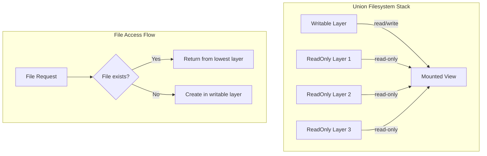

# Filesystem Abstraction: Union Filesystems in C++

## Introduction

Union filesystems are a critical component of container technology, enabling the layered image architecture that makes Docker efficient and portable. This article explores the implementation of union filesystems in C++, covering overlay filesystem management, layer handling, and copy-on-write mechanisms.

## Understanding Union Filesystems

### What is a Union Filesystem?

A union filesystem (UnionFS) combines multiple directories into a single virtual filesystem, creating a layered view where changes are written to upper layers while preserving the integrity of lower layers.



### Union Filesystem Types

1. **OverlayFS** - Modern kernel implementation (Linux 3.18+)
2. **AUFS** - Original union filesystem (deprecated)
3. **Btrfs** - Copy-on-write filesystem with built-in snapshot support
4. **ZFS** - Advanced filesystem with data integrity features

## OverlayFS Implementation in C++

### 1. OverlayFS Manager

```cpp
#include <sys/mount.h>
#include <sys/stat.h>
#include <filesystem>
#include <string>
#include <vector>
#include <memory>
#include <fstream>

class OverlayFSManager {
public:
    struct Layer {
        std::string path;
        bool read_only = true;
        std::string checksum; // Content hash for integrity

        Layer(std::string path, bool ro = true)
            : path(std::move(path)), read_only(ro) {
            calculateChecksum();
        }

    private:
        void calculateChecksum() {
            // Implement layer checksum calculation
            checksum = calculateDirectoryChecksum(path);
        }
    };

    explicit OverlayFSManager(const std::string& base_dir)
        : base_dir_(base_dir) {
        std::filesystem::create_directories(base_dir_);
        std::filesystem::create_directories(getWorkDir());
        std::filesystem::create_directories(getUpperDir());
    }

    ~OverlayFSManager() {
        // Cleanup mounted filesystems
        for (const auto& [mount_point, _] : mounted_filesystems_) {
            try {
                unmount(mount_point);
            } catch (...) {
                // Ignore cleanup errors
            }
        }
    }

    std::string mountOverlayFS(const std::vector<Layer>& lower_layers,
                              const std::string& mount_point,
                              bool read_only = false) {
        // Ensure mount point exists
        std::filesystem::create_directories(mount_point);

        // Generate unique upper directory for this mount
        std::string upper_dir = generateUniquePath(getUpperDir());
        std::string work_dir = generateUniquePath(getWorkDir());

        std::filesystem::create_directories(upper_dir);
        std::filesystem::create_directories(work_dir);

        // Build lowerdir option string
        std::string lowerdir_option;
        for (size_t i = 0; i < lower_layers.size(); ++i) {
            if (i > 0) {
                lowerdir_option += ":";
            }
            lowerdir_option += lower_layers[i].path;
        }

        // Build mount options
        std::string mount_options = "lowerdir=" + lowerdir_option +
                                  ",upperdir=" + upper_dir +
                                  ",workdir=" + work_dir;

        if (read_only) {
            mount_options += ",ro";
        }

        // Perform the mount
        if (::mount("overlay", mount_point.c_str(), "overlay",
                    0, mount_options.c_str()) == -1) {
            // Cleanup on failure
            std::filesystem::remove_all(upper_dir);
            std::filesystem::remove_all(work_dir);
            throw std::system_error(errno, std::system_category(),
                                  "Failed to mount overlay filesystem");
        }

        // Record mount information
        MountInfo mount_info{
            .mount_point = mount_point,
            .upper_dir = upper_dir,
            .work_dir = work_dir,
            .lower_layers = lower_layers,
            .read_only = read_only
        };

        mounted_filesystems_[mount_point] = mount_info;

        return mount_point;
    }

    void unmount(const std::string& mount_point) {
        auto it = mounted_filesystems_.find(mount_point);
        if (it == mounted_filesystems_.end()) {
            throw std::runtime_error("Mount point not found: " + mount_point);
        }

        // Perform unmount
        if (::umount(mount_point.c_str()) == -1) {
            throw std::system_error(errno, std::system_category(),
                                  "Failed to unmount filesystem");
        }

        // Cleanup directories
        const auto& mount_info = it->second;
        std::filesystem::remove_all(mount_info.upper_dir);
        std::filesystem::remove_all(mount_info.work_dir);

        // Remove from tracking
        mounted_filesystems_.erase(it);
    }

    std::vector<std::string> getModifiedFiles(const std::string& mount_point) const {
        auto it = mounted_filesystems_.find(mount_point);
        if (it == mounted_filesystems_.end()) {
            throw std::runtime_error("Mount point not found: " + mount_point);
        }

        const auto& mount_info = it->second;
        return getFilesInDirectory(mount_info.upper_dir);
    }

    void createDiff(const std::string& mount_point, const std::string& diff_path) {
        auto it = mounted_filesystems_.find(mount_point);
        if (it == mounted_filesystems_.end()) {
            throw std::runtime_error("Mount point not found: " + mount_point);
        }

        const auto& mount_info = it->second;
        std::filesystem::create_directories(diff_path);

        // Copy upper layer to diff directory
        copyDirectory(mount_info.upper_dir, diff_path);
    }

private:
    std::string base_dir_;
    std::unordered_map<std::string, MountInfo> mounted_filesystems_;

    struct MountInfo {
        std::string mount_point;
        std::string upper_dir;
        std::string work_dir;
        std::vector<Layer> lower_layers;
        bool read_only;
    };

    std::string getWorkDir() const {
        return base_dir_ + "/work";
    }

    std::string getUpperDir() const {
        return base_dir_ + "/upper";
    }

    std::string generateUniquePath(const std::string& base_path) const {
        static std::atomic<uint64_t> counter{0};
        return base_path + "/" + std::to_string(counter.fetch_add(1));
    }

    std::string calculateDirectoryChecksum(const std::string& path) const {
        // Implement directory checksum calculation
        // This would typically involve hashing file contents and metadata
        return "sha256:" + std::to_string(std::hash<std::string>{}(path));
    }

    std::vector<std::string> getFilesInDirectory(const std::string& dir_path) const {
        std::vector<std::string> files;

        for (const auto& entry : std::filesystem::recursive_directory_iterator(dir_path)) {
            if (entry.is_regular_file()) {
                files.push_back(entry.path().string());
            }
        }

        return files;
    }

    void copyDirectory(const std::string& src, const std::string& dst) const {
        std::filesystem::copy(src, dst,
                             std::filesystem::copy_options::recursive |
                             std::filesystem::copy_options::copy_symlinks);
    }
};
```

### 2. Layer Management System

```cpp
#include <openssl/sha.h>
#include <fstream>
#include <iomanip>

class LayerManager {
public:
    struct LayerInfo {
        std::string id;
        std::string path;
        std::string parent_id;
        std::string checksum;
        size_t size_bytes;
        std::chrono::system_clock::time_point created_at;
        std::map<std::string, std::string> metadata;
    };

    explicit LayerManager(const std::string& layers_dir)
        : layers_dir_(layers_dir) {
        std::filesystem::create_directories(layers_dir_);
        loadLayerIndex();
    }

    std::string createLayer(const std::string& content_path,
                           const std::string& parent_id = "",
                           const std::map<std::string, std::string>& metadata = {}) {
        // Calculate layer checksum
        std::string checksum = calculateLayerChecksum(content_path);

        // Generate layer ID from checksum
        std::string layer_id = "sha256:" + checksum.substr(0, 12);

        // Create layer directory
        std::string layer_path = layers_dir_ + "/" + layer_id;
        std::filesystem::create_directories(layer_path);

        // Copy content to layer directory
        copyDirectory(content_path, layer_path);

        // Calculate layer size
        size_t layer_size = calculateDirectorySize(layer_path);

        // Create layer info
        LayerInfo layer_info{
            .id = layer_id,
            .path = layer_path,
            .parent_id = parent_id,
            .checksum = checksum,
            .size_bytes = layer_size,
            .created_at = std::chrono::system_clock::now(),
            .metadata = metadata
        };

        // Save layer info
        saveLayerInfo(layer_info);

        // Update index
        layers_index_[layer_id] = layer_info;

        return layer_id;
    }

    std::optional<LayerInfo> getLayerInfo(const std::string& layer_id) const {
        auto it = layers_index_.find(layer_id);
        if (it != layers_index_.end()) {
            return it->second;
        }
        return std::nullopt;
    }

    std::vector<LayerInfo> getAllLayers() const {
        std::vector<LayerInfo> layers;
        layers.reserve(layers_index_.size());

        for (const auto& [id, info] : layers_index_) {
            layers.push_back(info);
        }

        return layers;
    }

    std::vector<std::string> getLayerChain(const std::string& layer_id) const {
        std::vector<std::string> chain;
        std::string current_id = layer_id;

        while (!current_id.empty()) {
            chain.push_back(current_id);

            auto layer_info = getLayerInfo(current_id);
            if (!layer_info) {
                break;
            }

            current_id = layer_info->parent_id;
        }

        std::reverse(chain.begin(), chain.end());
        return chain;
    }

    bool deleteLayer(const std::string& layer_id) {
        auto it = layers_index_.find(layer_id);
        if (it == layers_index_.end()) {
            return false;
        }

        // Check if layer has dependents
        if (hasDependents(layer_id)) {
            throw std::runtime_error("Cannot delete layer: has dependents");
        }

        // Remove layer directory
        std::filesystem::remove_all(it->second.path);

        // Remove from index
        layers_index_.erase(it);

        // Save updated index
        saveLayerIndex();

        return true;
    }

    std::string exportLayer(const std::string& layer_id, const std::string& export_path) {
        auto layer_info = getLayerInfo(layer_id);
        if (!layer_info) {
            throw std::runtime_error("Layer not found: " + layer_id);
        }

        // Create export directory
        std::filesystem::create_directories(export_path);

        // Copy layer content
        copyDirectory(layer_info->path, export_path);

        // Create layer metadata file
        std::ofstream metadata_file(export_path + "/layer.json");
        if (!metadata_file) {
            throw std::runtime_error("Failed to create metadata file");
        }

        // Write layer metadata as JSON
        metadata_file << "{\n";
        metadata_file << "  \"id\": \"" << layer_info->id << "\",\n";
        metadata_file << "  \"parent\": \"" << layer_info->parent_id << "\",\n";
        metadata_file << "  \"checksum\": \"" << layer_info->checksum << "\",\n";
        metadata_file << "  \"size\": " << layer_info->size_bytes << ",\n";
        metadata_file << "  \"created_at\": \"" << formatTime(layer_info->created_at) << "\"\n";
        metadata_file << "}\n";

        return export_path;
    }

    std::string importLayer(const std::string& import_path) {
        // Read layer metadata
        std::ifstream metadata_file(import_path + "/layer.json");
        if (!metadata_file) {
            throw std::runtime_error("Invalid layer format: missing metadata");
        }

        // Parse metadata (simplified JSON parsing)
        std::string line;
        std::string layer_id, parent_id, checksum;
        size_t size_bytes = 0;

        while (std::getline(metadata_file, line)) {
            if (line.find("\"id\"") != std::string::npos) {
                layer_id = extractStringValue(line);
            } else if (line.find("\"parent\"") != std::string::npos) {
                parent_id = extractStringValue(line);
            } else if (line.find("\"checksum\"") != std::string::npos) {
                checksum = extractStringValue(line);
            } else if (line.find("\"size\"") != std::string::npos) {
                size_bytes = extractSizeValue(line);
            }
        }

        // Verify layer integrity
        std::string calculated_checksum = calculateLayerChecksum(import_path);
        if (calculated_checksum != checksum) {
            throw std::runtime_error("Layer integrity check failed");
        }

        // Create layer directory
        std::string layer_path = layers_dir_ + "/" + layer_id;
        std::filesystem::create_directories(layer_path);

        // Copy content
        copyDirectory(import_path, layer_path, true); // Exclude metadata file

        // Create layer info
        LayerInfo layer_info{
            .id = layer_id,
            .path = layer_path,
            .parent_id = parent_id,
            .checksum = checksum,
            .size_bytes = size_bytes,
            .created_at = std::chrono::system_clock::now(),
            .metadata = {}
        };

        // Save layer info
        saveLayerInfo(layer_info);
        layers_index_[layer_id] = layer_info;

        return layer_id;
    }

private:
    std::string layers_dir_;
    std::unordered_map<std::string, LayerInfo> layers_index_;

    void loadLayerIndex() {
        std::ifstream index_file(layers_dir_ + "/layers.index");
        if (!index_file) {
            return;
        }

        // Parse index file (simplified format)
        std::string line;
        while (std::getline(index_file, line)) {
            // Parse line and reconstruct LayerInfo
            // Implementation depends on chosen serialization format
        }
    }

    void saveLayerIndex() const {
        std::ofstream index_file(layers_dir_ + "/layers.index");
        if (!index_file) {
            throw std::runtime_error("Failed to save layer index");
        }

        // Write all layer information
        for (const auto& [id, info] : layers_index_) {
            index_file << id << ":" << info.path << ":" << info.parent_id
                      << ":" << info.checksum << ":" << info.size_bytes << "\n";
        }
    }

    void saveLayerInfo(const LayerInfo& info) const {
        std::string info_file_path = info.path + "/layer.info";
        std::ofstream info_file(info_file_path);

        info_file << "id=" << info.id << "\n";
        info_file << "parent=" << info.parent_id << "\n";
        info_file << "checksum=" << info.checksum << "\n";
        info_file << "size=" << info.size_bytes << "\n";
        info_file << "created_at=" << formatTime(info.created_at) << "\n";

        for (const auto& [key, value] : info.metadata) {
            info_file << "metadata." << key << "=" << value << "\n";
        }
    }

    std::string calculateLayerChecksum(const std::string& path) const {
        SHA256_CTX sha256;
        SHA256_Init(&sha256);

        // Hash all files in directory
        for (const auto& entry : std::filesystem::recursive_directory_iterator(path)) {
            if (entry.is_regular_file()) {
                hashFile(entry.path().string(), sha256);
            }
        }

        unsigned char hash[SHA256_DIGEST_LENGTH];
        SHA256_Final(hash, &sha256);

        std::stringstream ss;
        for (int i = 0; i < SHA256_DIGEST_LENGTH; i++) {
            ss << std::hex << std::setw(2) << std::setfill('0') << (int)hash[i];
        }

        return ss.str();
    }

    void hashFile(const std::string& file_path, SHA256_CTX& sha256) const {
        std::ifstream file(file_path, std::ios::binary);
        if (!file) {
            throw std::runtime_error("Failed to open file for hashing: " + file_path);
        }

        constexpr size_t buffer_size = 8192;
        std::vector<char> buffer(buffer_size);

        while (file.read(buffer.data(), buffer_size)) {
            SHA256_Update(&sha256, buffer.data(), file.gcount());
        }

        if (file.gcount() > 0) {
            SHA256_Update(&sha256, buffer.data(), file.gcount());
        }
    }

    size_t calculateDirectorySize(const std::string& path) const {
        size_t total_size = 0;

        for (const auto& entry : std::filesystem::recursive_directory_iterator(path)) {
            if (entry.is_regular_file()) {
                total_size += entry.file_size();
            }
        }

        return total_size;
    }

    bool hasDependents(const std::string& layer_id) const {
        for (const auto& [id, info] : layers_index_) {
            if (info.parent_id == layer_id) {
                return true;
            }
        }
        return false;
    }

    std::string extractStringValue(const std::string& line) const {
        size_t start = line.find("\"") + 1;
        size_t end = line.find("\"", start);
        return line.substr(start, end - start);
    }

    size_t extractSizeValue(const std::string& line) const {
        size_t start = line.find(":") + 1;
        size_t end = line.find(",");
        std::string size_str = line.substr(start, end - start);
        return std::stoull(size_str);
    }

    std::string formatTime(const std::chrono::system_clock::time_point& time_point) const {
        auto time_t = std::chrono::system_clock::to_time_t(time_point);
        std::stringstream ss;
        ss << std::put_time(std::gmtime(&time_t), "%Y-%m-%dT%H:%M:%SZ");
        return ss.str();
    }

    void copyDirectory(const std::string& src, const std::string& dst, bool exclude_metadata = false) const {
        for (const auto& entry : std::filesystem::recursive_directory_iterator(src)) {
            if (exclude_metadata && entry.path().filename() == "layer.info") {
                continue;
            }

            auto relative_path = std::filesystem::relative(entry.path(), src);
            auto dest_path = dst / relative_path;

            if (entry.is_directory()) {
                std::filesystem::create_directories(dest_path);
            } else if (entry.is_regular_file()) {
                std::filesystem::copy_file(entry.path(), dest_path);
            } else if (entry.is_symlink()) {
                std::filesystem::copy_symlink(entry.path(), dest_path);
            }
        }
    }
};
```

### 3. Copy-on-Write Implementation

```cpp
class CopyOnWriteManager {
public:
    explicit CopyOnWriteManager(std::shared_ptr<OverlayFSManager> overlay_manager)
        : overlay_manager_(std::move(overlay_manager)) {}

    std::string createCowView(const std::vector<std::string>& layer_ids,
                             const std::string& view_name) {
        // Convert layer IDs to OverlayFS layers
        std::vector<OverlayFSManager::Layer> layers;
        layers.reserve(layer_ids.size());

        for (const auto& layer_id : layer_ids) {
            // Get layer path from layer manager (assume we have access)
            std::string layer_path = getLayerPath(layer_id);
            layers.emplace_back(layer_path, true); // Read-only layers
        }

        // Create unique mount point
        std::string mount_point = generateMountPoint(view_name);

        // Mount overlay filesystem
        return overlay_manager_->mountOverlayFS(layers, mount_point, false);
    }

    void createSnapshot(const std::string& view_mount_point, const std::string& snapshot_name) {
        // Create new layer from changes in view
        std::string diff_path = "/tmp/snapshot_" + snapshot_name;
        overlay_manager_->createDiff(view_mount_point, diff_path);

        // Import diff as new layer
        std::string layer_id = importLayerFromDiff(diff_path, snapshot_name);

        // Cleanup
        std::filesystem::remove_all(diff_path);

        std::cout << "Created snapshot layer: " << layer_id << std::endl;
    }

    std::vector<std::string> getChangedFiles(const std::string& view_mount_point) {
        return overlay_manager_->getModifiedFiles(view_mount_point);
    }

    void resetView(const std::string& view_mount_point) {
        // Get mount info and recreate upper layer
        // This would involve unmounting and remounting with fresh upper layer
        overlay_manager_->unmount(view_mount_point);
        // Implementation would recreate the view...
    }

private:
    std::shared_ptr<OverlayFSManager> overlay_manager_;

    std::string getLayerPath(const std::string& layer_id) const {
        // This would typically use a LayerManager
        return "/var/lib/docker-cpp/layers/" + layer_id;
    }

    std::string generateMountPoint(const std::string& view_name) const {
        static std::atomic<uint64_t> counter{0};
        return "/var/lib/docker-cpp/mounts/" + view_name + "_" +
               std::to_string(counter.fetch_add(1));
    }

    std::string importLayerFromDiff(const std::string& diff_path, const std::string& name) {
        // This would use LayerManager::createLayer
        // For now, return a mock ID
        return "sha256:mock_layer_id";
    }
};
```

## Performance Optimization

### 1. Cache Management

```cpp
class LayerCache {
public:
    struct CacheEntry {
        std::string layer_id;
        std::string cache_path;
        std::chrono::system_clock::time_point last_accessed;
        size_t access_count;
        size_t size_bytes;
    };

    explicit LayerCache(size_t max_size_bytes, size_t max_entries)
        : max_size_bytes_(max_size_bytes), max_entries_(max_entries) {}

    std::optional<std::string> getCachedLayer(const std::string& layer_id) {
        std::lock_guard lock(cache_mutex_);

        auto it = cache_.find(layer_id);
        if (it != cache_.end()) {
            // Update access information
            it->second.last_accessed = std::chrono::system_clock::now();
            it->second.access_count++;

            return it->second.cache_path;
        }

        return std::nullopt;
    }

    void cacheLayer(const std::string& layer_id, const std::string& source_path) {
        std::lock_guard lock(cache_mutex_);

        // Check if layer is already cached
        if (cache_.find(layer_id) != cache_.end()) {
            return;
        }

        // Calculate layer size
        size_t layer_size = calculateDirectorySize(source_path);

        // Check if we need to evict entries
        evictIfNeeded(layer_size);

        // Create cache entry
        std::string cache_path = generateCachePath(layer_id);
        std::filesystem::create_directories(std::filesystem::path(cache_path).parent_path());

        // Copy layer to cache
        copyDirectory(source_path, cache_path);

        // Add to cache
        CacheEntry entry{
            .layer_id = layer_id,
            .cache_path = cache_path,
            .last_accessed = std::chrono::system_clock::now(),
            .access_count = 1,
            .size_bytes = layer_size
        };

        cache_[layer_id] = entry;
        current_size_bytes_ += layer_size;
    }

    void removeLayer(const std::string& layer_id) {
        std::lock_guard lock(cache_mutex_);

        auto it = cache_.find(layer_id);
        if (it != cache_.end()) {
            // Remove cache directory
            std::filesystem::remove_all(it->second.cache_path);

            // Update size
            current_size_bytes_ -= it->second.size_bytes;

            // Remove from cache
            cache_.erase(it);
        }
    }

    void clearCache() {
        std::lock_guard lock(cache_mutex_);

        for (const auto& [layer_id, entry] : cache_) {
            std::filesystem::remove_all(entry.cache_path);
        }

        cache_.clear();
        current_size_bytes_ = 0;
    }

private:
    size_t max_size_bytes_;
    size_t max_entries_;
    size_t current_size_bytes_ = 0;
    std::unordered_map<std::string, CacheEntry> cache_;
    std::mutex cache_mutex_;

    void evictIfNeeded(size_t new_layer_size) {
        while ((current_size_bytes_ + new_layer_size > max_size_bytes_) ||
               (cache_.size() >= max_entries_)) {

            // Find least recently used entry
            auto lru_it = std::min_element(cache_.begin(), cache_.end(),
                [](const auto& a, const auto& b) {
                    return a.second.last_accessed < b.second.last_accessed;
                });

            if (lru_it != cache_.end()) {
                std::filesystem::remove_all(lru_it->second.cache_path);
                current_size_bytes_ -= lru_it->second.size_bytes;
                cache_.erase(lru_it);
            } else {
                break;
            }
        }
    }

    std::string generateCachePath(const std::string& layer_id) const {
        return "/var/lib/docker-cpp/cache/" + layer_id.substr(0, 2) + "/" + layer_id;
    }
};
```

## Security Considerations

### 1. Permission Management

```cpp
class FilesystemSecurity {
public:
    static void secureLayer(const std::string& layer_path) {
        // Set appropriate permissions for layer files
        setDirectoryPermissions(layer_path, 0755);

        for (const auto& entry : std::filesystem::recursive_directory_iterator(layer_path)) {
            if (entry.is_regular_file()) {
                // Set file permissions based on type
                if (isExecutable(entry.path())) {
                    std::filesystem::permissions(entry.path(),
                        std::filesystem::perms::owner_all |
                        std::filesystem::perms::group_read |
                        std::filesystem::perms::group_exec |
                        std::filesystem::perms::others_read |
                        std::filesystem::perms::others_exec);
                } else {
                    std::filesystem::permissions(entry.path(),
                        std::filesystem::perms::owner_read |
                        std::filesystem::perms::owner_write |
                        std::filesystem::perms::group_read |
                        std::filesystem::perms::others_read);
                }
            }
        }
    }

    static bool validateLayerIntegrity(const std::string& layer_path,
                                     const std::string& expected_checksum) {
        // Calculate current checksum
        std::string actual_checksum = calculateLayerChecksum(layer_path);
        return actual_checksum == expected_checksum;
    }

    static void quarantineLayer(const std::string& layer_path) {
        // Move layer to quarantine directory for investigation
        std::string quarantine_path = "/var/lib/docker-cpp/quarantine/" +
                                    std::filesystem::path(layer_path).filename();
        std::filesystem::rename(layer_path, quarantine_path);
    }

private:
    static void setDirectoryPermissions(const std::string& path, mode_t mode) {
        std::filesystem::permissions(path,
            static_cast<std::filesystem::perms>(mode));
    }

    static bool isExecutable(const std::filesystem::path& file_path) {
        std::ifstream file(file_path, std::ios::binary);
        if (!file) return false;

        // Check ELF magic number
        std::array<char, 4> magic;
        file.read(magic.data(), 4);

        return magic[0] == 0x7F && magic[1] == 'E' && magic[2] == 'L' && magic[3] == 'F';
    }

    static std::string calculateLayerChecksum(const std::string& path) {
        // Implementation would hash all files in the layer
        return "mock_checksum";
    }
};
```

## Usage Example

```cpp
int main() {
    try {
        // Initialize components
        auto overlay_manager = std::make_shared<OverlayFSManager>("/var/lib/docker-cpp/overlay");
        LayerManager layer_manager("/var/lib/docker-cpp/layers");
        CopyOnWriteManager cow_manager(overlay_manager);

        // Create layers from directories
        std::string base_layer = layer_manager.createLayer("./base_layer");
        std::string app_layer = layer_manager.createLayer("./app_layer", base_layer);

        // Get layer chain
        auto layer_chain = layer_manager.getLayerChain(app_layer);
        std::cout << "Layer chain: ";
        for (const auto& layer_id : layer_chain) {
            std::cout << layer_id << " ";
        }
        std::cout << std::endl;

        // Create COW view
        std::string mount_point = cow_manager.createCowView(layer_chain, "app_container");
        std::cout << "Container mounted at: " << mount_point << std::endl;

        // Use the mounted filesystem...
        std::this_thread::sleep_for(std::chrono::seconds(5));

        // Get modified files
        auto modified_files = cow_manager.getChangedFiles(mount_point);
        std::cout << "Modified files: " << modified_files.size() << std::endl;

        // Create snapshot
        cow_manager.createSnapshot(mount_point, "app_snapshot");

        // Cleanup
        overlay_manager->unmount(mount_point);

    } catch (const std::exception& e) {
        std::cerr << "Error: " << e.what() << std::endl;
        return 1;
    }

    return 0;
}
```

## Conclusion

Union filesystems are fundamental to container technology, enabling efficient storage through layering and copy-on-write mechanisms. The C++ implementation presented in this article provides:

1. **Efficient Layer Management**: Content-addressable storage with deduplication
2. **Performance Optimization**: Caching and optimized mount operations
3. **Security**: Permission management and integrity validation
4. **Flexibility**: Support for different overlay filesystem implementations

This implementation forms the foundation for container image storage and management in our docker-cpp project. The layered approach enables efficient image distribution, storage, and execution while maintaining security and performance.

## Next Steps

In our next article, "Process Isolation: Implementing Linux Namespaces in C++," we'll explore how to create and manage Linux namespaces to provide process isolation, building on the filesystem foundation established here.

---

**Previous Article**: [Building a Container Runtime: Core Architecture Patterns](./04-container-runtime-architecture.md)
**Next Article**: [Process Isolation: Implementing Linux Namespaces in C++](./06-process-isolation-namespaces.md)
**Series Index**: [Table of Contents](./00-table-of-contents.md)