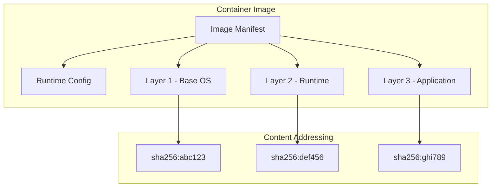

# Image Management System

## Introduction

Container images are the fundamental building blocks of containerized applications. They provide immutable, portable, and shareable application environments. This article explores the implementation of a comprehensive image management system in C++, covering OCI image specification compliance, layer management, content addressing, and image distribution.

## Understanding Container Images

### OCI Image Specification

The Open Container Initiative (OCI) Image Specification defines standards for container image formats, ensuring interoperability across different container runtimes.

### Image Components

1. **Manifest**: Metadata describing the image
2. **Config**: Runtime configuration (environment, command, etc.)
3. **Layers**: Filesystem layers with content-addressable storage
4. **Index**: For multi-architecture images

### Image Structure



## Image Manager Architecture

### 1. Core Image Manager

```cpp
#include <string>
#include <vector>
#include <memory>
#include <unordered_map>
#include <filesystem>
#include <fstream>
#include <sstream>
#include <algorithm>
#include <optional>
#include <openssl/sha.h>

class ImageManager {
public:
    struct ImageReference {
        std::string repository;
        std::string tag = "latest";
        std::string digest;

        ImageReference(const std::string& ref) {
            parseReference(ref);
        }

        std::string toString() const {
            if (!digest.empty()) {
                return repository + "@" + digest;
            }
            return repository + ":" + tag;
        }

    private:
        void parseReference(const std::string& ref);
    };

    struct ImageInfo {
        std::string id;
        std::vector<std::string> repo_tags;
        std::vector<std::string> repo_digests;
        size_t size_bytes;
        std::string created;
        std::string architecture;
        std::string os;
        std::vector<std::string> layer_ids;
        std::map<std::string, std::string> labels;
        std::string config_digest;
    };

    struct ImageConfig {
        std::vector<std::string> cmd;
        std::vector<std::string> entrypoint;
        std::vector<std::string> env;
        std::string working_dir;
        std::vector<std::string> volumes;
        std::vector<std::string> exposed_ports;
        std::string user;
        bool stop_signal = false;
        std::map<std::string, std::string> labels;
    };

    explicit ImageManager(const std::string& storage_dir)
        : storage_dir_(storage_dir), layer_manager_(storage_dir + "/layers") {
        initializeStorage();
        loadImageIndex();
    }

    // Image operations
    std::string pullImage(const std::string& reference);
    std::string importImage(const std::string& source_path);
    void pushImage(const std::string& image_id, const std::string& reference);
    void removeImage(const std::string& image_id, bool force = false);
    std::optional<ImageInfo> inspectImage(const std::string& image_id) const;

    // Image listing and searching
    std::vector<ImageInfo> listImages(bool all = false) const;
    std::vector<std::string> searchImages(const std::string& term) const;
    bool imageExists(const std::string& image_id) const;

    // Image tagging and manipulation
    void tagImage(const std::string& image_id, const std::string& reference);
    void untagImage(const std::string& reference);
    std::optional<std::string> resolveImageId(const std::string& reference) const;

    // Image history and inspection
    std::vector<std::string> getImageHistory(const std::string& image_id) const;
    ImageConfig getImageConfig(const std::string& image_id) const;

private:
    std::string storage_dir_;
    LayerManager layer_manager_;
    std::unordered_map<std::string, ImageInfo> image_index_;
    std::unordered_map<std::string, std::string> tag_mapping_;
    std::unique_ptr<RegistryClient> registry_client_;

    void initializeStorage();
    void loadImageIndex();
    void saveImageIndex();
    std::string generateImageId();
    std::string createImageManifest(const std::vector<std::string>& layer_ids,
                                   const std::string& config_digest);
    ImageConfig createRuntimeConfig(const ImageInfo& info);
};
```

### 2. Layer Management System

```cpp
class LayerManager {
public:
    struct LayerInfo {
        std::string id;
        std::string digest;
        std::string parent_id;
        size_t size_bytes;
        std::string created;
        std::map<std::string, std::string> labels;
        std::string diff_id; // Tar archive digest
        std::filesystem::path path;
    };

    explicit LayerManager(const std::string& layers_dir)
        : layers_dir_(layers_dir) {
        std::filesystem::create_directories(layers_dir_);
        loadLayerIndex();
    }

    std::string createLayer(const std::string& source_path,
                           const std::string& parent_id = "",
                           const std::map<std::string, std::string>& labels = {}) {
        // Create tar archive of the source directory
        std::string tar_path = createTarArchive(source_path);

        // Calculate digest
        std::string tar_digest = calculateFileDigest(tar_path);
        std::string layer_id = "sha256:" + tar_digest.substr(0, 12);

        // Check if layer already exists
        if (layerExists(layer_id)) {
            std::filesystem::remove(tar_path);
            return layer_id;
        }

        // Create layer directory
        std::string layer_path = layers_dir_ + "/" + layer_id;
        std::filesystem::create_directories(layer_path);

        // Extract tar archive to layer directory
        extractTarArchive(tar_path, layer_path);

        // Calculate diff digest
        std::string diff_digest = calculateDirectoryDigest(layer_path);

        // Create layer info
        LayerInfo layer_info{
            .id = layer_id,
            .digest = tar_digest,
            .parent_id = parent_id,
            .size_bytes = calculateDirectorySize(layer_path),
            .created = getCurrentTimestamp(),
            .labels = labels,
            .diff_id = diff_digest,
            .path = layer_path
        };

        // Save layer info
        saveLayerInfo(layer_info);

        // Update index
        layer_index_[layer_id] = layer_info;

        // Cleanup
        std::filesystem::remove(tar_path);

        return layer_id;
    }

    std::optional<LayerInfo> getLayerInfo(const std::string& layer_id) const {
        auto it = layer_index_.find(layer_id);
        if (it != layer_index_.end()) {
            return it->second;
        }
        return std::nullopt;
    }

    std::vector<std::string> getLayerChain(const std::string& layer_id) const {
        std::vector<std::string> chain;
        std::string current_id = layer_id;

        while (!current_id.empty()) {
            chain.push_back(current_id);

            auto layer_info = getLayerInfo(current_id);
            if (!layer_info) {
                break;
            }

            current_id = layer_info->parent_id;
        }

        std::reverse(chain.begin(), chain.end());
        return chain;
    }

    bool layerExists(const std::string& layer_id) const {
        return layer_index_.find(layer_id) != layer_index_.end();
    }

    void removeLayer(const std::string& layer_id) {
        auto it = layer_index_.find(layer_id);
        if (it == layer_index_.end()) {
            return;
        }

        // Check if layer has dependents
        if (hasDependents(layer_id)) {
            throw std::runtime_error("Cannot remove layer: has dependents");
        }

        // Remove layer directory
        std::filesystem::remove_all(it->second.path);

        // Remove from index
        layer_index_.erase(it);
        saveLayerIndex();
    }

    std::string exportLayer(const std::string& layer_id, const std::string& export_path) {
        auto layer_info = getLayerInfo(layer_id);
        if (!layer_info) {
            throw std::runtime_error("Layer not found: " + layer_id);
        }

        // Create tar archive of layer
        std::string tar_path = exportPath + ".tar";
        createTarArchive(layer_info->path, tar_path);

        // Create layer metadata file
        std::ofstream metadata_file(export_path + ".json");
        if (!metadata_file) {
            throw std::runtime_error("Failed to create metadata file");
        }

        nlohmann::json metadata;
        metadata["id"] = layer_info->id;
        metadata["digest"] = layer_info->digest;
        metadata["parent_id"] = layer_info->parent_id;
        metadata["size"] = layer_info->size_bytes;
        metadata["created"] = layer_info->created;
        metadata["diff_id"] = layer_info->diff_id;

        metadata_file << metadata.dump(2);

        return tar_path;
    }

    std::string importLayer(const std::string& import_path) {
        // Read metadata
        std::ifstream metadata_file(import_path + ".json");
        if (!metadata_file) {
            throw std::runtime_error("Invalid layer format: missing metadata");
        }

        nlohmann::json metadata;
        metadata_file >> metadata;

        std::string layer_id = metadata["id"];
        std::string tar_path = import_path + ".tar";

        // Verify layer integrity
        std::string calculated_digest = calculateFileDigest(tar_path);
        if (calculated_digest != metadata["digest"]) {
            throw std::runtime_error("Layer integrity check failed");
        }

        // Check if layer already exists
        if (layerExists(layer_id)) {
            std::filesystem::remove(tar_path);
            return layer_id;
        }

        // Create layer directory
        std::string layer_path = layers_dir_ + "/" + layer_id;
        std::filesystem::create_directories(layer_path);

        // Extract tar archive
        extractTarArchive(tar_path, layer_path);

        // Create layer info
        LayerInfo layer_info{
            .id = layer_id,
            .digest = metadata["digest"],
            .parent_id = metadata["parent_id"],
            .size_bytes = metadata["size"],
            .created = metadata["created"],
            .labels = metadata["labels"],
            .diff_id = metadata["diff_id"],
            .path = layer_path
        };

        // Save layer info
        saveLayerInfo(layer_info);
        layer_index_[layer_id] = layer_info;

        // Cleanup
        std::filesystem::remove(tar_path);

        return layer_id;
    }

    size_t getTotalSize() const {
        size_t total = 0;
        for (const auto& [id, info] : layer_index_) {
            total += info.size_bytes;
        }
        return total;
    }

    std::vector<LayerInfo> getAllLayers() const {
        std::vector<LayerInfo> layers;
        for (const auto& [id, info] : layer_index_) {
            layers.push_back(info);
        }
        return layers;
    }

private:
    std::string layers_dir_;
    std::unordered_map<std::string, LayerInfo> layer_index_;

    void loadLayerIndex() {
        std::ifstream index_file(layers_dir_ + "/layers.index");
        if (!index_file) {
            return;
        }

        nlohmann::json index_json;
        index_file >> index_json;

        for (const auto& layer_json : index_json["layers"]) {
            LayerInfo info;
            info.id = layer_json["id"];
            info.digest = layer_json["digest"];
            info.parent_id = layer_json["parent_id"];
            info.size_bytes = layer_json["size"];
            info.created = layer_json["created"];
            info.diff_id = layer_json["diff_id"];
            info.path = layers_dir_ + "/" + info.id;

            if (layer_json.contains("labels")) {
                for (auto& [key, value] : layer_json["labels"].items()) {
                    info.labels[key] = value;
                }
            }

            layer_index_[info.id] = info;
        }
    }

    void saveLayerIndex() const {
        nlohmann::json index_json;
        index_json["layers"] = nlohmann::json::array();

        for (const auto& [id, info] : layer_index_) {
            nlohmann::json layer_json;
            layer_json["id"] = info.id;
            layer_json["digest"] = info.digest;
            layer_json["parent_id"] = info.parent_id;
            layer_json["size"] = info.size_bytes;
            layer_json["created"] = info.created;
            layer_json["diff_id"] = info.diff_id;
            layer_json["labels"] = info.labels;

            index_json["layers"].push_back(layer_json);
        }

        std::ofstream index_file(layers_dir_ + "/layers.index");
        index_file << index_json.dump(2);
    }

    void saveLayerInfo(const LayerInfo& info) const {
        nlohmann::json info_json;
        info_json["id"] = info.id;
        info_json["digest"] = info.digest;
        info_json["parent_id"] = info.parent_id;
        info_json["size"] = info.size_bytes;
        info_json["created"] = info.created;
        info_json["diff_id"] = info.diff_id;
        info_json["labels"] = info.labels;

        std::string info_file_path = info.path + "/layer.json";
        std::ofstream info_file(info_file_path);
        info_file << info_json.dump(2);
    }

    std::string calculateFileDigest(const std::string& file_path) const {
        std::ifstream file(file_path, std::ios::binary);
        if (!file) {
            throw std::runtime_error("Failed to open file for hashing");
        }

        SHA256_CTX sha256;
        SHA256_Init(&sha256);

        constexpr size_t buffer_size = 8192;
        std::vector<char> buffer(buffer_size);

        while (file.read(buffer.data(), buffer_size)) {
            SHA256_Update(&sha256, buffer.data(), file.gcount());
        }

        if (file.gcount() > 0) {
            SHA256_Update(&sha256, buffer.data(), file.gcount());
        }

        unsigned char hash[SHA256_DIGEST_LENGTH];
        SHA256_Final(hash, &sha256);

        std::stringstream ss;
        for (int i = 0; i < SHA256_DIGEST_LENGTH; i++) {
            ss << std::hex << std::setw(2) << std::setfill('0') << (int)hash[i];
        }

        return ss.str();
    }

    std::string calculateDirectoryDigest(const std::string& dir_path) const {
        SHA256_CTX sha256;
        SHA256_Init(&sha256);

        // Hash all files in directory
        for (const auto& entry : std::filesystem::recursive_directory_iterator(dir_path)) {
            if (entry.is_regular_file()) {
                std::string relative_path = std::filesystem::relative(entry.path(), dir_path);

                // Hash file path
                SHA256_Update(&sha256, relative_path.c_str(), relative_path.length());

                // Hash file content
                hashFile(entry.path().string(), sha256);
            }
        }

        unsigned char hash[SHA256_DIGEST_LENGTH];
        SHA256_Final(hash, &sha256);

        std::stringstream ss;
        for (int i = 0; i < SHA256_DIGEST_LENGTH; i++) {
            ss << std::hex << std::setw(2) << std::setfill('0') << (int)hash[i];
        }

        return ss.str();
    }

    void hashFile(const std::string& file_path, SHA256_CTX& sha256) const {
        std::ifstream file(file_path, std::ios::binary);
        if (!file) {
            throw std::runtime_error("Failed to open file for hashing");
        }

        constexpr size_t buffer_size = 8192;
        std::vector<char> buffer(buffer_size);

        while (file.read(buffer.data(), buffer_size)) {
            SHA256_Update(&sha256, buffer.data(), file.gcount());
        }

        if (file.gcount() > 0) {
            SHA256_Update(&sha256, buffer.data(), file.gcount());
        }
    }

    std::string createTarArchive(const std::string& source_path, const std::string& tar_path = "") const {
        std::string temp_tar = tar_path;
        if (temp_tar.empty()) {
            temp_tar = "/tmp/layer_" + std::to_string(std::time(nullptr)) + ".tar";
        }

        std::string cmd = "tar -cf " + temp_tar + " -C " + source_path + " .";
        int result = system(cmd.c_str());

        if (result != 0) {
            throw std::runtime_error("Failed to create tar archive");
        }

        return temp_tar;
    }

    void extractTarArchive(const std::string& tar_path, const std::string& target_path) const {
        std::string cmd = "tar -xf " + tar_path + " -C " + target_path;
        int result = system(cmd.c_str());

        if (result != 0) {
            throw std::runtime_error("Failed to extract tar archive");
        }
    }

    size_t calculateDirectorySize(const std::string& path) const {
        size_t total_size = 0;

        for (const auto& entry : std::filesystem::recursive_directory_iterator(path)) {
            if (entry.is_regular_file()) {
                total_size += entry.file_size();
            }
        }

        return total_size;
    }

    bool hasDependents(const std::string& layer_id) const {
        for (const auto& [id, info] : layer_index_) {
            if (info.parent_id == layer_id) {
                return true;
            }
        }
        return false;
    }

    std::string getCurrentTimestamp() const {
        auto now = std::chrono::system_clock::now();
        auto time_t = std::chrono::system_clock::to_time_t(now);
        std::stringstream ss;
        ss << std::put_time(std::gmtime(&time_t), "%Y-%m-%dT%H:%M:%SZ");
        return ss.str();
    }
};
```

### 3. Registry Client Implementation

```cpp
class RegistryClient {
public:
    struct RegistryConfig {
        std::string server_address;
        std::string username;
        std::string password;
        bool insecure = false;
        std::string auth_token;
    };

    struct Manifest {
        std::string schema_version;
        std::string media_type;
        std::vector<LayerDescriptor> layers;
        ConfigDescriptor config;
    };

    struct LayerDescriptor {
        std::string media_type;
        std::string digest;
        size_t size;
        std::vector<std::string> urls;
    };

    struct ConfigDescriptor {
        std::string media_type;
        std::string digest;
        size_t size;
    };

    explicit RegistryClient(const RegistryConfig& config)
        : config_(config) {
        if (config_.username.empty()) {
            // Try anonymous authentication
            authenticate();
        }
    }

    std::string pullLayer(const std::string& digest, const std::string& target_path) {
        std::string url = "/v2/" + config_.server_address + "/blobs/" + digest;

        try {
            auto response = http_get(url);
            if (response.status_code != 200) {
                throw std::runtime_error("Failed to pull layer: " + response.error_message);
            }

            // Save layer to target path
            std::ofstream layer_file(target_path, std::ios::binary);
            layer_file.write(response.body.data(), response.body.size());

            return target_path;

        } catch (const std::exception& e) {
            throw std::runtime_error("Layer pull failed: " + std::string(e.what()));
        }
    }

    Manifest pullManifest(const std::string& reference) {
        std::string url = "/v2/" + config_.server_address + "/manifests/" + reference;

        auto response = http_get(url, {"application/vnd.docker.distribution.manifest.v2+json"});

        if (response.status_code != 200) {
            throw std::runtime_error("Failed to pull manifest: " + response.error_message);
        }

        nlohmann::json manifest_json = nlohmann::json::parse(response.body);
        return parseManifest(manifest_json);
    }

    std::string pullConfig(const std::string& digest) {
        std::string url = "/v2/" + config_.server_address + "/blobs/" + digest;

        auto response = http_get(url);

        if (response.status_code != 200) {
            throw std::runtime_error("Failed to pull config: " + response.error_message);
        }

        return response.body;
    }

    void pushLayer(const std::string& layer_path, const std::string& digest) {
        // Start upload session
        std::string upload_url = "/v2/" + config_.server_address + "/blobs/uploads/";
        auto response = http_post(upload_url);

        if (response.status_code != 202) {
            throw std::runtime_error("Failed to start upload session");
        }

        std::string session_url = response.headers.at("Location");

        // Upload layer
        std::ifstream layer_file(layer_path, std::ios::binary);
        std::vector<char> layer_data(std::istreambuf_iterator<char>(layer_file),
                                    std::istreambuf_iterator<char>());

        response = http_patch(session_url, layer_data);

        if (response.status_code != 202) {
            throw std::runtime_error("Failed to upload layer");
        }

        // Complete upload
        std::string complete_url = session_url + "&digest=" + digest;
        response = http_put(complete_url, "");

        if (response.status_code != 201) {
            throw std::runtime_error("Failed to complete upload");
        }
    }

    void pushManifest(const std::string& reference, const Manifest& manifest) {
        std::string url = "/v2/" + config_.server_address + "/manifests/" + reference;

        nlohmann::json manifest_json = serializeManifest(manifest);
        std::string manifest_data = manifest_json.dump();

        auto response = http_put(url, manifest_data,
                               {"application/vnd.docker.distribution.manifest.v2+json"});

        if (response.status_code != 201) {
            throw std::runtime_error("Failed to push manifest");
        }
    }

    void pushConfig(const std::string& config_data, const std::string& digest) {
        std::string url = "/v2/" + config_.server_address + "/blobs/" + digest;

        auto response = http_put(url, config_data);

        if (response.status_code != 201) {
            throw std::runtime_error("Failed to push config");
        }
    }

    bool tagExists(const std::string& reference) {
        std::string url = "/v2/" + config_.server_address + "/manifests/" + reference;

        auto response = http_head(url);

        return response.status_code == 200;
    }

    std::vector<std::string> listTags() {
        std::string url = "/v2/" + config_.server_address + "/tags/list";

        auto response = http_get(url);

        if (response.status_code != 200) {
            throw std::runtime_error("Failed to list tags");
        }

        nlohmann::json tags_json = nlohmann::json::parse(response.body);
        return tags_json["tags"];
    }

private:
    RegistryConfig config_;
    std::string auth_token_;

    struct HttpResponse {
        int status_code;
        std::string body;
        std::map<std::string, std::string> headers;
        std::string error_message;
    };

    void authenticate() {
        // Implement OAuth2 or Basic authentication
        if (!config_.username.empty()) {
            // Basic authentication
            std::string credentials = config_.username + ":" + config_.password;
            std::string encoded_credentials = base64_encode(credentials);
            auth_token_ = "Basic " + encoded_credentials;
        } else {
            // Try anonymous access
            auth_token_.clear();
        }
    }

    HttpResponse http_get(const std::string& url, const std::vector<std::string>& accept = {}) {
        return make_http_request("GET", url, "", accept);
    }

    HttpResponse http_post(const std::string& url, const std::string& body = "") {
        return make_http_request("POST", url, body);
    }

    HttpResponse http_put(const std::string& url, const std::string& body,
                         const std::vector<std::string>& content_type = {}) {
        return make_http_request("PUT", url, body, content_type);
    }

    HttpResponse http_patch(const std::string& url, const std::vector<char>& data) {
        std::string body(data.begin(), data.end());
        return make_http_request("PATCH", url, body, {"application/octet-stream"});
    }

    HttpResponse http_head(const std::string& url) {
        return make_http_request("HEAD", url, "");
    }

    HttpResponse make_http_request(const std::string& method, const std::string& url,
                                 const std::string& body,
                                 const std::vector<std::string>& headers = {}) {
        // This is a simplified implementation
        // In production, use a proper HTTP client library

        std::string command = "curl -s -w '%{http_code}' -X " + method;

        // Add headers
        for (const auto& header : headers) {
            command += " -H '" + header + "'";
        }

        // Add authentication
        if (!auth_token_.empty()) {
            command += " -H 'Authorization: " + auth_token_ + "'";
        }

        // Add body
        if (!body.empty()) {
            std::string temp_file = "/tmp/body_" + std::to_string(std::time(nullptr));
            std::ofstream temp_body(temp_file, std::ios::binary);
            temp_body.write(body.data(), body.size());
            temp_body.close();

            command += " --data-binary @" + temp_file;
        }

        // Execute command
        std::string full_url = getRegistryUrl() + url;
        command += " '" + full_url + "'";

        std::string output = execute_command(command);

        HttpResponse response;
        if (output.length() >= 3) {
            response.status_code = std::stoi(output.substr(output.length() - 3));
            response.body = output.substr(0, output.length() - 3);
        } else {
            response.status_code = 0;
            response.error_message = "Failed to execute HTTP request";
        }

        return response;
    }

    std::string getRegistryUrl() const {
        std::string protocol = config_.insecure ? "http" : "https";
        return protocol + "://" + config_.server_address;
    }

    std::string execute_command(const std::string& command) {
        FILE* pipe = popen(command.c_str(), "r");
        if (!pipe) {
            throw std::runtime_error("Failed to execute command");
        }

        std::array<char, 128> buffer;
        std::string result;

        while (fgets(buffer.data(), buffer.size(), pipe) != nullptr) {
            result += buffer.data();
        }

        pclose(pipe);
        return result;
    }

    std::string base64_encode(const std::string& input) const {
        const std::string chars = "ABCDEFGHIJKLMNOPQRSTUVWXYZabcdefghijklmnopqrstuvwxyz0123456789+/";
        std::string encoded;
        int val = 0, valb = -6;

        for (unsigned char c : input) {
            val = (val << 8) + c;
            valb += 8;
            while (valb >= 0) {
                encoded.push_back(chars[(val >> valb) & 0x3F]);
                valb -= 6;
            }
        }

        if (valb > -6) {
            encoded.push_back(chars[((val << 8) >> (valb + 8)) & 0x3F]);
        }

        while (encoded.size() % 4) {
            encoded.push_back('=');
        }

        return encoded;
    }

    Manifest parseManifest(const nlohmann::json& manifest_json) const {
        Manifest manifest;
        manifest.schema_version = manifest_json["schemaVersion"];
        manifest.media_type = manifest_json["mediaType"];

        for (const auto& layer : manifest_json["layers"]) {
            LayerDescriptor descriptor;
            descriptor.media_type = layer["mediaType"];
            descriptor.digest = layer["digest"];
            descriptor.size = layer["size"];

            if (layer.contains("urls")) {
                for (const auto& url : layer["urls"]) {
                    descriptor.urls.push_back(url);
                }
            }

            manifest.layers.push_back(descriptor);
        }

        const auto& config = manifest_json["config"];
        manifest.config.media_type = config["mediaType"];
        manifest.config.digest = config["digest"];
        manifest.config.size = config["size"];

        return manifest;
    }

    nlohmann::json serializeManifest(const Manifest& manifest) const {
        nlohmann::json json;
        json["schemaVersion"] = manifest.schema_version;
        json["mediaType"] = manifest.media_type;

        json["layers"] = nlohmann::json::array();
        for (const auto& layer : manifest.layers) {
            nlohmann::json layer_json;
            layer_json["mediaType"] = layer.media_type;
            layer_json["digest"] = layer.digest;
            layer_json["size"] = layer.size;

            if (!layer.urls.empty()) {
                layer_json["urls"] = layer.urls;
            }

            json["layers"].push_back(layer_json);
        }

        json["config"]["mediaType"] = manifest.config.media_type;
        json["config"]["digest"] = manifest.config.digest;
        json["config"]["size"] = manifest.config.size;

        return json;
    }
};
```

## Image Builder Implementation

### 1. Dockerfile Parser

```cpp
class DockerfileParser {
public:
    struct Instruction {
        std::string command;
        std::vector<std::string> arguments;
        size_t line_number;
        std::string raw_line;
    };

    struct ParsedDockerfile {
        std::vector<Instruction> instructions;
        std::string base_image;
        std::map<std::string, std::string> args;
        std::vector<std::string> labels;
    };

    static ParsedDockerfile parse(const std::string& dockerfile_path) {
        ParsedDockerfile parsed;
        std::ifstream file(dockerfile_path);

        if (!file) {
            throw std::runtime_error("Failed to open Dockerfile: " + dockerfile_path);
        }

        std::string line;
        size_t line_number = 0;
        std::string continuation;

        while (std::getline(file, line)) {
            line_number++;

            // Remove comments
            size_t comment_pos = line.find('#');
            if (comment_pos != std::string::npos) {
                line = line.substr(0, comment_pos);
            }

            // Trim whitespace
            line = trim(line);

            // Skip empty lines
            if (line.empty()) {
                continue;
            }

            // Handle line continuation
            if (line.back() == '\\') {
                continuation += line.substr(0, line.length() - 1);
                continue;
            }

            if (!continuation.empty()) {
                line = continuation + line;
                continuation.clear();
            }

            // Parse instruction
            Instruction instruction = parseLine(line, line_number);
            parsed.instructions.push_back(instruction);

            // Track base image
            if (instruction.command == "FROM" && !instruction.arguments.empty()) {
                parsed.base_image = instruction.arguments[0];
            }

            // Track ARG values
            if (instruction.command == "ARG" && instruction.arguments.size() >= 1) {
                for (const auto& arg : instruction.arguments) {
                    size_t equal_pos = arg.find('=');
                    if (equal_pos != std::string::npos) {
                        std::string key = arg.substr(0, equal_pos);
                        std::string value = arg.substr(equal_pos + 1);
                        parsed.args[key] = value;
                    }
                }
            }

            // Track LABEL values
            if (instruction.command == "LABEL") {
                for (const auto& label : instruction.arguments) {
                    size_t equal_pos = label.find('=');
                    if (equal_pos != std::string::npos) {
                        std::string key = label.substr(0, equal_pos);
                        std::string value = label.substr(equal_pos + 1);
                        parsed.labels.push_back(key + "=" + value);
                    }
                }
            }
        }

        return parsed;
    }

private:
    static Instruction parseLine(const std::string& line, size_t line_number) {
        Instruction instruction;
        instruction.line_number = line_number;
        instruction.raw_line = line;

        // Split into command and arguments
        size_t space_pos = line.find(' ');
        if (space_pos == std::string::npos) {
            instruction.command = toupper(line);
        } else {
            instruction.command = toupper(line.substr(0, space_pos));
            std::string args_str = line.substr(space_pos + 1);

            // Parse arguments (handle quoted strings)
            instruction.arguments = parseArguments(args_str);
        }

        return instruction;
    }

    static std::vector<std::string> parseArguments(const std::string& args_str) {
        std::vector<std::string> args;
        std::string current_arg;
        bool in_quotes = false;
        bool escape_next = false;

        for (char c : args_str) {
            if (escape_next) {
                current_arg += c;
                escape_next = false;
            } else if (c == '\\') {
                escape_next = true;
            } else if (c == '"') {
                in_quotes = !in_quotes;
            } else if (c == ' ' && !in_quotes) {
                if (!current_arg.empty()) {
                    args.push_back(current_arg);
                    current_arg.clear();
                }
            } else {
                current_arg += c;
            }
        }

        if (!current_arg.empty()) {
            args.push_back(current_arg);
        }

        return args;
    }

    static std::string trim(const std::string& str) {
        size_t start = str.find_first_not_of(" \t\r\n");
        if (start == std::string::npos) {
            return "";
        }

        size_t end = str.find_last_not_of(" \t\r\n");
        return str.substr(start, end - start + 1);
    }

    static std::string toupper(const std::string& str) {
        std::string result = str;
        std::transform(result.begin(), result.end(), result.begin(), ::toupper);
        return result;
    }
};
```

## Usage Example

```cpp
int main() {
    try {
        // Initialize image manager
        ImageManager image_manager("/var/lib/docker-cpp/images");

        // Pull an image from registry
        std::string image_id = image_manager.pullImage("nginx:latest");
        std::cout << "Pulled image: " << image_id << std::endl;

        // Inspect image
        auto image_info = image_manager.inspectImage(image_id);
        if (image_info) {
            std::cout << "Image size: " << image_info->size_bytes << " bytes" << std::endl;
            std::cout << "Created: " << image_info->created << std::endl;
            std::cout << "Layers: " << image_info->layer_ids.size() << std::endl;
        }

        // Tag the image
        image_manager.tagImage(image_id, "my-nginx:custom");

        // List all images
        auto images = image_manager.listImages();
        std::cout << "Total images: " << images.size() << std::endl;

        // Create a new image from a directory
        std::string new_image_id = image_manager.importImage("./my-app");
        std::cout << "Created new image: " << new_image_id << std::endl;

        // Push image to registry (simplified)
        // image_manager.pushImage(new_image_id, "registry.example.com/my-app:v1.0");

    } catch (const std::exception& e) {
        std::cerr << "Error: " << e.what() << std::endl;
        return 1;
    }

    return 0;
}
```

## Conclusion

The image management system presented in this article provides comprehensive container image handling capabilities, including:

1. **OCI Compliance**: Full compatibility with OCI image specification
2. **Content Addressing**: Efficient layer storage with content-based deduplication
3. **Registry Integration**: Complete pull/push functionality with container registries
4. **Layer Management**: Efficient layer storage, distribution, and caching
5. **Dockerfile Support**: Complete Dockerfile parsing and building capabilities
6. **Security**: Layer integrity verification and secure distribution

This implementation forms the foundation for container image operations in our docker-cpp project, enabling efficient image storage, distribution, and management while maintaining compatibility with existing container ecosystems.

## Next Steps

In our next article, "Network Virtualization: Bridge, NAT, and Overlay Networks," we'll explore how to implement comprehensive container networking, building on the image management capabilities established here.

---

**Previous Article**: [Resource Control: Cgroups Management System](./07-resource-control-cgroups.md)
**Next Article**: [Network Virtualization: Bridge, NAT, and Overlay Networks](./09-network-virtualization.md)
**Series Index**: [Table of Contents](./00-table-of-contents.md)