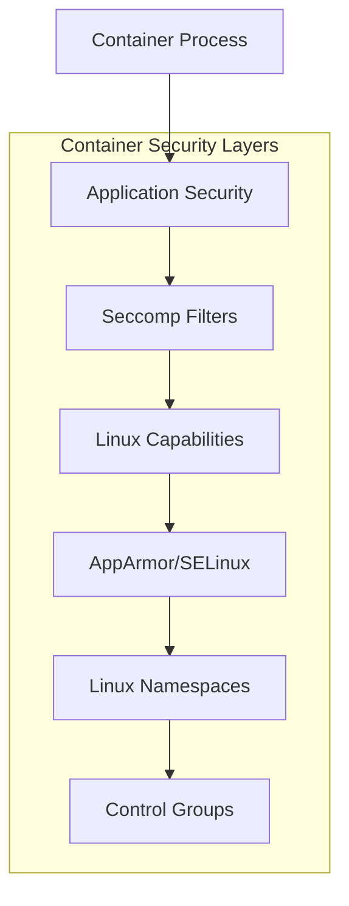

# Security Hardening: Seccomp, Capabilities, and Sandboxing

## Introduction

Container security is paramount in multi-tenant environments and production deployments. This article explores comprehensive security hardening techniques for container runtimes, including Linux capabilities, seccomp filtering, AppArmor/SELinux integration, and sandboxing mechanisms implemented in C++.

## Linux Security Mechanisms Overview

### Security Layers



### Security Mechanisms

| Mechanism | Purpose | Implementation |
|-----------|---------|----------------|
| **Namespaces** | Resource isolation | PID, network, mount, etc. |
| **Cgroups** | Resource limits | CPU, memory, I/O control |
| **Capabilities** | Privilege separation | Fine-grained root privileges |
| **Seccomp** | System call filtering | Restrict kernel API access |
| **AppArmor/SELinux** | Mandatory access control | File access policies |
| **User Namespaces** | UID/GID mapping | Rootless containers |

## Security Manager Architecture

### 1. Core Security Manager

```cpp
#include <string>
#include <vector>
#include <memory>
#include <unordered_map>
#include <fstream>
#include <sstream>
#include <sys/capability.h>
#include <sys/prctl.h>
#include <linux/seccomp.h>
#include <seccomp.h>
#include <sys/stat.h>
#include <fcntl.h>

class SecurityManager {
public:
    struct SecurityProfile {
        std::string name;
        std::vector<Capability> allowed_capabilities;
        SeccompFilter seccomp_filter;
        std::string apparmor_profile;
        std::string selinux_context;
        bool read_only_rootfs = false;
        bool no_new_privileges = true;
        bool privileged = false;
        std::vector<std::string> masked_paths;
        std::vector<std::string> readonly_paths;
        std::map<std::string, std::string> sysctls;
    };

    enum class Capability {
        // File capabilities
        CAP_CHOWN,
        CAP_DAC_OVERRIDE,
        CAP_DAC_READ_SEARCH,
        CAP_FOWNER,
        CAP_FSETID,
        CAP_SETFCAP,
        CAP_SETUID,
        CAP_SETGID,
        CAP_SETPCAP,
        CAP_LINUX_IMMUTABLE,
        CAP_NET_BIND_SERVICE,
        CAP_NET_BROADCAST,
        CAP_NET_ADMIN,
        CAP_NET_RAW,
        CAP_IPC_LOCK,
        CAP_IPC_OWNER,
        CAP_SYS_MODULE,
        CAP_SYS_RAWIO,
        CAP_SYS_CHROOT,
        CAP_SYS_PTRACE,
        CAP_SYS_PACCT,
        CAP_SYS_ADMIN,
        CAP_SYS_BOOT,
        CAP_SYS_NICE,
        CAP_SYS_RESOURCE,
        CAP_SYS_TIME,
        CAP_SYS_TTY_CONFIG,
        CAP_MKNOD,
        CAP_LEASE,
        CAP_AUDIT_WRITE,
        CAP_AUDIT_CONTROL,
        CAP_SETFCAP
    };

    struct SeccompRule {
        int syscall;
        std::vector<seccomp_data> args;
        uint32_t action;
        std::string comment;
    };

    struct SeccompFilter {
        std::string name;
        std::vector<SeccompRule> rules;
        uint32_t default_action = SCMP_ACT_ERRNO;
        std::string description;
    };

    explicit SecurityManager(const std::string& security_dir)
        : security_dir_(security_dir) {
        std::filesystem::create_directories(security_dir_);
        loadDefaultProfiles();
    }

    void applySecurityProfile(pid_t pid, const SecurityProfile& profile) {
        // Apply seccomp filter
        if (!profile.privileged && !profile.seccomp_filter.rules.empty()) {
            applySeccompFilter(pid, profile.seccomp_filter);
        }

        // Apply capability restrictions
        if (!profile.privileged) {
            applyCapabilities(pid, profile.allowed_capabilities);
        }

        // Apply AppArmor profile
        if (!profile.apparmor_profile.empty()) {
            applyAppArmorProfile(pid, profile.apparmor_profile);
        }

        // Apply SELinux context
        if (!profile.selinux_context.empty()) {
            applySELinuxContext(pid, profile.selinux_context);
        }

        // Apply file system restrictions
        applyFilesystemRestrictions(pid, profile);

        // Apply sysctl changes
        applySysctls(pid, profile.sysctls);
    }

    SecurityProfile getDefaultProfile() const {
        return getSecurityProfile("default");
    }

    SecurityProfile getSecurityProfile(const std::string& profile_name) const {
        auto it = security_profiles_.find(profile_name);
        if (it != security_profiles_.end()) {
            return it->second;
        }
        throw std::runtime_error("Security profile not found: " + profile_name);
    }

    void createCustomProfile(const std::string& name, const SecurityProfile& profile) {
        security_profiles_[name] = profile;
        saveSecurityProfile(name, profile);
    }

    std::vector<std::string> listSecurityProfiles() const {
        std::vector<std::string> profiles;
        for (const auto& [name, _] : security_profiles_) {
            profiles.push_back(name);
        }
        return profiles;
    }

    bool validateSecurityProfile(const SecurityProfile& profile) const {
        // Validate capabilities
        for (const auto& cap : profile.allowed_capabilities) {
            if (!isValidCapability(cap)) {
                return false;
            }
        }

        // Validate seccomp filter
        if (!validateSeccompFilter(profile.seccomp_filter)) {
            return false;
        }

        // Validate AppArmor profile
        if (!profile.apparmor_profile.empty() && !isValidAppArmorProfile(profile.apparmor_profile)) {
            return false;
        }

        return true;
    }

private:
    std::string security_dir_;
    std::unordered_map<std::string, SecurityProfile> security_profiles_;

    void loadDefaultProfiles() {
        // Load default security profile
        SecurityProfile default_profile;
        default_profile.name = "default";
        default_profile.allowed_capabilities = {};
        default_profile.no_new_privileges = true;
        default_profile.read_only_rootfs = false;
        default_profile.seccomp_filter = createDefaultSeccompFilter();

        security_profiles_["default"] = default_profile;

        // Load restricted security profile
        SecurityProfile restricted_profile;
        restricted_profile.name = "restricted";
        restricted_profile.allowed_capabilities = {};
        restricted_profile.no_new_privileges = true;
        restricted_profile.read_only_rootfs = true;
        restricted_profile.seccomp_filter = createRestrictedSeccompFilter();
        restricted_profile.masked_paths = {
            "/proc/acpi",
            "/proc/kcore",
            "/proc/keys",
            "/proc/latency_stats",
            "/proc/timer_list",
            "/proc/timer_stats",
            "/proc/sched_debug",
            "/sys/firmware"
        };

        security_profiles_["restricted"] = restricted_profile;
    }

    void saveSecurityProfile(const std::string& name, const SecurityProfile& profile) {
        nlohmann::json profile_json;
        profile_json["name"] = profile.name;
        profile_json["privileged"] = profile.privileged;
        profile_json["read_only_rootfs"] = profile.read_only_rootfs;
        profile_json["no_new_privileges"] = profile.no_new_privileges;
        profile_json["apparmor_profile"] = profile.apparmor_profile;
        profile_json["selinux_context"] = profile.selinux_context;

        // Save capabilities
        profile_json["allowed_capabilities"] = nlohmann::json::array();
        for (const auto& cap : profile.allowed_capabilities) {
            profile_json["allowed_capabilities"].push_back(capabilityToString(cap));
        }

        // Save seccomp filter
        profile_json["seccomp_filter"] = serializeSeccompFilter(profile.seccomp_filter);

        // Save masked paths
        profile_json["masked_paths"] = profile.masked_paths;
        profile_json["readonly_paths"] = profile.readonly_paths;

        // Save sysctls
        profile_json["sysctls"] = profile.sysctls;

        std::string profile_file = security_dir_ + "/" + name + ".json";
        std::ofstream file(profile_file);
        file << profile_json.dump(2);
    }

    SeccompFilter createDefaultSeccompFilter() const {
        SeccompFilter filter;
        filter.name = "default";
        filter.default_action = SCMP_ACT_ERRNO;
        filter.description = "Default Docker-compatible seccomp profile";

        // Allow basic system calls
        std::vector<int> allowed_syscalls = {
            SCMP_SYS(access), SCMP_SYS(adjtimex), SCMP_SYS(alarm),
            SCMP_SYS(brk), SCMP_SYS(capget), SCMP_SYS(capset),
            SCMP_SYS(chdir), SCMP_SYS(chmod), SCMP_SYS(chown),
            SCMP_SYS(chown32), SCMP_SYS(clock_getres), SCMP_SYS(clock_gettime),
            SCMP_SYS(clock_nanosleep), SCMP_SYS(close), SCMP_SYS(connect),
            SCMP_SYS(copy_file_range), SCMP_SYS(creat), SCMP_SYS(dup),
            SCMP_SYS(dup2), SCMP_SYS(dup3), SCMP_SYS(epoll_create),
            SCMP_SYS(epoll_create1), SCMP_SYS(epoll_ctl), SCMP_SYS(epoll_ctl_old),
            SCMP_SYS(epoll_pwait), SCMP_SYS(epoll_wait), SCMP_SYS(epoll_wait_old),
            SCMP_SYS(eventfd), SCMP_SYS(eventfd2), SCMP_SYS(execve),
            SCMP_SYS(execveat), SCMP_SYS(exit), SCMP_SYS(exit_group),
            SCMP_SYS(faccessat), SCMP_SYS(fadvise64), SCMP_SYS(fadvise64_64),
            SCMP_SYS(fallocate), SCMP_SYS(fanotify_mark), SCMP_SYS(fchdir),
            SCMP_SYS(fchmod), SCMP_SYS(fchmodat), SCMP_SYS(fchown),
            SCMP_SYS(fchown32), SCMP_SYS(fchownat), SCMP_SYS(fcntl),
            SCMP_SYS(fcntl64), SCMP_SYS(fdatasync), SCMP_SYS(fgetxattr),
            SCMP_SYS(flistxattr), SCMP_SYS(flock), SCMP_SYS(fork),
            SCMP_SYS(fremovexattr), SCMP_SYS(fsetxattr), SCMP_SYS(fstat),
            SCMP_SYS(fstat64), SCMP_SYS(fstatat64), SCMP_SYS(fstatfs),
            SCMP_SYS(fstatfs64), SCMP_SYS(fsync), SCMP_SYS(ftruncate),
            SCMP_SYS(ftruncate64), SCMP_SYS(futex), SCMP_SYS(getcwd),
            SCMP_SYS(getdents), SCMP_SYS(getdents64), SCMP_SYS(getegid),
            SCMP_SYS(getegid32), SCMP_SYS(geteuid), SCMP_SYS(geteuid32),
            SCMP_SYS(getgid), SCMP_SYS(getgid32), SCMP_SYS(getgroups),
            SCMP_SYS(getgroups32), SCMP_SYS(getitimer), SCMP_SYS(getpeername),
            SCMP_SYS(getpgid), SCMP_SYS(getpgrp), SCMP_SYS(getpid),
            SCMP_SYS(getppid), SCMP_SYS(getpriority), SCMP_SYS(getrandom),
            SCMP_SYS(getresgid), SCMP_SYS(getresgid32), SCMP_SYS(getresuid),
            SCMP_SYS(getresuid32), SCMP_SYS(getrlimit), SCMP_SYS(get_robust_list),
            SCMP_SYS(getrusage), SCMP_SYS(getsid), SCMP_SYS(getsockname),
            SCMP_SYS(getsockopt), SCMP_SYS(get_thread_area), SCMP_SYS(gettid),
            SCMP_SYS(gettimeofday), SCMP_SYS(getuid), SCMP_SYS(getuid32),
            SCMP_SYS(getxattr), SCMP_SYS(inotify_add_watch), SCMP_SYS(inotify_init),
            SCMP_SYS(inotify_init1), SCMP_SYS(inotify_rm_watch), SCMP_SYS(io_cancel),
            SCMP_SYS(io_destroy), SCMP_SYS(io_getevents), SCMP_SYS(ioprio_get),
            SCMP_SYS(ioprio_set), SCMP_SYS(io_setup), SCMP_SYS(io_submit),
            SCMP_SYS(ipc), SCMP_SYS(kcmp), SCMP_SYS(kexec_file_load),
            SCMP_SYS(kexec_load), SCMP_SYS(keyctl), SCMP_SYS(kill),
            SCMP_SYS(lchown), SCMP_SYS(lchown32), SCMP_SYS(lgetxattr),
            SCMP_SYS(link), SCMP_SYS(linkat), SCMP_SYS(listen),
            SCMP_SYS(listxattr), SCMP_SYS(llistxattr), SCMP_SYS(lremovexattr),
            SCMP_SYS(lseek), SCMP_SYS(lsetxattr), SCMP_SYS(lstat),
            SCMP_SYS(lstat64), SCMP_SYS(madvise), SCMP_SYS(memfd_create),
            SCMP_SYS(mincore), SCMP_SYS(mkdir), SCMP_SYS(mkdirat),
            SCMP_SYS(mknod), SCMP_SYS(mknodat), SCMP_SYS(mlock), SCMP_SYS(mlock2),
            SCMP_SYS(mlockall), SCMP_SYS(mmap), SCMP_SYS(mmap2),
            SCMP_SYS(mprotect), SCMP_SYS(mq_getsetattr), SCMP_SYS(mq_notify),
            SCMP_SYS(mq_open), SCMP_SYS(mq_timedreceive), SCMP_SYS(mq_timedsend),
            SCMP_SYS(mq_unlink), SCMP_SYS(mremap), SCMP_SYS(msgctl),
            SCMP_SYS(msgget), SCMP_SYS(msgrcv), SCMP_SYS(msgsnd),
            SCMP_SYS(msync), SCMP_SYS(munlock), SCMP_SYS(munlockall),
            SCMP_SYS(munmap), SCMP_SYS(nanosleep), SCMP_SYS(newfstatat),
            SCMP_SYS(open), SCMP_SYS(openat), SCMP_SYS(pause),
            SCMP_SYS(pipe), SCMP_SYS(pipe2), SCMP_SYS(poll), SCMP_SYS(ppoll),
            SCMP_SYS(prctl), SCMP_SYS(pread64), SCMP_SYS(preadv),
            SCMP_SYS(prlimit64), SCMP_SYS(pselect6), SCMP_SYS(ptrace),
            SCMP_SYS(pwrite64), SCMP_SYS(pwritev), SCMP_SYS(read),
            SCMP_SYS(readahead), SCMP_SYS(readlink), SCMP_SYS(readlinkat),
            SCMP_SYS(readv), SCMP_SYS(recv), SCMP_SYS(recvfrom),
            SCMP_SYS(recvmmsg), SCMP_SYS(recvmsg), SCMP_SYS(remap_file_pages),
            SCMP_SYS(removexattr), SCMP_SYS(rename), SCMP_SYS(renameat),
            SCMP_SYS(renameat2), SCMP_SYS(restart_syscall), SCMP_SYS(rmdir),
            SCMP_SYS(rt_sigaction), SCMP_SYS(rt_sigpending), SCMP_SYS(rt_sigprocmask),
            SCMP_SYS(rt_sigqueueinfo), SCMP_SYS(rt_sigreturn), SCMP_SYS(rt_sigsuspend),
            SCMP_SYS(rt_sigtimedwait), SCMP_SYS(rt_tgsigqueueinfo), SCMP_SYS(sched_getaffinity),
            SCMP_SYS(sched_getattr), SCMP_SYS(sched_getparam), SCMP_SYS(sched_get_priority_max),
            SCMP_SYS(sched_get_priority_min), SCMP_SYS(sched_getscheduler),
            SCMP_SYS(sched_rr_get_interval), SCMP_SYS(sched_setaffinity),
            SCMP_SYS(sched_setattr), SCMP_SYS(sched_setparam), SCMP_SYS(sched_setscheduler),
            SCMP_SYS(sched_yield), SCMP_SYS(seccomp), SCMP_SYS(select),
            SCMP_SYS(semctl), SCMP_SYS(semget), SCMP_SYS(semop), SCMP_SYS(semtimedop),
            SCMP_SYS(send), SCMP_SYS(sendfile), SCMP_SYS(sendfile64), SCMP_SYS(sendmmsg),
            SCMP_SYS(sendmsg), SCMP_SYS(sendto), SCMP_SYS(setfsgid), SCMP_SYS(setfsgid32),
            SCMP_SYS(setfsuid), SCMP_SYS(setfsuid32), SCMP_SYS(setgid),
            SCMP_SYS(setgid32), SCMP_SYS(setgroups), SCMP_SYS(setgroups32),
            SCMP_SYS(setitimer), SCMP_SYS(setpgid), SCMP_SYS(setpriority),
            SCMP_SYS(setregid), SCMP_SYS(setregid32), SCMP_SYS(setresgid),
            SCMP_SYS(setresgid32), SCMP_SYS(setresuid), SCMP_SYS(setresuid32),
            SCMP_SYS(setreuid), SCMP_SYS(setreuid32), SCMP_SYS(setrlimit),
            SCMP_SYS(set_robust_list), SCMP_SYS(setuid), SCMP_SYS(setuid32),
            SCMP_SYS(setxattr), SCMP_SYS(shmat), SCMP_SYS(shmctl), SCMP_SYS(shmdt),
            SCMP_SYS(shmget), SCMP_SYS(shutdown), SCMP_SYS(sigaltstack),
            SCMP_SYS(signalfd), SCMP_SYS(signalfd4), SCMP_SYS(sigreturn),
            SCMP_SYS(socket), SCMP_SYS(socketcall), SCMP_SYS(socketpair),
            SCMP_SYS(splice), SCMP_SYS(stat), SCMP_SYS(stat64), SCMP_SYS(statfs),
            SCMP_SYS(statfs64), SCMP_SYS(statx), SCMP_SYS(symlink),
            SCMP_SYS(symlinkat), SCMP_SYS(sync), SCMP_SYS(sync_file_range),
            SCMP_SYS(syncfs), SCMP_SYS(syscalls), SCMP_SYS(sysinfo),
            SCMP_SYS(tee), SCMP_SYS(tgkill), SCMP_SYS(time), SCMP_SYS(timer_create),
            SCMP_SYS(timer_delete), SCMP_SYS(timerfd_create), SCMP_SYS(timerfd_gettime),
            SCMP_SYS(timerfd_settime), SCMP_SYS(timer_getoverrun), SCMP_SYS(timer_gettime),
            SCMP_SYS(timer_settime), SCMP_SYS(times), SCMP_SYS(tkill),
            SCMP_SYS(truncate), SCMP_SYS(truncate64), SCMP_SYS(ugetrlimit),
            SCMP_SYS(umask), SCMP_SYS(uname), SCMP_SYS(unlink),
            SCMP_SYS(unlinkat), SCMP_SYS(utime), SCMP_SYS(utimensat),
            SCMP_SYS(utimes), SCMP_SYS(vfork), SCMP_SYS(vmsplice),
            SCMP_SYS(wait4), SCMP_SYS(waitid), SCMP_SYS(waitpid),
            SCMP_SYS(write), SCMP_SYS(writev)
        };

        for (int syscall : allowed_syscalls) {
            SeccompRule rule{
                .syscall = syscall,
                .args = {},
                .action = SCMP_ACT_ALLOW,
                .comment = "Allowed syscall"
            };
            filter.rules.push_back(rule);
        }

        return filter;
    }

    SeccompFilter createRestrictedSeccompFilter() const {
        SeccompFilter filter = createDefaultSeccompFilter();
        filter.name = "restricted";
        filter.description = "Restricted seccomp profile with minimal syscalls";

        // Remove potentially dangerous syscalls
        std::vector<int> restricted_syscalls = {
            SCMP_SYS(acct), SCMP_SYS(add_key), SCMP_SYS(bpf), SCMP_SYS(clock_adjtime),
            SCMP_SYS(create_module), SCMP_SYS(delete_module), SCMP_SYS(finit_module),
            SCMP_SYS(get_kernel_syms), SCMP_SYS(init_module), SCMP_SYS(ioperm),
            SCMP_SYS(iopl), SCMP_SYS(kcmp), SCMP_SYS(kexec_file_load),
            SCMP_SYS(kexec_load), SCMP_SYS(keyctl), SCMP_SYS(lookup_dcookie),
            SCMP_SYS(mount), SCMP_SYS(move_pages), SCMP_SYS(name_to_handle_at),
            SCMP_SYS(nfsservctl), SCMP_SYS(open_by_handle_at), SCMP_SYS(perf_event_open),
            SCMP_SYS(pivot_root), SCMP_SYS(process_vm_readv), SCMP_SYS(process_vm_writev),
            SCMP_SYS(ptrace), SCMP_SYS(query_module), SCMP_SYS(quotactl), SCMP_SYS(reboot),
            SCMP_SYS(request_key), SCMP_SYS(set_mempolicy), SCMP_SYS(setdomainname),
            SCMP_SYS(sethostname), SCMP_SYS(setns), SCMP_SYS(settimeofday),
            SCMP_SYS(stime), SCMP_SYS(swapoff), SCMP_SYS(swapon), SCMP_SYS(_sysctl),
            SCMP_SYS(umount), SCMP_SYS(umount2), SCMP_SYS(unshare), SCMP_SYS(uselib),
            SCMP_SYS(ustat), SCMP_SYS(vm86), SCMP_SYS(vm86old)
        };

        // Add restricted syscalls to rules
        for (int syscall : restricted_syscalls) {
            SeccompRule rule{
                .syscall = syscall,
                .args = {},
                .action = SCMP_ACT_ERRNO,
                .comment = "Restricted syscall"
            };
            filter.rules.push_back(rule);
        }

        return filter;
    }
};
```

### 2. Capability Manager

```cpp
class CapabilityManager {
public:
    explicit CapabilityManager() = default;

    void dropCapabilities(pid_t pid, const std::vector<SecurityManager::Capability>& allowed_caps) {
        // Get current capabilities
        cap_t caps = cap_get_pid(pid);
        if (!caps) {
            throw std::system_error(errno, std::system_category(),
                                  "Failed to get process capabilities");
        }

        // Convert allowed capabilities to cap_value_t
        std::vector<cap_value_t> cap_values;
        for (const auto& cap : allowed_caps) {
            cap_values.push_back(static_cast<cap_value_t>(cap));
        }

        // Clear all capabilities first
        cap_clear(caps);

        // Set allowed capabilities
        if (!cap_values.empty()) {
            if (cap_set_flag(caps, CAP_PERMITTED, cap_values.size(), cap_values.data(), CAP_SET) == -1) {
                cap_free(caps);
                throw std::system_error(errno, std::system_category(),
                                      "Failed to set permitted capabilities");
            }

            if (cap_set_flag(caps, CAP_EFFECTIVE, cap_values.size(), cap_values.data(), CAP_SET) == -1) {
                cap_free(caps);
                throw std::system_error(errno, std::system_category(),
                                      "Failed to set effective capabilities");
            }

            if (cap_set_flag(caps, CAP_INHERITABLE, cap_values.size(), cap_values.data(), CAP_SET) == -1) {
                cap_free(caps);
                throw std::system_error(errno, std::system_category(),
                                      "Failed to set inheritable capabilities");
            }
        }

        // Apply capabilities to process
        if (cap_set_proc(caps) == -1) {
            cap_free(caps);
            throw std::system_error(errno, std::system_category(),
                                  "Failed to apply capabilities to process");
        }

        cap_free(caps);
    }

    void dropAllCapabilities(pid_t pid) {
        dropCapabilities(pid, {});
    }

    std::vector<SecurityManager::Capability> getCurrentCapabilities(pid_t pid) const {
        cap_t caps = cap_get_pid(pid);
        if (!caps) {
            throw std::system_error(errno, std::system_category(),
                                  "Failed to get process capabilities");
        }

        std::vector<SecurityManager::Capability> current_caps;

        for (int cap = 0; cap <= CAP_LAST_CAP; ++cap) {
            cap_flag_value_t value;
            if (cap_get_flag(caps, cap, CAP_EFFECTIVE, &value) == 0 && value == CAP_SET) {
                current_caps.push_back(static_cast<SecurityManager::Capability>(cap));
            }
        }

        cap_free(caps);
        return current_caps;
    }

    bool hasCapability(pid_t pid, SecurityManager::Capability cap) const {
        cap_t caps = cap_get_pid(pid);
        if (!caps) {
            return false;
        }

        cap_flag_value_t value;
        bool result = (cap_get_flag(caps, static_cast<int>(cap), CAP_EFFECTIVE, &value) == 0 && value == CAP_SET);

        cap_free(caps);
        return result;
    }

    void printCapabilities(pid_t pid) const {
        auto caps = getCurrentCapabilities(pid);
        std::cout << "Process " << pid << " capabilities: ";
        for (const auto& cap : caps) {
            std::cout << capabilityToString(cap) << " ";
        }
        std::cout << std::endl;
    }

    static std::string capabilityToString(SecurityManager::Capability cap) {
        switch (cap) {
            case SecurityManager::Capability::CAP_CHOWN: return "CAP_CHOWN";
            case SecurityManager::Capability::CAP_DAC_OVERRIDE: return "CAP_DAC_OVERRIDE";
            case SecurityManager::Capability::CAP_DAC_READ_SEARCH: return "CAP_DAC_READ_SEARCH";
            case SecurityManager::Capability::CAP_FOWNER: return "CAP_FOWNER";
            case SecurityManager::Capability::CAP_FSETID: return "CAP_FSETID";
            case SecurityManager::Capability::CAP_KILL: return "CAP_KILL";
            case SecurityManager::Capability::CAP_SETGID: return "CAP_SETGID";
            case SecurityManager::Capability::CAP_SETUID: return "CAP_SETUID";
            case SecurityManager::Capability::CAP_SETPCAP: return "CAP_SETPCAP";
            case SecurityManager::Capability::CAP_LINUX_IMMUTABLE: return "CAP_LINUX_IMMUTABLE";
            case SecurityManager::Capability::CAP_NET_BIND_SERVICE: return "CAP_NET_BIND_SERVICE";
            case SecurityManager::Capability::CAP_NET_BROADCAST: return "CAP_NET_BROADCAST";
            case SecurityManager::Capability::CAP_NET_ADMIN: return "CAP_NET_ADMIN";
            case SecurityManager::Capability::CAP_NET_RAW: return "CAP_NET_RAW";
            case SecurityManager::Capability::CAP_IPC_LOCK: return "CAP_IPC_LOCK";
            case SecurityManager::Capability::CAP_IPC_OWNER: return "CAP_IPC_OWNER";
            case SecurityManager::Capability::CAP_SYS_MODULE: return "CAP_SYS_MODULE";
            case SecurityManager::Capability::CAP_SYS_RAWIO: return "CAP_SYS_RAWIO";
            case SecurityManager::Capability::CAP_SYS_CHROOT: return "CAP_SYS_CHROOT";
            case SecurityManager::Capability::CAP_SYS_PTRACE: return "CAP_SYS_PTRACE";
            case SecurityManager::Capability::CAP_SYS_PACCT: return "CAP_SYS_PACCT";
            case SecurityManager::Capability::CAP_SYS_ADMIN: return "CAP_SYS_ADMIN";
            case SecurityManager::Capability::CAP_SYS_BOOT: return "CAP_SYS_BOOT";
            case SecurityManager::Capability::CAP_SYS_NICE: return "CAP_SYS_NICE";
            case SecurityManager::Capability::CAP_SYS_RESOURCE: return "CAP_SYS_RESOURCE";
            case SecurityManager::Capability::CAP_SYS_TIME: return "CAP_SYS_TIME";
            case SecurityManager::Capability::CAP_SYS_TTY_CONFIG: return "CAP_SYS_TTY_CONFIG";
            case SecurityManager::Capability::CAP_MKNOD: return "CAP_MKNOD";
            case SecurityManager::Capability::CAP_LEASE: return "CAP_LEASE";
            case SecurityManager::Capability::CAP_AUDIT_WRITE: return "CAP_AUDIT_WRITE";
            case SecurityManager::Capability::CAP_AUDIT_CONTROL: return "CAP_AUDIT_CONTROL";
            case SecurityManager::Capability::CAP_SETFCAP: return "CAP_SETFCAP";
            default: return "CAP_UNKNOWN";
        }
    }

private:
    bool isValidCapability(SecurityManager::Capability cap) const {
        return cap >= SecurityManager::Capability::CAP_CHOWN && cap <= SecurityManager::Capability::CAP_SETFCAP;
    }
};
```

### 3. Seccomp Filter Manager

```cpp
class SeccompManager {
public:
    explicit SeccompManager() = default;

    void applySeccompFilter(pid_t pid, const SecurityManager::SeccompFilter& filter) {
        // Create seccomp context
        scmp_filter_ctx ctx = seccomp_init(filter.default_action);
        if (!ctx) {
            throw std::runtime_error("Failed to initialize seccomp context");
        }

        // Add rules
        for (const auto& rule : filter.rules) {
            if (seccomp_rule_add(ctx, rule.action, rule.syscall, 0) != 0) {
                seccomp_release(ctx);
                throw std::runtime_error("Failed to add seccomp rule for syscall " +
                                       std::to_string(rule.syscall));
            }
        }

        // Load filter into kernel
        if (seccomp_load(ctx) != 0) {
            seccomp_release(ctx);
            throw std::runtime_error("Failed to load seccomp filter");
        }

        // Export filter for debugging
        exportSeccompFilter(pid, filter);

        seccomp_release(ctx);
    }

    SecurityManager::SeccompFilter createSeccompProfile(const std::string& profile_name) {
        if (profile_name == "default") {
            return createDefaultProfile();
        } else if (profile_name == "restricted") {
            return createRestrictedProfile();
        } else if (profile_name == "unconfined") {
            return createUnconfinedProfile();
        } else {
            throw std::runtime_error("Unknown seccomp profile: " + profile_name);
        }
    }

    bool validateSeccompFilter(const SecurityManager::SeccompFilter& filter) const {
        // Validate each rule
        for (const auto& rule : filter.rules) {
            if (!isValidSyscall(rule.syscall)) {
                return false;
            }

            if (!isValidAction(rule.action)) {
                return false;
            }
        }

        return true;
    }

    std::vector<int> getBlockedSyscalls(pid_t pid) const {
        // This would require seccomp export and analysis
        // For now, return empty vector
        return {};
    }

private:
    SecurityManager::SeccompFilter createDefaultProfile() const {
        SecurityManager::SeccompFilter filter;
        filter.name = "default";
        filter.default_action = SCMP_ACT_ERRNO;
        filter.description = "Default Docker-compatible seccomp profile";

        // Allow common syscalls (simplified)
        std::vector<int> allowed_syscalls = {
            SCMP_SYS(access), SCMP_SYS(brk), SCMP_SYS(close), SCMP_SYS(connect),
            SCMP_SYS(execve), SCMP_SYS(exit), SCMP_SYS(exit_group), SCMP_SYS(fstat),
            SCMP_SYS(futex), SCMP_SYS(getcwd), SCMP_SYS(getdents), SCMP_SYS(getpid),
            SCMP_SYS(gettimeofday), SCMP_SYS(kill), SCMP_SYS(lseek), SCMP_SYS(lstat),
            SCMP_SYS(mkdir), SCMP_SYS(mmap), SCMP_SYS(mprotect), SCMP_SYS(munmap),
            SCMP_SYS(nanosleep), SCMP_SYS(open), SCMP_SYS(poll), SCMP_SYS(read),
            SCMP_SYS(readlink), SCMP_SYS(recvfrom), SCMP_SYS(rename), SCMP_SYS(rmdir),
            SCMP_SYS(rt_sigaction), SCMP_SYS(rt_sigprocmask), SCMP_SYS(rt_sigreturn),
            SCMP_SYS(sched_getaffinity), SCMP_SYS(sched_yield), SCMP_SYS(select),
            SCMP_SYS(stat), SCMP_SYS(sysinfo), SCMP_SYS(uname), SCMP_SYS(unlink),
            SCMP_SYS(wait4), SCMP_SYS(write)
        };

        for (int syscall : allowed_syscalls) {
            SecurityManager::SeccompRule rule{
                .syscall = syscall,
                .args = {},
                .action = SCMP_ACT_ALLOW,
                .comment = "Allowed syscall"
            };
            filter.rules.push_back(rule);
        }

        return filter;
    }

    SecurityManager::SeccompFilter createRestrictedProfile() const {
        SecurityManager::SeccompFilter filter;
        filter.name = "restricted";
        filter.default_action = SCMP_ACT_ERRNO;
        filter.description = "Restricted seccomp profile with minimal syscalls";

        // Allow only essential syscalls
        std::vector<int> allowed_syscalls = {
            SCMP_SYS(brk), SCMP_SYS(close), SCMP_SYS(exit), SCMP_SYS(exit_group),
            SCMP_SYS(fstat), SCMP_SYS(getpid), SCMP_SYS(lseek), SCMP_SYS(mmap),
            SCMP_SYS(mprotect), SCMP_SYS(munmap), SCMP_SYS(nanosleep), SCMP_SYS(open),
            SCMP_SYS(read), SCMP_SYS(rt_sigaction), SCMP_SYS(rt_sigprocmask),
            SCMP_SYS(rt_sigreturn), SCMP_SYS(sched_yield), SCMP_SYS(write)
        };

        for (int syscall : allowed_syscalls) {
            SecurityManager::SeccompRule rule{
                .syscall = syscall,
                .args = {},
                .action = SCMP_ACT_ALLOW,
                .comment = "Essential syscall"
            };
            filter.rules.push_back(rule);
        }

        return filter;
    }

    SecurityManager::SeccompFilter createUnconfinedProfile() const {
        SecurityManager::SeccompFilter filter;
        filter.name = "unconfined";
        filter.default_action = SCMP_ACT_ALLOW;
        filter.description = "Unconfined seccomp profile - allows all syscalls";
        return filter;
    }

    bool isValidSyscall(int syscall) const {
        return syscall >= 0 && syscall <= __NR_syscall_max;
    }

    bool isValidAction(uint32_t action) const {
        return action == SCMP_ACT_KILL || action == SCMP_ACT_TRAP ||
               action == SCMP_ACT_ERRNO || action == SCMP_ACT_TRACE ||
               action == SCMP_ACT_ALLOW || action == SCMP_ACT_LOG;
    }

    void exportSeccompFilter(pid_t pid, const SecurityManager::SeccompFilter& filter) const {
        // Export filter for debugging
        std::string export_file = "/tmp/seccomp_" + std::to_string(pid) + ".json";
        nlohmann::json filter_json = serializeSeccompFilter(filter);

        std::ofstream file(export_file);
        file << filter_json.dump(2);
    }

    nlohmann::json serializeSeccompFilter(const SecurityManager::SeccompFilter& filter) const {
        nlohmann::json filter_json;
        filter_json["name"] = filter.name;
        filter_json["default_action"] = filter.default_action;
        filter_json["description"] = filter.description;
        filter_json["rules"] = nlohmann::json::array();

        for (const auto& rule : filter.rules) {
            nlohmann::json rule_json;
            rule_json["syscall"] = rule.syscall;
            rule_json["action"] = rule.action;
            rule_json["comment"] = rule.comment;
            filter_json["rules"].push_back(rule_json);
        }

        return filter_json;
    }
};
```

### 4. AppArmor/SELinux Integration

```cpp
class SecurityModuleManager {
public:
    enum class SecurityModule {
        APPARMOR,
        SELINUX,
        NONE
    };

    explicit SecurityModuleManager() {
        detectSecurityModule();
    }

    SecurityModule getAvailableSecurityModule() const {
        return available_module_;
    }

    void applyAppArmorProfile(pid_t pid, const std::string& profile_name) {
        if (available_module_ != SecurityModule::APPARMOR) {
            throw std::runtime_error("AppArmor not available");
        }

        if (!isAppArmorProfileLoaded(profile_name)) {
            throw std::runtime_error("AppArmor profile not loaded: " + profile_name);
        }

        // Change to AppArmor profile
        std::string profile_path = "/sys/kernel/security/apparmor/profiles";
        std::string command = "echo " + profile_name + " > /proc/" + std::to_string(pid) + "/attr/current";

        int result = system(command.c_str());
        if (result != 0) {
            throw std::runtime_error("Failed to apply AppArmor profile");
        }
    }

    void applySELinuxContext(pid_t pid, const std::string& context) {
        if (available_module_ != SecurityModule::SELINUX) {
            throw std::runtime_error("SELinux not available");
        }

        // Set SELinux context
        std::string command = "setexeccon " + context;
        int result = system(command.c_str());
        if (result != 0) {
            throw std::runtime_error("Failed to set SELinux context");
        }
    }

    std::string getCurrentAppArmorProfile(pid_t pid) const {
        std::string profile_file = "/proc/" + std::to_string(pid) + "/attr/current";
        std::ifstream file(profile_file);
        if (!file) {
            return "unconfined";
        }

        std::string profile;
        std::getline(file, profile);
        return profile;
    }

    std::string getCurrentSELinuxContext(pid_t pid) const {
        std::string context_file = "/proc/" + std::to_string(pid) + "/attr/context";
        std::ifstream file(context_file);
        if (!file) {
            return "unconfined";
        }

        std::string context;
        std::getline(file, context);
        return context;
    }

    bool isAppArmorProfileLoaded(const std::string& profile_name) const {
        std::string profiles_file = "/sys/kernel/security/apparmor/profiles";
        std::ifstream file(profiles_file);
        if (!file) {
            return false;
        }

        std::string line;
        while (std::getline(file, line)) {
            if (line.find(profile_name) != std::string::npos) {
                return true;
            }
        }

        return false;
    }

    void loadAppArmorProfile(const std::string& profile_path, const std::string& profile_name) {
        std::string command = "apparmor_parser -r " + profile_path;
        int result = system(command.c_str());
        if (result != 0) {
            throw std::runtime_error("Failed to load AppArmor profile");
        }
    }

private:
    SecurityModule available_module_;

    void detectSecurityModule() {
        // Check for AppArmor
        if (std::filesystem::exists("/sys/kernel/security/apparmor")) {
            available_module_ = SecurityModule::APPARMOR;
            return;
        }

        // Check for SELinux
        if (std::filesystem::exists("/sys/fs/selinux")) {
            available_module_ = SecurityModule::SELINUX;
            return;
        }

        available_module_ = SecurityModule::NONE;
    }
};
```

## Usage Example

```cpp
int main() {
    try {
        // Initialize security manager
        SecurityManager security_manager("/var/lib/docker-cpp/security");

        // Create custom security profile
        SecurityManager::SecurityProfile web_profile;
        web_profile.name = "web-server";
        web_profile.allowed_capabilities = {
            SecurityManager::Capability::CAP_NET_BIND_SERVICE
        };
        web_profile.no_new_privileges = true;
        web_profile.read_only_rootfs = true;
        web_profile.seccomp_filter = security_manager.createDefaultSeccompFilter();

        security_manager.createCustomProfile("web-server", web_profile);

        // Apply security profile to container process
        pid_t container_pid = 12345; // This would be the actual container PID

        // Get security profile
        auto profile = security_manager.getSecurityProfile("web-server");

        // Apply all security measures
        security_manager.applySecurityProfile(container_pid, profile);

        std::cout << "Applied security profile to container process " << container_pid << std::endl;

        // List available security profiles
        auto profiles = security_manager.listSecurityProfiles();
        std::cout << "Available security profiles: ";
        for (const auto& profile_name : profiles) {
            std::cout << profile_name << " ";
        }
        std::cout << std::endl;

    } catch (const std::exception& e) {
        std::cerr << "Error: " << e.what() << std::endl;
        return 1;
    }

    return 0;
}
```

## Security Best Practices

### 1. Default Secure Configuration

```cpp
class SecureDefaults {
public:
    static SecurityManager::SecurityProfile getSecureDefault() {
        SecurityManager::SecurityProfile profile;
        profile.name = "secure-default";
        profile.no_new_privileges = true;
        profile.read_only_rootfs = false; // Let application decide
        profile.privileged = false;

        // Minimal capabilities
        profile.allowed_capabilities = {};

        // Default seccomp profile
        profile.seccomp_filter = createDefaultSeccompFilter();

        // Mask sensitive paths
        profile.masked_paths = {
            "/proc/acpi",
            "/proc/kcore",
            "/proc/keys",
            "/proc/latency_stats",
            "/proc/timer_list",
            "/proc/timer_stats",
            "/proc/sched_debug",
            "/sys/firmware",
            "/proc/sys",
            "/proc/sysrq-trigger"
        };

        // Read-only paths
        profile.readonly_paths = {
            "/proc/asound",
            "/proc/bus",
            "/proc/fs",
            "/proc/irq",
            "/proc/sys",
            "/proc/sysrq-trigger"
        };

        // Secure sysctls
        profile.sysctls = {
            {"net.ipv4.ip_forward", "0"},
            {"net.ipv4.conf.all.send_redirects", "0"},
            {"net.ipv4.conf.default.send_redirects", "0"},
            {"net.ipv4.conf.all.accept_source_route", "0"},
            {"net.ipv4.conf.default.accept_source_route", "0"},
            {"net.ipv4.conf.all.accept_redirects", "0"},
            {"net.ipv4.conf.default.accept_redirects", "0"}
        };

        return profile;
    }
};
```

### 2. Security Validation

```cpp
class SecurityValidator {
public:
    struct SecurityViolation {
        std::string violation_type;
        std::string description;
        std::string severity;
    };

    static std::vector<SecurityViolation> validateSecurityProfile(const SecurityManager::SecurityProfile& profile) {
        std::vector<SecurityViolation> violations;

        // Check for dangerous capabilities
        std::vector<SecurityManager::Capability> dangerous_caps = {
            SecurityManager::Capability::CAP_SYS_ADMIN,
            SecurityManager::Capability::CAP_SYS_MODULE,
            SecurityManager::Capability::CAP_SYS_RAWIO
        };

        for (const auto& cap : profile.allowed_capabilities) {
            if (std::find(dangerous_caps.begin(), dangerous_caps.end(), cap) != dangerous_caps.end()) {
                violations.push_back({
                    "dangerous_capability",
                    "Capability " + SecurityManager::CapabilityManager::capabilityToString(cap) + " may be dangerous",
                    "high"
                });
            }
        }

        // Check for privileged mode
        if (profile.privileged) {
            violations.push_back({
                "privileged_mode",
                "Running in privileged mode reduces security",
                "high"
            });
        }

        // Check for no_new_privileges
        if (!profile.no_new_privileges) {
            violations.push_back({
                "no_new_privileges_disabled",
                "no_new_privileges should be enabled for better security",
                "medium"
            });
        }

        // Check seccomp filter
        if (profile.seccomp_filter.rules.empty()) {
            violations.push_back({
                "no_seccomp_filter",
                "No seccomp filter applied - all syscalls allowed",
                "high"
            });
        }

        return violations;
    }
};
```

## Conclusion

The security hardening system presented in this article provides comprehensive security measures for container runtimes, including:

1. **Capability Management**: Fine-grained privilege control
2. **Seccomp Filtering**: System call restriction
3. **Security Module Integration**: AppArmor/SELinux support
4. **Secure Defaults**: Security-first configuration
5. **Validation**: Security policy verification

This implementation forms the security foundation of our docker-cpp project, ensuring containers run with minimal privileges and maximum isolation while maintaining compatibility with existing security tools and practices.

## Next Steps

In our next article, "Build System Implementation," we'll explore how to implement Dockerfile processing and image building, building on the security capabilities established here.

---

**Previous Article**: [Network Virtualization: Bridge, NAT, and Overlay Networks](./09-network-virtualization.md)
**Next Article**: [Build System Implementation](./11-build-system-implementation.md)
**Series Index**: [Table of Contents](./00-table-of-contents.md)