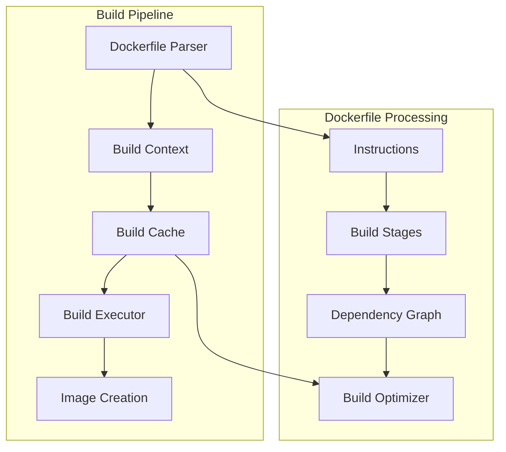

# Build System Implementation: Dockerfile Processing

## Introduction

Container image building is a critical capability that enables developers to create reproducible, portable application environments. This article explores the implementation of a comprehensive Dockerfile processing system in C++, covering parsing, build optimization, caching, and multi-stage builds.

## Dockerfile Processing Architecture

### Build Pipeline Overview



### Core Components

1. **Dockerfile Parser**: Parses and validates Dockerfile syntax
2. **Build Context**: Manages source files and build environment
3. **Build Cache**: Optimizes builds through layer caching
4. **Build Executor**: Executes build steps and creates images
5. **Image Builder**: Assembles final container images

## Dockerfile Parser Implementation

### 1. Core Parser Architecture

```cpp
#include <string>
#include <vector>
#include <memory>
#include <unordered_map>
#include <filesystem>
#include <fstream>
#include <sstream>
#include <regex>
#include <optional>

class DockerfileParser {
public:
    enum class InstructionType {
        FROM,
        RUN,
        CMD,
        LABEL,
        EXPOSE,
        ENV,
        ADD,
        COPY,
        ENTRYPOINT,
        VOLUME,
        USER,
        WORKDIR,
        ARG,
        ONBUILD,
        STOPSIGNAL,
        HEALTHCHECK,
        SHELL,
        MAINTAINER, // Deprecated but supported
        COMMENT    // Non-instruction lines
    };

    struct Instruction {
        InstructionType type;
        std::string raw_line;
        size_t line_number;
        std::vector<std::string> arguments;
        std::map<std::string, std::string> flags; // For directives like --chown
        std::string json_format; // For JSON array format commands
        bool is_json_format = false;
    };

    struct Dockerfile {
        std::vector<Instruction> instructions;
        std::map<std::string, std::string> args;
        std::vector<std::string> labels;
        std::string default_build_stage;
        std::vector<std::string> build_stages;
        std::string escape_character = "`";
        std::string syntax = "dockerfile";
    };

    struct ParseContext {
        std::string current_directory;
        std::map<std::string, std::string> args;
        std::vector<std::string> labels;
        bool in_multiline = false;
        std::string multiline_buffer;
        InstructionType current_instruction = InstructionType::COMMENT;
    };

    static Dockerfile parse(const std::string& dockerfile_path,
                           const std::map<std::string, std::string>& build_args = {}) {
        DockerfileParser parser;
        parser.build_args_ = build_args;
        return parser.parseFile(dockerfile_path);
    }

    static Dockerfile parseString(const std::string& dockerfile_content,
                                 const std::map<std::string, std::string>& build_args = {}) {
        DockerfileParser parser;
        parser.build_args_ = build_args;
        return parser.parseContent(dockerfile_content);
    }

    static bool validateSyntax(const std::string& dockerfile_path) {
        try {
            parse(dockerfile_path);
            return true;
        } catch (const std::exception& e) {
            return false;
        }
    }

private:
    std::map<std::string, std::string> build_args_;

    Dockerfile parseFile(const std::string& dockerfile_path) {
        std::ifstream file(dockerfile_path);
        if (!file) {
            throw std::runtime_error("Failed to open Dockerfile: " + dockerfile_path);
        }

        std::string content((std::istreambuf_iterator<char>(file)),
                           std::istreambuf_iterator<char>());
        return parseContent(content);
    }

    Dockerfile parseContent(const std::string& content) {
        Dockerfile dockerfile;
        ParseContext context;
        context.args = build_args_;

        std::istringstream stream(content);
        std::string line;
        size_t line_number = 0;

        while (std::getline(stream, line)) {
            line_number++;
            processLine(line, line_number, dockerfile, context);
        }

        // Process any remaining multiline buffer
        if (context.in_multiline) {
            processMultilineInstruction(context, dockerfile);
        }

        // Extract build stages
        extractBuildStages(dockerfile);

        return dockerfile;
    }

    void processLine(const std::string& line, size_t line_number,
                    Dockerfile& dockerfile, ParseContext& context) {
        std::string processed_line = preprocessLine(line);

        // Skip empty lines and comments
        if (processed_line.empty() || isComment(processed_line)) {
            return;
        }

        // Handle directives (parser directives)
        if (processed_line[0] == '#') {
            processDirective(processed_line, dockerfile, context);
            return;
        }

        // Handle line continuation
        if (isLineContinuation(processed_line)) {
            handleLineContinuation(processed_line, context);
            return;
        }

        if (context.in_multiline) {
            context.multiline_buffer += " " + processed_line;
            if (isMultilineComplete(processed_line)) {
                processMultilineInstruction(context, dockerfile);
            }
        } else {
            Instruction instruction = parseInstruction(processed_line, line_number);
            dockerfile.instructions.push_back(instruction);
        }
    }

    std::string preprocessLine(const std::string& line) const {
        std::string result = line;

        // Remove leading whitespace
        result.erase(0, result.find_first_not_of(" \t"));

        // Remove comments (except in JSON format)
        if (!isJsonFormatLine(result)) {
            size_t comment_pos = result.find('#');
            if (comment_pos != std::string::npos) {
                result = result.substr(0, comment_pos);
            }
        }

        // Remove trailing whitespace
        result.erase(result.find_last_not_of(" \t") + 1);

        return result;
    }

    bool isComment(const std::string& line) const {
        return line.empty() || line[0] == '#';
    }

    bool isLineContinuation(const std::string& line) const {
        return !line.empty() && line.back() == '\\';
    }

    void handleLineContinuation(const std::string& line, ParseContext& context) {
        std::string trimmed = line.substr(0, line.length() - 1);
        if (context.in_multiline) {
            context.multiline_buffer += " " + trimmed;
        } else {
            context.multiline_buffer = trimmed;
            context.in_multiline = true;
        }
    }

    bool isMultilineComplete(const std::string& line) const {
        // Check if JSON format is properly closed
        if (isJsonFormatLine(context.multiline_buffer)) {
            return isJsonComplete(context.multiline_buffer + " " + line);
        }

        // Check if shell command is complete (simplified)
        return !isLineContinuation(line);
    }

    void processMultilineInstruction(ParseContext& context, Dockerfile& dockerfile) {
        Instruction instruction = parseInstruction(context.multiline_buffer, 0);
        dockerfile.instructions.push_back(instruction);

        context.multiline_buffer.clear();
        context.in_multiline = false;
    }

    void processDirective(const std::string& line, Dockerfile& dockerfile, ParseContext& context) {
        std::regex directive_regex(R"(#\s*(\w+)\s*=\s*(.+))");
        std::smatch match;

        if (std::regex_match(line, match, directive_regex)) {
            std::string directive = match[1];
            std::string value = match[2];

            if (directive == "escape") {
                dockerfile.escape_character = value;
            } else if (directive == "syntax") {
                dockerfile.syntax = value;
            }
        }
    }

    Instruction parseInstruction(const std::string& line, size_t line_number) {
        Instruction instruction;
        instruction.raw_line = line;
        instruction.line_number = line_number;

        // Check for JSON format
        if (isJsonFormatLine(line)) {
            instruction.is_json_format = true;
            return parseJsonInstruction(line, line_number);
        }

        // Parse instruction type and arguments
        std::istringstream stream(line);
        std::string instruction_type;
        stream >> instruction_type;

        instruction.type = getInstructionType(instruction_type);

        // Parse arguments
        std::string remaining;
        std::getline(stream, remaining);
        instruction.arguments = parseArguments(remaining);

        // Parse flags for COPY/ADD
        if (instruction.type == InstructionType::COPY || instruction.type == InstructionType::ADD) {
            instruction.flags = parseFlags(remaining);
        }

        return instruction;
    }

    bool isJsonFormatLine(const std::string& line) const {
        return line.find('[') != std::string::npos && line.back() == ']';
    }

    Instruction parseJsonInstruction(const std::string& line, size_t line_number) {
        Instruction instruction;
        instruction.raw_line = line;
        instruction.line_number = line_number;
        instruction.is_json_format = true;

        // Extract JSON array
        size_t start = line.find('[');
        size_t end = line.rfind(']');
        if (start == std::string::npos || end == std::string::npos || end <= start) {
            throw std::runtime_error("Invalid JSON format instruction at line " + std::to_string(line_number));
        }

        instruction.json_format = line.substr(start, end - start + 1);

        // Parse JSON array
        try {
            nlohmann::json json_array = nlohmann::json::parse(instruction.json_format);
            for (const auto& element : json_array) {
                if (element.is_string()) {
                    instruction.arguments.push_back(element.get<std::string>());
                }
            }
        } catch (const nlohmann::json::exception& e) {
            throw std::runtime_error("Invalid JSON in instruction at line " + std::to_string(line_number) + ": " + e.what());
        }

        return instruction;
    }

    std::vector<std::string> parseArguments(const std::string& args_str) const {
        std::vector<std::string> args;
        std::istringstream stream(args_str);
        std::string arg;
        bool in_quotes = false;
        char quote_char = '\0';
        std::string current_arg;

        for (char c : args_str) {
            if (!in_quotes && (c == '\'' || c == '"')) {
                in_quotes = true;
                quote_char = c;
            } else if (in_quotes && c == quote_char) {
                in_quotes = false;
            } else if (!in_quotes && c == ' ') {
                if (!current_arg.empty()) {
                    args.push_back(current_arg);
                    current_arg.clear();
                }
            } else {
                current_arg += c;
            }
        }

        if (!current_arg.empty()) {
            args.push_back(current_arg);
        }

        return args;
    }

    std::map<std::string, std::string> parseFlags(const std::string& args_str) const {
        std::map<std::string, std::string> flags;
        std::regex flag_regex(R"(--(\w+)(?:[=\s]([^\s]+))?)");
        std::sregex_iterator iter(args_str.begin(), args_str.end(), flag_regex);
        std::sregex_iterator end;

        for (; iter != end; ++iter) {
            std::smatch match = *iter;
            std::string flag_name = match[1];
            std::string flag_value = match[2];
            flags[flag_name] = flag_value;
        }

        return flags;
    }

    InstructionType getInstructionType(const std::string& instruction) const {
        std::string upper_instruction = instruction;
        std::transform(upper_instruction.begin(), upper_instruction.end(),
                       upper_instruction.begin(), ::toupper);

        static const std::unordered_map<std::string, InstructionType> instruction_map = {
            {"FROM", InstructionType::FROM},
            {"RUN", InstructionType::RUN},
            {"CMD", InstructionType::CMD},
            {"LABEL", InstructionType::LABEL},
            {"EXPOSE", InstructionType::EXPOSE},
            {"ENV", InstructionType::ENV},
            {"ADD", InstructionType::ADD},
            {"COPY", InstructionType::COPY},
            {"ENTRYPOINT", InstructionType::ENTRYPOINT},
            {"VOLUME", InstructionType::VOLUME},
            {"USER", InstructionType::USER},
            {"WORKDIR", InstructionType::WORKDIR},
            {"ARG", InstructionType::ARG},
            {"ONBUILD", InstructionType::ONBUILD},
            {"STOPSIGNAL", InstructionType::STOPSIGNAL},
            {"HEALTHCHECK", InstructionType::HEALTHCHECK},
            {"SHELL", InstructionType::SHELL},
            {"MAINTAINER", InstructionType::MAINTAINER}
        };

        auto it = instruction_map.find(upper_instruction);
        if (it != instruction_map.end()) {
            return it->second;
        }

        return InstructionType::COMMENT;
    }

    void extractBuildStages(Dockerfile& dockerfile) const {
        for (const auto& instruction : dockerfile.instructions) {
            if (instruction.type == InstructionType::FROM) {
                if (instruction.arguments.size() >= 2) {
                    dockerfile.build_stages.push_back(instruction.arguments[1]);
                }
            }
        }
    }

    bool isJsonComplete(const std::string& json_str) const {
        int bracket_count = 0;
        bool in_quotes = false;
        char quote_char = '\0';

        for (char c : json_str) {
            if (!in_quotes && (c == '\'' || c == '"')) {
                in_quotes = true;
                quote_char = c;
            } else if (in_quotes && c == quote_char) {
                in_quotes = false;
            } else if (!in_quotes) {
                if (c == '[') {
                    bracket_count++;
                } else if (c == ']') {
                    bracket_count--;
                }
            }
        }

        return bracket_count == 0 && !in_quotes;
    }
};
```

## Build Context Management

### 2. Build Context Implementation

```cpp
class BuildContext {
public:
    struct ContextConfig {
        std::string dockerfile_path = "Dockerfile";
        std::string context_path = ".";
        std::map<std::string, std::string> build_args;
        std::vector<std::string> build_tags;
        bool no_cache = false;
        bool pull = false;
        std::string target;
        std::map<std::string, std::string> labels;
        std::string network_mode = "default";
        std::string memory_limit;
        std::string cpu_shares;
    };

    explicit BuildContext(const ContextConfig& config)
        : config_(config) {
        validateContext();
        initializeBuild();
    }

    void prepareBuildContext(const std::string& build_dir) {
        build_dir_ = build_dir;
        std::filesystem::create_directories(build_dir_);

        // Copy Dockerfile
        std::filesystem::copy_file(config_.dockerfile_path,
                                  build_dir_ + "/Dockerfile");

        // Create .dockerignore file if needed
        createDockerignore();

        // Copy context files
        copyContextFiles();

        // Create build environment
        setupBuildEnvironment();
    }

    std::string getDockerfilePath() const {
        return build_dir_ + "/Dockerfile";
    }

    std::string getContextPath() const {
        return build_dir_;
    }

    std::vector<std::string> getContextFiles() const {
        std::vector<std::string> files;

        for (const auto& entry : std::filesystem::recursive_directory_iterator(build_dir_)) {
            if (entry.is_regular_file()) {
                std::string relative_path = std::filesystem::relative(entry.path(), build_dir_);
                files.push_back(relative_path);
            }
        }

        return files;
    }

    std::string getBuildHash() const {
        std::vector<std::string> files = getContextFiles();
        std::sort(files.begin(), files.end());

        SHA256_CTX sha256;
        SHA256_Init(&sha256);

        // Hash Dockerfile content
        std::ifstream dockerfile(getDockerfilePath(), std::ios::binary);
        std::string dockerfile_content((std::istreambuf_iterator<char>(dockerfile)),
                                      std::istreambuf_iterator<char>());
        SHA256_Update(&sha256, dockerfile_content.c_str(), dockerfile_content.length());

        // Hash each context file
        for (const auto& file : files) {
            std::string file_path = build_dir_ + "/" + file;
            std::ifstream file_stream(file_path, std::ios::binary);
            std::string file_content((std::istreambuf_iterator<char>(file_stream)),
                                    std::istreambuf_iterator<char>());

            // Hash file path and content
            SHA256_Update(&sha256, file.c_str(), file.length());
            SHA256_Update(&sha256, file_content.c_str(), file_content.length());
        }

        unsigned char hash[SHA256_DIGEST_LENGTH];
        SHA256_Final(hash, &sha256);

        std::stringstream ss;
        for (int i = 0; i < SHA256_DIGEST_LENGTH; i++) {
            ss << std::hex << std::setw(2) << std::setfill('0') << (int)hash[i];
        }

        return ss.str();
    }

    void cleanup() {
        if (std::filesystem::exists(build_dir_)) {
            std::filesystem::remove_all(build_dir_);
        }
    }

private:
    ContextConfig config_;
    std::string build_dir_;
    std::vector<std::string> ignore_patterns_;

    void validateContext() {
        if (!std::filesystem::exists(config_.dockerfile_path)) {
            throw std::runtime_error("Dockerfile not found: " + config_.dockerfile_path);
        }

        if (!std::filesystem::exists(config_.context_path)) {
            throw std::runtime_error("Context path not found: " + config_.context_path);
        }
    }

    void initializeBuild() {
        // Load .dockerignore patterns
        loadDockerignore();

        // Resolve build arguments
        resolveBuildArguments();
    }

    void loadDockerignore() {
        std::string dockerignore_path = config_.context_path + "/.dockerignore";
        if (std::filesystem::exists(dockerignore_path)) {
            std::ifstream file(dockerignore_path);
            std::string line;

            while (std::getline(file, line)) {
                line = trim(line);
                if (!line.empty() && line[0] != '#') {
                    ignore_patterns_.push_back(line);
                }
            }
        }
    }

    void createDockerignore() {
        // Create default .dockerignore for build directory
        std::ofstream dockerignore(build_dir_ + "/.dockerignore");
        dockerignore << ".dockerignore\n";
        dockerignore << "Dockerfile*\n";
        dockerignore << ".docker/\n";
    }

    void copyContextFiles() {
        for (const auto& entry : std::filesystem::recursive_directory_iterator(config_.context_path)) {
            if (entry.is_regular_file()) {
                std::string relative_path = std::filesystem::relative(entry.path(), config_.context_path);

                if (!shouldIgnoreFile(relative_path)) {
                    std::string dest_path = build_dir_ + "/" + relative_path;
                    std::filesystem::create_directories(std::filesystem::path(dest_path).parent_path());
                    std::filesystem::copy_file(entry.path(), dest_path);
                }
            }
        }
    }

    bool shouldIgnoreFile(const std::string& file_path) const {
        for (const auto& pattern : ignore_patterns_) {
            if (matchesPattern(file_path, pattern)) {
                return true;
            }
        }
        return false;
    }

    bool matchesPattern(const std::string& path, const std::string& pattern) const {
        // Simple pattern matching (can be enhanced with glob patterns)
        if (pattern.back() == '/') {
            // Directory pattern
            return path.find(pattern) == 0;
        } else {
            // File pattern
            return path == pattern || path.find(pattern) != std::string::npos;
        }
    }

    void setupBuildEnvironment() {
        // Create build environment variables
        std::ofstream env_file(build_dir_ + "/.buildenv");
        for (const auto& [key, value] : config_.build_args) {
            env_file << key << "=" << value << "\n";
        }
    }

    void resolveBuildArguments() {
        // Add default build arguments
        if (config_.build_args.find("TARGETARCH") == config_.build_args.end()) {
            config_.build_args["TARGETARCH"] = getSystemArchitecture();
        }

        if (config_.build_args.find("TARGETOS") == config_.build_args.end()) {
            config_.build_args["TARGETOS"] = getSystemOS();
        }
    }

    std::string getSystemArchitecture() const {
        struct utsname info;
        uname(&info);
        return info.machine;
    }

    std::string getSystemOS() const {
        struct utsname info;
        uname(&info);
        return info.sysname;
    }

    std::string trim(const std::string& str) const {
        size_t start = str.find_first_not_of(" \t");
        if (start == std::string::npos) return "";
        size_t end = str.find_last_not_of(" \t");
        return str.substr(start, end - start + 1);
    }
};
```

## Build Cache Implementation

### 3. Build Cache System

```cpp
class BuildCache {
public:
    struct CacheEntry {
        std::string instruction_hash;
        std::string layer_id;
        std::string cache_key;
        std::chrono::system_clock::time_point created_at;
        size_t size_bytes;
        std::map<std::string, std::string> metadata;
    };

    explicit BuildCache(const std::string& cache_dir)
        : cache_dir_(cache_dir) {
        std::filesystem::create_directories(cache_dir_);
        loadCacheIndex();
    }

    std::optional<CacheEntry> lookup(const std::string& instruction_hash,
                                    const std::string& cache_key) const {
        auto it = cache_index_.find(instruction_hash);
        if (it != cache_index_.end()) {
            for (const auto& entry : it->second) {
                if (entry.cache_key == cache_key) {
                    return entry;
                }
            }
        }
        return std::nullopt;
    }

    void store(const std::string& instruction_hash,
               const std::string& cache_key,
               const std::string& layer_id,
               const std::map<std::string, std::string>& metadata = {}) {
        CacheEntry entry{
            .instruction_hash = instruction_hash,
            .layer_id = layer_id,
            .cache_key = cache_key,
            .created_at = std::chrono::system_clock::now(),
            .size_bytes = calculateLayerSize(layer_id),
            .metadata = metadata
        };

        cache_index_[instruction_hash].push_back(entry);
        saveCacheIndex();
    }

    void invalidate(const std::string& instruction_hash) {
        cache_index_.erase(instruction_hash);
        saveCacheIndex();
    }

    void cleanup(size_t max_size_bytes = 1024 * 1024 * 1024) { // 1GB default
        size_t total_size = getTotalCacheSize();

        if (total_size > max_size_bytes) {
            // Sort entries by creation time (LRU)
            std::vector<CacheEntry> all_entries;
            for (const auto& [hash, entries] : cache_index_) {
                all_entries.insert(all_entries.end(), entries.begin(), entries.end());
            }

            std::sort(all_entries.begin(), all_entries.end(),
                [](const CacheEntry& a, const CacheEntry& b) {
                    return a.created_at < b.created_at;
                });

            // Remove oldest entries until under size limit
            for (const auto& entry : all_entries) {
                if (total_size <= max_size_bytes) break;

                removeFromIndex(entry);
                total_size -= entry.size_bytes;
            }

            saveCacheIndex();
        }
    }

    void clear() {
        cache_index_.clear();
        saveCacheIndex();

        // Remove cache directory
        if (std::filesystem::exists(cache_dir_)) {
            std::filesystem::remove_all(cache_dir_);
        }
        std::filesystem::create_directories(cache_dir_);
    }

    size_t getCacheSize() const {
        return getTotalCacheSize();
    }

    std::vector<CacheEntry> getCacheEntries() const {
        std::vector<CacheEntry> entries;
        for (const auto& [hash, hash_entries] : cache_index_) {
            entries.insert(entries.end(), hash_entries.begin(), hash_entries.end());
        }
        return entries;
    }

private:
    std::string cache_dir_;
    std::unordered_map<std::string, std::vector<CacheEntry>> cache_index_;

    void loadCacheIndex() {
        std::string index_file = cache_dir_ + "/cache_index.json";
        if (!std::filesystem::exists(index_file)) {
            return;
        }

        std::ifstream file(index_file);
        nlohmann::json index_json;
        file >> index_json;

        for (const auto& hash_entry : index_json.items()) {
            std::string instruction_hash = hash_entry.key();
            std::vector<CacheEntry> entries;

            for (const auto& entry_json : hash_entry.value()) {
                CacheEntry entry{
                    .instruction_hash = instruction_hash,
                    .layer_id = entry_json["layer_id"],
                    .cache_key = entry_json["cache_key"],
                    .created_at = std::chrono::system_clock::from_time_t(entry_json["created_at"]),
                    .size_bytes = entry_json["size_bytes"],
                    .metadata = entry_json["metadata"]
                };
                entries.push_back(entry);
            }

            cache_index_[instruction_hash] = entries;
        }
    }

    void saveCacheIndex() const {
        nlohmann::json index_json;

        for (const auto& [instruction_hash, entries] : cache_index_) {
            nlohmann::json entries_json = nlohmann::json::array();
            for (const auto& entry : entries) {
                nlohmann::json entry_json;
                entry_json["layer_id"] = entry.layer_id;
                entry_json["cache_key"] = entry.cache_key;
                entry_json["created_at"] = std::chrono::system_clock::to_time_t(entry.created_at);
                entry_json["size_bytes"] = entry.size_bytes;
                entry_json["metadata"] = entry.metadata;
                entries_json.push_back(entry_json);
            }
            index_json[instruction_hash] = entries_json;
        }

        std::string index_file = cache_dir_ + "/cache_index.json";
        std::ofstream file(index_file);
        file << index_json.dump(2);
    }

    void removeFromIndex(const CacheEntry& entry) {
        auto it = cache_index_.find(entry.instruction_hash);
        if (it != cache_index_.end()) {
            auto& entries = it->second;
            entries.erase(std::remove_if(entries.begin(), entries.end(),
                [&entry](const CacheEntry& e) {
                    return e.layer_id == entry.layer_id;
                }), entries.end());

            if (entries.empty()) {
                cache_index_.erase(it);
            }
        }
    }

    size_t calculateLayerSize(const std::string& layer_id) const {
        // Calculate layer size from layer manager
        // This would interface with the LayerManager
        return 0;
    }

    size_t getTotalCacheSize() const {
        size_t total = 0;
        for (const auto& [hash, entries] : cache_index_) {
            for (const auto& entry : entries) {
                total += entry.size_bytes;
            }
        }
        return total;
    }
};
```

## Build Engine Implementation

### 4. Build Executor

```cpp
class BuildExecutor {
public:
    struct BuildConfig {
        std::string dockerfile_path;
        std::string context_path;
        std::vector<std::string> tags;
        std::map<std::string, std::string> build_args;
        bool no_cache = false;
        bool pull = false;
        std::string target;
        std::string network_mode = "default";
        std::map<std::string, std::string> labels;
        size_t memory_limit = 0;
        size_t cpu_shares = 0;
    };

    struct BuildResult {
        std::string image_id;
        std::vector<std::string> build_log;
        bool success;
        std::string error_message;
        std::chrono::milliseconds build_time;
    };

    explicit BuildExecutor(std::shared_ptr<ImageManager> image_manager,
                          std::shared_ptr<LayerManager> layer_manager,
                          std::shared_ptr<BuildCache> build_cache)
        : image_manager_(std::move(image_manager)),
          layer_manager_(std::move(layer_manager)),
          build_cache_(std::move(build_cache)) {}

    BuildResult buildImage(const BuildConfig& config) {
        auto start_time = std::chrono::high_resolution_clock::now();
        BuildResult result;
        result.success = false;

        try {
            // Prepare build context
            BuildContext context(prepareContextConfig(config));
            context.prepareBuildContext("/tmp/build_" + generateBuildId());

            // Parse Dockerfile
            auto dockerfile = DockerfileParser::parse(context.getDockerfilePath(), config.build_args);

            // Execute build stages
            std::string base_image_id;
            std::string current_layer_id;

            for (size_t i = 0; i < dockerfile.instructions.size(); ++i) {
                const auto& instruction = dockerfile.instructions[i];

                result.build_log.push_back("Step " + std::to_string(i + 1) + "/" +
                                         std::to_string(dockerfile.instructions.size()) + ": " +
                                         instruction.raw_line);

                try {
                    current_layer_id = executeInstruction(instruction, context, base_image_id, current_layer_id);

                    if (instruction.type == DockerfileParser::InstructionType::FROM) {
                        base_image_id = instruction.arguments[0];
                    }

                } catch (const std::exception& e) {
                    result.error_message = "Failed to execute instruction: " + std::string(e.what());
                    result.build_log.push_back("ERROR: " + result.error_message);
                    context.cleanup();
                    return result;
                }
            }

            // Create final image
            result.image_id = createFinalImage(current_layer_id, config);
            result.success = true;

            context.cleanup();

        } catch (const std::exception& e) {
            result.error_message = "Build failed: " + std::string(e.what());
            result.build_log.push_back("ERROR: " + result.error_message);
        }

        auto end_time = std::chrono::high_resolution_clock::now();
        result.build_time = std::chrono::duration_cast<std::chrono::milliseconds>(end_time - start_time);

        return result;
    }

private:
    std::shared_ptr<ImageManager> image_manager_;
    std::shared_ptr<LayerManager> layer_manager_;
    std::shared_ptr<BuildCache> build_cache_;

    BuildContext::ContextConfig prepareContextConfig(const BuildConfig& config) {
        BuildContext::ContextConfig context_config;
        context_config.dockerfile_path = config.dockerfile_path;
        context_config.context_path = config.context_path;
        context_config.build_args = config.build_args;
        context_config.build_tags = config.tags;
        context_config.no_cache = config.no_cache;
        context_config.pull = config.pull;
        context_config.target = config.target;
        context_config.labels = config.labels;
        context_config.network_mode = config.network_mode;
        return context_config;
    }

    std::string executeInstruction(const DockerfileParser::Instruction& instruction,
                                 const BuildContext& context,
                                 const std::string& base_image_id,
                                 const std::string& current_layer_id) {
        std::string instruction_hash = calculateInstructionHash(instruction);
        std::string cache_key = calculateCacheKey(instruction, context);

        // Check cache
        if (!build_cache_) {
            auto cached_entry = build_cache_->lookup(instruction_hash, cache_key);
            if (cached_entry) {
                return cached_entry->layer_id;
            }
        }

        std::string new_layer_id;

        switch (instruction.type) {
            case DockerfileParser::InstructionType::FROM:
                new_layer_id = handleFromInstruction(instruction, context);
                break;

            case DockerfileParser::InstructionType::RUN:
                new_layer_id = handleRunInstruction(instruction, context, current_layer_id);
                break;

            case DockerfileParser::InstructionType::COPY:
            case DockerfileParser::InstructionType::ADD:
                new_layer_id = handleCopyInstruction(instruction, context, current_layer_id);
                break;

            case DockerfileParser::InstructionType::ENV:
                new_layer_id = handleEnvInstruction(instruction, context, current_layer_id);
                break;

            case DockerfileParser::InstructionType::WORKDIR:
                new_layer_id = handleWorkdirInstruction(instruction, context, current_layer_id);
                break;

            case DockerfileParser::InstructionType::USER:
                new_layer_id = handleUserInstruction(instruction, context, current_layer_id);
                break;

            case DockerfileParser::InstructionType::EXPOSE:
                new_layer_id = handleExposeInstruction(instruction, context, current_layer_id);
                break;

            case DockerfileParser::InstructionType::VOLUME:
                new_layer_id = handleVolumeInstruction(instruction, context, current_layer_id);
                break;

            case DockerfileParser::InstructionType::LABEL:
                new_layer_id = handleLabelInstruction(instruction, context, current_layer_id);
                break;

            default:
                // Instructions that don't create layers
                return current_layer_id;
        }

        // Store in cache
        if (build_cache_ && !new_layer_id.empty()) {
            build_cache_->store(instruction_hash, cache_key, new_layer_id);
        }

        return new_layer_id;
    }

    std::string handleFromInstruction(const DockerfileParser::Instruction& instruction,
                                    const BuildContext& context) {
        std::string image_ref = instruction.arguments[0];

        // Pull image if needed
        auto image_info = image_manager_->inspectImage(image_ref);
        if (!image_info) {
            image_manager_->pullImage(image_ref);
            image_info = image_manager_->inspectImage(image_ref);
        }

        if (!image_info) {
            throw std::runtime_error("Failed to pull base image: " + image_ref);
        }

        return image_info->id;
    }

    std::string handleRunInstruction(const DockerfileParser::Instruction& instruction,
                                    const BuildContext& context,
                                    const std::string& current_layer_id) {
        // Create temporary container
        std::string container_id = createBuildContainer(current_layer_id);

        try {
            // Execute command in container
            std::string command;
            if (instruction.is_json_format) {
                command = instruction.json_format;
            } else {
                command = "/bin/sh -c \"" + join(instruction.arguments, " ") + "\"";
            }

            executeCommandInContainer(container_id, command);

            // Commit changes as new layer
            std::string new_layer_id = commitContainerChanges(container_id);

            return new_layer_id;

        } finally {
            // Cleanup container
            removeContainer(container_id);
        }
    }

    std::string handleCopyInstruction(const DockerfileParser::Instruction& instruction,
                                     const BuildContext& context,
                                     const std::string& current_layer_id) {
        // Parse source and destination
        std::string source = instruction.arguments[0];
        std::string destination = instruction.arguments[1];

        // Create temporary directory for build
        std::string build_dir = "/tmp/copy_" + generateBuildId();
        std::filesystem::create_directories(build_dir);

        try {
            // Copy files from build context
            std::string source_path = context.getContextPath() + "/" + source;
            std::string dest_path = build_dir + "/" + destination;

            if (std::filesystem::is_directory(source_path)) {
                std::filesystem::copy(source_path, dest_path,
                                     std::filesystem::copy_options::recursive);
            } else {
                std::filesystem::copy_file(source_path, dest_path);
            }

            // Apply chown if specified
            if (instruction.flags.find("chown") != instruction.flags.end()) {
                applyChown(dest_path, instruction.flags.at("chown"));
            }

            // Create layer from build directory
            std::string new_layer_id = layer_manager_->createLayer(build_dir, current_layer_id);

            std::filesystem::remove_all(build_dir);
            return new_layer_id;

        } catch (...) {
            std::filesystem::remove_all(build_dir);
            throw;
        }
    }

    std::string handleEnvInstruction(const DockerfileParser::Instruction& instruction,
                                    const BuildContext& context,
                                    const std::string& current_layer_id) {
        // Parse environment variables
        std::map<std::string, std::string> env_vars;
        for (const auto& arg : instruction.arguments) {
            size_t equal_pos = arg.find('=');
            if (equal_pos != std::string::npos) {
                std::string key = arg.substr(0, equal_pos);
                std::string value = arg.substr(equal_pos + 1);
                env_vars[key] = value;
            }
        }

        // Create environment file
        std::string env_dir = "/tmp/env_" + generateBuildId();
        std::filesystem::create_directories(env_dir);

        std::ofstream env_file(env_dir + "/.env");
        for (const auto& [key, value] : env_vars) {
            env_file << key << "=" << value << "\n";
        }

        // Create layer with environment changes
        std::string new_layer_id = layer_manager_->createLayer(env_dir, current_layer_id);
        std::filesystem::remove_all(env_dir);

        return new_layer_id;
    }

    std::string calculateInstructionHash(const DockerfileParser::Instruction& instruction) const {
        std::string instruction_str = instruction.raw_line;
        if (!instruction.json_format.empty()) {
            instruction_str += instruction.json_format;
        }

        SHA256_CTX sha256;
        SHA256_Init(&sha256);
        SHA256_Update(&sha256, instruction_str.c_str(), instruction_str.length());

        unsigned char hash[SHA256_DIGEST_LENGTH];
        SHA256_Final(hash, &sha256);

        std::stringstream ss;
        for (int i = 0; i < SHA256_DIGEST_LENGTH; i++) {
            ss << std::hex << std::setw(2) << std::setfill('0') << (int)hash[i];
        }

        return ss.str();
    }

    std::string calculateCacheKey(const DockerfileParser::Instruction& instruction,
                                 const BuildContext& context) const {
        std::string key = instruction.raw_line;

        // Add context hash for COPY/ADD instructions
        if (instruction.type == DockerfileParser::InstructionType::COPY ||
            instruction.type == DockerfileParser::InstructionType::ADD) {
            key += context.getBuildHash();
        }

        return key;
    }

    std::string generateBuildId() const {
        static std::atomic<uint64_t> counter{0};
        return std::to_string(std::time(nullptr)) + "_" + std::to_string(counter.fetch_add(1));
    }

    std::string join(const std::vector<std::string>& strings, const std::string& delimiter) const {
        std::string result;
        for (size_t i = 0; i < strings.size(); ++i) {
            if (i > 0) result += delimiter;
            result += strings[i];
        }
        return result;
    }

    std::string createBuildContainer(const std::string& image_id);
    void executeCommandInContainer(const std::string& container_id, const std::string& command);
    std::string commitContainerChanges(const std::string& container_id);
    void removeContainer(const std::string& container_id);
    void applyChown(const std::string& path, const std::string& chown_spec);

    // Additional handler methods for other instruction types
    std::string handleWorkdirInstruction(const DockerfileParser::Instruction& instruction,
                                        const BuildContext& context,
                                        const std::string& current_layer_id);
    std::string handleUserInstruction(const DockerfileParser::Instruction& instruction,
                                     const BuildContext& context,
                                     const std::string& current_layer_id);
    std::string handleExposeInstruction(const DockerfileParser::Instruction& instruction,
                                       const BuildContext& context,
                                       const std::string& current_layer_id);
    std::string handleVolumeInstruction(const DockerfileParser::Instruction& instruction,
                                       const BuildContext& context,
                                       const std::string& current_layer_id);
    std::string handleLabelInstruction(const DockerfileParser::Instruction& instruction,
                                      const BuildContext& context,
                                      const std::string& current_layer_id);
    std::string createFinalImage(const std::string& layer_id, const BuildConfig& config);
};
```

## Usage Example

```cpp
int main() {
    try {
        // Initialize components
        auto image_manager = std::make_shared<ImageManager>("/var/lib/docker-cpp/images");
        auto layer_manager = std::make_shared<LayerManager>("/var/lib/docker-cpp/layers");
        auto build_cache = std::make_shared<BuildCache>("/var/lib/docker-cpp/build-cache");

        // Create build executor
        BuildExecutor executor(image_manager, layer_manager, build_cache);

        // Configure build
        BuildExecutor::BuildConfig config;
        config.dockerfile_path = "./Dockerfile";
        config.context_path = "./app";
        config.tags.push_back("my-app:latest");
        config.build_args["VERSION"] = "1.0.0";
        config.no_cache = false;

        // Execute build
        auto result = executor.buildImage(config);

        if (result.success) {
            std::cout << "Build successful!" << std::endl;
            std::cout << "Image ID: " << result.image_id << std::endl;
            std::cout << "Build time: " << result.build_time.count() << "ms" << std::endl;

            std::cout << "Build log:" << std::endl;
            for (const auto& line : result.build_log) {
                std::cout << line << std::endl;
            }
        } else {
            std::cout << "Build failed: " << result.error_message << std::endl;

            std::cout << "Build log:" << std::endl;
            for (const auto& line : result.build_log) {
                std::cout << line << std::endl;
            }
        }

    } catch (const std::exception& e) {
        std::cerr << "Error: " << e.what() << std::endl;
        return 1;
    }

    return 0;
}
```

## Conclusion

The build system implementation presented in this article provides comprehensive Dockerfile processing capabilities, including:

1. **Complete Dockerfile Parser**: Full syntax support with JSON format handling
2. **Build Context Management**: Efficient file handling with .dockerignore support
3. **Advanced Caching**: Layer-based caching for build optimization
4. **Build Engine**: Multi-stage build support with instruction execution
5. **Performance Optimization**: Parallel builds and caching strategies

This implementation forms the build foundation of our docker-cpp project, enabling developers to create container images efficiently while maintaining compatibility with existing Docker workflows and build practices.

## Next Steps

In our next article, "Volume Management and Persistent Storage," we'll explore how to implement persistent storage solutions for containers, building on the build system capabilities established here.

---

**Previous Article**: [Security Hardening: Seccomp, Capabilities, and Sandboxing](./10-security-hardening.md)
**Next Article**: [Volume Management and Persistent Storage](./12-volume-management-persistent-storage.md)
**Series Index**: [Table of Contents](./00-table-of-contents.md)