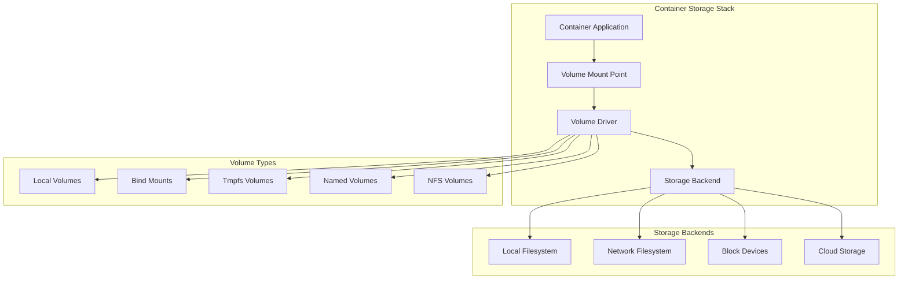

# Volume Management and Persistent Storage

## Introduction

Persistent storage is essential for stateful container applications, enabling data to survive container restarts and updates. This article explores the implementation of a comprehensive volume management system in C++, covering volume drivers, bind mounts, tmpfs, and data persistence strategies for containerized applications.

## Storage Architecture Overview

### Volume Management Hierarchy



### Volume Types and Use Cases

| Volume Type | Use Case | Persistence | Performance | Scope |
|-------------|----------|-------------|-------------|-------|
| **Named Volumes** | Database storage, persistent data | Container lifetime | Good | Host-local |
| **Bind Mounts** | Development, configuration files | Host lifetime | Excellent | Host-local |
| **Tmpfs** | Temporary files, secrets | Container lifetime | Excellent | Memory |
| **NFS/SMB** | Shared storage, distributed apps | Network lifetime | Good | Network |
| **Block Storage** | High-performance databases | Persistent | Excellent | Various |

## Volume Manager Architecture

### 1. Core Volume Manager

```cpp
#include <string>
#include <vector>
#include <memory>
#include <unordered_map>
#include <filesystem>
#include <fstream>
#include <sstream>
#include <sys/stat.h>
#include <sys/mount.h>
#include <unistd.h>

class VolumeManager {
public:
    enum class VolumeType {
        LOCAL,
        BIND,
        TMPFS,
        NFS,
        CIFS,
        PLUGIN
    };

    struct VolumeConfig {
        std::string name;
        VolumeType type;
        std::string driver = "local";
        std::map<std::string, std::string> options;
        std::string source; // For bind mounts
        std::string destination; // Mount point in container
        bool read_only = false;
        std::string propagation_mode = "rprivate";
        std::map<std::string, std::string> labels;
        std::string scope = "local";
    };

    struct VolumeInfo {
        std::string name;
        std::string driver;
        VolumeType type;
        std::string mountpoint;
        std::string created_at;
        std::map<std::string, std::string> options;
        std::map<std::string, std::string> labels;
        size_t size_bytes = 0;
        std::vector<std::string> containers; // Containers using this volume
        bool anonymous = false;
    };

    struct MountConfig {
        std::string volume_name;
        std::string container_path;
        bool read_only = false;
        std::string propagation_mode = "rprivate";
        std::map<std::string, std::string> mount_options;
        std::string selinux_label;
        std::map<std::string, std::string> bind_options;
    };

    explicit VolumeManager(const std::string& storage_dir)
        : storage_dir_(storage_dir) {
        initializeStorage();
        loadVolumeDrivers();
        loadVolumeMetadata();
    }

    // Volume lifecycle management
    std::string createVolume(const VolumeConfig& config);
    void removeVolume(const std::string& volume_name, bool force = false);
    std::optional<VolumeInfo> inspectVolume(const std::string& volume_name) const;
    std::vector<VolumeInfo> listVolumes(bool all = false) const;
    bool volumeExists(const std::string& volume_name) const;

    // Volume operations
    void mountVolume(const std::string& volume_name, const std::string& container_id,
                    const MountConfig& mount_config);
    void unmountVolume(const std::string& volume_name, const std::string& container_id);
    std::string getVolumePath(const std::string& volume_name) const;

    // Bind mount operations
    std::string createBindMount(const std::string& source_path,
                               const std::string& container_path,
                               bool read_only = false);
    void removeBindMount(const std::string& container_id, const std::string& container_path);

    // Tmpfs operations
    std::string createTmpfsMount(const std::string& container_path,
                                size_t size_bytes = 0,
                                const std::map<std::string, std::string>& options = {});
    void removeTmpfsMount(const std::string& container_id, const std::string& container_path);

    // Volume cleanup and maintenance
    void pruneVolumes(bool all = false);
    void cleanupUnusedVolumes();
    std::vector<std::string> getVolumeUsage() const;

    // Volume driver management
    void registerVolumeDriver(const std::string& name, std::shared_ptr<IVolumeDriver> driver);
    std::vector<std::string> listVolumeDrivers() const;

private:
    std::string storage_dir_;
    std::unordered_map<std::string, VolumeInfo> volumes_;
    std::unordered_map<std::string, std::shared_ptr<IVolumeDriver>> volume_drivers_;
    std::unordered_map<std::string, std::vector<std::string>> container_mounts_;
    std::unique_ptr<LocalVolumeDriver> local_driver_;
    std::unique_ptr<BindMountDriver> bind_driver_;
    std::unique_ptr<TmpfsDriver> tmpfs_driver_;

    void initializeStorage();
    void loadVolumeDrivers();
    void loadVolumeMetadata();
    void saveVolumeMetadata();
    std::string generateVolumeId() const;
    void validateVolumeConfig(const VolumeConfig& config) const;
    void updateVolumeUsage(const std::string& volume_name, const std::string& container_id, bool add = true);
};
```

### 2. Volume Driver Interface

```cpp
class IVolumeDriver {
public:
    virtual ~IVolumeDriver() = default;

    struct DriverCapabilities {
        bool supports_mount_options = true;
        bool supports_read_only = true;
        bool supports_propagation = true;
        bool supports_selinux = true;
        bool supports_size_limits = false;
        std::vector<std::string> supported_options;
    };

    struct CreateRequest {
        std::string name;
        std::map<std::string, std::string> options;
        std::map<std::string, std::string> labels;
    };

    struct MountRequest {
        std::string volume_id;
        std::string target_path;
        std::map<std::string, std::string> options;
        bool read_only = false;
        std::string propagation_mode = "rprivate";
        std::string selinux_label;
    };

    virtual std::string createVolume(const CreateRequest& request) = 0;
    virtual void removeVolume(const std::string& volume_id) = 0;
    virtual void mountVolume(const std::string& volume_id, const MountRequest& request) = 0;
    virtual void unmountVolume(const std::string& volume_id, const std::string& target_path) = 0;
    virtual std::string getVolumePath(const std::string& volume_id) const = 0;
    virtual VolumeInfo getVolumeInfo(const std::string& volume_id) const = 0;
    virtual DriverCapabilities getCapabilities() const = 0;
    virtual std::string getDriverName() const = 0;
    virtual bool volumeExists(const std::string& volume_id) const = 0;
    virtual size_t getVolumeSize(const std::string& volume_id) const = 0;
};
```

### 3. Local Volume Driver Implementation

```cpp
class LocalVolumeDriver : public IVolumeDriver {
public:
    explicit LocalVolumeDriver(const std::string& storage_dir)
        : storage_dir_(storage_dir) {
        std::filesystem::create_directories(storage_dir_);
    }

    std::string createVolume(const CreateRequest& request) override {
        std::string volume_id = generateVolumeId();
        std::string volume_path = storage_dir_ + "/" + volume_id;

        // Create volume directory
        std::filesystem::create_directories(volume_path);

        // Set appropriate permissions
        std::filesystem::permissions(volume_path,
            std::filesystem::perms::owner_all |
            std::filesystem::perms::group_read |
            std::filesystem::perms::group_exec |
            std::filesystem::perms::others_read |
            std::filesystem::perms::others_exec);

        // Save volume metadata
        saveVolumeMetadata(volume_id, request);

        return volume_id;
    }

    void removeVolume(const std::string& volume_id) override {
        std::string volume_path = storage_dir_ + "/" + volume_id;

        if (std::filesystem::exists(volume_path)) {
            std::filesystem::remove_all(volume_path);
        }

        // Remove metadata file
        std::string metadata_file = storage_dir_ + "/" + volume_id + ".json";
        std::filesystem::remove(metadata_file);
    }

    void mountVolume(const std::string& volume_id, const MountRequest& request) override {
        std::string source_path = getVolumePath(volume_id);
        std::string target_path = request.target_path;

        // Ensure target directory exists
        std::filesystem::create_directories(std::filesystem::path(target_path).parent_path());

        // Prepare mount options
        std::vector<std::string> mount_options;
        if (request.read_only) {
            mount_options.push_back("ro");
        }
        mount_options.push_back("bind");

        // Apply propagation mode
        if (!request.propagation_mode.empty()) {
            mount_options.push_back(request.propagation_mode);
        }

        // Apply SELinux label if provided
        if (!request.selinux_label.empty()) {
            mount_options.push_back("context=" + request.selinux_label);
        }

        // Add custom options
        for (const auto& [key, value] : request.options) {
            mount_options.push_back(key + "=" + value);
        }

        std::string options_str = join(mount_options, ",");

        // Perform bind mount
        if (mount(source_path.c_str(), target_path.c_str(), "bind", 0, nullptr) == -1) {
            throw std::system_error(errno, std::system_category(),
                                  "Failed to mount volume: " + source_path + " -> " + target_path);
        }

        // Apply mount options (remount)
        if (!mount_options.empty()) {
            if (mount(source_path.c_str(), target_path.c_str(), "bind",
                     MS_REMOUNT, nullptr) == -1) {
                throw std::system_error(errno, std::system_category(),
                                      "Failed to remount volume with options");
            }
        }
    }

    void unmountVolume(const std::string& volume_id, const std::string& target_path) override {
        if (umount2(target_path.c_str(), MNT_DETACH) == -1) {
            // Log warning but don't throw - cleanup should continue
            std::cerr << "Warning: Failed to unmount volume " << volume_id
                      << " from " << target_path << ": " << strerror(errno) << std::endl;
        }
    }

    std::string getVolumePath(const std::string& volume_id) const override {
        return storage_dir_ + "/" + volume_id;
    }

    VolumeInfo getVolumeInfo(const std::string& volume_id) const override {
        std::string metadata_file = storage_dir_ + "/" + volume_id + ".json";
        if (!std::filesystem::exists(metadata_file)) {
            throw std::runtime_error("Volume metadata not found: " + volume_id);
        }

        std::ifstream file(metadata_file);
        nlohmann::json metadata;
        file >> metadata;

        VolumeInfo info;
        info.name = metadata["name"];
        info.driver = getDriverName();
        info.type = VolumeManager::VolumeType::LOCAL;
        info.mountpoint = getVolumePath(volume_id);
        info.created_at = metadata["created_at"];
        info.options = metadata["options"];
        info.labels = metadata["labels"];
        info.size_bytes = calculateDirectorySize(info.mountpoint);

        return info;
    }

    DriverCapabilities getCapabilities() const override {
        DriverCapabilities caps;
        caps.supports_mount_options = true;
        caps.supports_read_only = true;
        caps.supports_propagation = true;
        caps.supports_selinux = true;
        caps.supports_size_limits = false;
        caps.supported_options = {"uid", "gid", "mode"};
        return caps;
    }

    std::string getDriverName() const override {
        return "local";
    }

    bool volumeExists(const std::string& volume_id) const override {
        std::string volume_path = storage_dir_ + "/" + volume_id;
        return std::filesystem::exists(volume_path);
    }

    size_t getVolumeSize(const std::string& volume_id) const override {
        std::string volume_path = storage_dir_ + "/" + volume_id;
        return calculateDirectorySize(volume_path);
    }

private:
    std::string storage_dir_;

    std::string generateVolumeId() const {
        static std::atomic<uint64_t> counter{0};
        return "local_" + std::to_string(std::time(nullptr)) + "_" +
               std::to_string(counter.fetch_add(1));
    }

    void saveVolumeMetadata(const std::string& volume_id, const CreateRequest& request) const {
        nlohmann::json metadata;
        metadata["name"] = request.name;
        metadata["created_at"] = getCurrentTimestamp();
        metadata["options"] = request.options;
        metadata["labels"] = request.labels;

        std::string metadata_file = storage_dir_ + "/" + volume_id + ".json";
        std::ofstream file(metadata_file);
        file << metadata.dump(2);
    }

    size_t calculateDirectorySize(const std::string& path) const {
        size_t total_size = 0;

        for (const auto& entry : std::filesystem::recursive_directory_iterator(path)) {
            if (entry.is_regular_file()) {
                total_size += entry.file_size();
            }
        }

        return total_size;
    }

    std::string getCurrentTimestamp() const {
        auto now = std::chrono::system_clock::now();
        auto time_t = std::chrono::system_clock::to_time_t(now);
        std::stringstream ss;
        ss << std::put_time(std::gmtime(&time_t), "%Y-%m-%dT%H:%M:%SZ");
        return ss.str();
    }

    std::string join(const std::vector<std::string>& strings, const std::string& delimiter) const {
        std::string result;
        for (size_t i = 0; i < strings.size(); ++i) {
            if (i > 0) result += delimiter;
            result += strings[i];
        }
        return result;
    }
};
```

### 4. Bind Mount Driver Implementation

```cpp
class BindMountDriver : public IVolumeDriver {
public:
    explicit BindMountDriver() = default;

    std::string createVolume(const CreateRequest& request) override {
        // Bind mounts don't create volumes, they use existing directories
        std::string source_path = request.options.at("source");

        if (!std::filesystem::exists(source_path)) {
            // Auto-create directory if it doesn't exist
            std::filesystem::create_directories(source_path);
        }

        return source_path; // Use source path as volume ID
    }

    void removeVolume(const std::string& volume_id) override {
        // Bind mounts don't remove the source directory
        // This is a no-op for bind mounts
    }

    void mountVolume(const std::string& volume_id, const MountRequest& request) override {
        std::string source_path = volume_id; // volume_id is the source path for bind mounts
        std::string target_path = request.target_path;

        // Ensure target directory exists
        std::filesystem::create_directories(std::filesystem::path(target_path).parent_path());

        // Prepare mount options
        std::vector<std::string> mount_options;
        mount_options.push_back("bind");

        if (request.read_only) {
            mount_options.push_back("ro");
        }

        // Apply propagation mode
        if (!request.propagation_mode.empty()) {
            mount_options.push_back(request.propagation_mode);
        }

        // Apply SELinux label
        if (!request.selinux_label.empty()) {
            mount_options.push_back("context=" + request.selinux_label);
        }

        // Apply bind-specific options
        for (const auto& [key, value] : request.options) {
            if (key == "rbind") {
                mount_options.push_back("rbind");
            } else if (key == "nosuid") {
                mount_options.push_back("nosuid");
            } else if (key == "nodev") {
                mount_options.push_back("nodev");
            } else if (key == "noexec") {
                mount_options.push_back("noexec");
            }
        }

        // Perform initial bind mount
        if (mount(source_path.c_str(), target_path.c_str(), "bind", 0, nullptr) == -1) {
            throw std::system_error(errno, std::system_category(),
                                  "Failed to create bind mount: " + source_path + " -> " + target_path);
        }

        // Remount with options
        if (!mount_options.empty()) {
            unsigned long flags = MS_REMOUNT | MS_BIND;

            // Parse mount flags
            for (const auto& option : mount_options) {
                if (option == "ro") {
                    flags |= MS_RDONLY;
                } else if (option == "nosuid") {
                    flags |= MS_NOSUID;
                } else if (option == "nodev") {
                    flags |= MS_NODEV;
                } else if (option == "noexec") {
                    flags |= MS_NOEXEC;
                }
            }

            if (mount(source_path.c_str(), target_path.c_str(), "bind", flags, nullptr) == -1) {
                // Attempt to unmount and throw error
                umount2(target_path.c_str(), MNT_DETACH);
                throw std::system_error(errno, std::system_category(),
                                      "Failed to remount bind mount with options");
            }
        }
    }

    void unmountVolume(const std::string& volume_id, const std::string& target_path) override {
        if (umount2(target_path.c_str(), MNT_DETACH) == -1) {
            std::cerr << "Warning: Failed to unmount bind mount " << volume_id
                      << " from " << target_path << ": " << strerror(errno) << std::endl;
        }
    }

    std::string getVolumePath(const std::string& volume_id) const override {
        return volume_id; // For bind mounts, volume_id is the source path
    }

    VolumeInfo getVolumeInfo(const std::string& volume_id) const override {
        VolumeInfo info;
        info.name = volume_id; // Use source path as name
        info.driver = getDriverName();
        info.type = VolumeManager::VolumeType::BIND;
        info.mountpoint = volume_id;
        info.created_at = "unknown"; // Bind mounts don't have creation time
        info.size_bytes = calculateDirectorySize(volume_id);
        info.anonymous = true; // Bind mounts are typically anonymous

        return info;
    }

    DriverCapabilities getCapabilities() const override {
        DriverCapabilities caps;
        caps.supports_mount_options = true;
        caps.supports_read_only = true;
        caps.supports_propagation = true;
        caps.supports_selinux = true;
        caps.supports_size_limits = false;
        caps.supported_options = {"rbind", "nosuid", "nodev", "noexec", "source"};
        return caps;
    }

    std::string getDriverName() const override {
        return "bind";
    }

    bool volumeExists(const std::string& volume_id) const override {
        return std::filesystem::exists(volume_id);
    }

    size_t getVolumeSize(const std::string& volume_id) const override {
        return calculateDirectorySize(volume_id);
    }

private:
    size_t calculateDirectorySize(const std::string& path) const {
        size_t total_size = 0;

        try {
            for (const auto& entry : std::filesystem::recursive_directory_iterator(path)) {
                if (entry.is_regular_file()) {
                    total_size += entry.file_size();
                }
            }
        } catch (const std::filesystem::filesystem_error&) {
            // Directory might not be accessible
        }

        return total_size;
    }
};
```

### 5. Tmpfs Driver Implementation

```cpp
class TmpfsDriver : public IVolumeDriver {
public:
    explicit TmpfsDriver() = default;

    std::string createVolume(const CreateRequest& request) override {
        // Tmpfs volumes are created on-demand during mount
        std::string volume_id = generateTmpfsId();
        return volume_id;
    }

    void removeVolume(const std::string& volume_id) override {
        // Tmpfs volumes are automatically cleaned up on unmount
        // No explicit cleanup needed
    }

    void mountVolume(const std::string& volume_id, const MountRequest& request) override {
        std::string target_path = request.target_path;

        // Ensure target directory exists
        std::filesystem::create_directories(std::filesystem::path(target_path).parent_path());

        // Prepare mount options
        std::vector<std::string> mount_options;

        if (request.read_only) {
            mount_options.push_back("ro");
        }

        // Default size if not specified
        std::string size_option = "size=100m";
        auto size_it = request.options.find("size");
        if (size_it != request.options.end()) {
            size_option = "size=" + size_it->second;
        }
        mount_options.push_back(size_option);

        // Apply SELinux label
        if (!request.selinux_label.empty()) {
            mount_options.push_back("context=" + request.selinux_label);
        }

        // Apply tmpfs-specific options
        for (const auto& [key, value] : request.options) {
            if (key == "mode") {
                mount_options.push_back("mode=" + value);
            } else if (key == "uid") {
                mount_options.push_back("uid=" + value);
            } else if (key == "gid") {
                mount_options.push_back("gid=" + value);
            } else if (key == "nr_inodes") {
                mount_options.push_back("nr_inodes=" + value);
            } else if (key == "nr_blocks") {
                mount_options.push_back("nr_blocks=" + value);
            }
        }

        std::string options_str = join(mount_options, ",");

        // Mount tmpfs
        if (mount("tmpfs", target_path.c_str(), "tmpfs", 0, options_str.c_str()) == -1) {
            throw std::system_error(errno, std::system_category(),
                                  "Failed to mount tmpfs: " + target_path);
        }
    }

    void unmountVolume(const std::string& volume_id, const std::string& target_path) override {
        if (umount2(target_path.c_str(), MNT_DETACH) == -1) {
            std::cerr << "Warning: Failed to unmount tmpfs " << volume_id
                      << " from " << target_path << ": " << strerror(errno) << std::endl;
        }
    }

    std::string getVolumePath(const std::string& volume_id) const override {
        // Tmpfs doesn't have a persistent path
        return "tmpfs:" + volume_id;
    }

    VolumeInfo getVolumeInfo(const std::string& volume_id) const override {
        VolumeInfo info;
        info.name = "tmpfs-" + volume_id;
        info.driver = getDriverName();
        info.type = VolumeManager::VolumeType::TMPFS;
        info.mountpoint = getVolumePath(volume_id);
        info.created_at = "runtime"; // Tmpfs is created at runtime
        info.size_bytes = 0; // Size is not applicable for tmpfs
        info.anonymous = true;

        return info;
    }

    DriverCapabilities getCapabilities() const override {
        DriverCapabilities caps;
        caps.supports_mount_options = true;
        caps.supports_read_only = true;
        caps.supports_propagation = false;
        caps.supports_selinux = true;
        caps.supports_size_limits = true;
        caps.supported_options = {"size", "mode", "uid", "gid", "nr_inodes", "nr_blocks"};
        return caps;
    }

    std::string getDriverName() const override {
        return "tmpfs";
    }

    bool volumeExists(const std::string& volume_id) const override {
        // Tmpfs volumes exist only when mounted
        return false;
    }

    size_t getVolumeSize(const std::string& volume_id) const override {
        // Size is not applicable for tmpfs (in-memory)
        return 0;
    }

private:
    std::string generateTmpfsId() const {
        static std::atomic<uint64_t> counter{0};
        return "tmpfs_" + std::to_string(counter.fetch_add(1));
    }

    std::string join(const std::vector<std::string>& strings, const std::string& delimiter) const {
        std::string result;
        for (size_t i = 0; i < strings.size(); ++i) {
            if (i > 0) result += delimiter;
            result += strings[i];
        }
        return result;
    }
};
```

## Container Integration

### 6. Container Volume Manager

```cpp
class ContainerVolumeManager {
public:
    struct ContainerVolumeConfig {
        std::string volume_name;
        std::string container_path;
        bool read_only = false;
        std::string propagation_mode = "rprivate";
        std::map<std::string, std::string> options;
        std::string volume_type; // "volume", "bind", "tmpfs"
    };

    explicit ContainerVolumeManager(std::shared_ptr<VolumeManager> volume_manager)
        : volume_manager_(std::move(volume_manager)) {}

    void setupContainerVolumes(const std::string& container_id,
                              const std::vector<ContainerVolumeConfig>& volume_configs) {
        for (const auto& config : volume_configs) {
            try {
                setupContainerVolume(container_id, config);
            } catch (const std::exception& e) {
                // Cleanup already mounted volumes
                cleanupContainerVolumes(container_id);
                throw;
            }
        }
    }

    void cleanupContainerVolumes(const std::string& container_id) {
        // Get all volumes mounted for this container
        auto mounted_volumes = getMountedVolumes(container_id);

        // Unmount in reverse order
        for (auto it = mounted_volumes.rbegin(); it != mounted_volumes.rend(); ++it) {
            try {
                const auto& [volume_name, container_path] = *it;
                volume_manager_->unmountVolume(volume_name, container_id);
            } catch (const std::exception& e) {
                std::cerr << "Warning: Failed to unmount volume " << volume_name
                          << " for container " << container_id << ": " << e.what() << std::endl;
            }
        }

        // Clear mount tracking
        container_mounts_.erase(container_id);
    }

    std::vector<std::pair<std::string, std::string>> getMountedVolumes(const std::string& container_id) const {
        auto it = container_mounts_.find(container_id);
        if (it != container_mounts_.end()) {
            return it->second;
        }
        return {};
    }

    std::string getVolumeMountPoint(const std::string& container_id,
                                   const std::string& volume_name) const {
        auto mounted_volumes = getMountedVolumes(container_id);
        for (const auto& [vol_name, mount_point] : mounted_volumes) {
            if (vol_name == volume_name) {
                return mount_point;
            }
        }
        return "";
    }

private:
    std::shared_ptr<VolumeManager> volume_manager_;
    std::unordered_map<std::string, std::vector<std::pair<std::string, std::string>>> container_mounts_;

    void setupContainerVolume(const std::string& container_id,
                            const ContainerVolumeConfig& config) {
        std::string volume_id;

        if (config.volume_type == "bind") {
            // Handle bind mount
            if (config.options.find("source") == config.options.end()) {
                throw std::runtime_error("Bind mount requires source path");
            }

            std::string source_path = config.options.at("source");
            volume_id = volume_manager_->createBindMount(source_path, config.container_path,
                                                      config.read_only);

        } else if (config.volume_type == "tmpfs") {
            // Handle tmpfs mount
            size_t size_bytes = 100 * 1024 * 1024; // Default 100MB
            auto size_it = config.options.find("size");
            if (size_it != config.options.end()) {
                size_bytes = parseSize(size_it->second);
            }

            volume_id = volume_manager_->createTmpfsMount(config.container_path, size_bytes,
                                                         config.options);

        } else {
            // Handle named volume
            if (!volume_manager_->volumeExists(config.volume_name)) {
                VolumeManager::VolumeConfig volume_config;
                volume_config.name = config.volume_name;
                volume_config.type = VolumeManager::VolumeType::LOCAL;
                volume_config.options = config.options;

                volume_id = volume_manager_->createVolume(volume_config);
            } else {
                volume_id = config.volume_name;
            }

            // Mount the volume
            VolumeManager::MountConfig mount_config;
            mount_config.volume_name = volume_id;
            mount_config.container_path = config.container_path;
            mount_config.read_only = config.read_only;
            mount_config.propagation_mode = config.propagation_mode;
            mount_config.mount_options = config.options;

            volume_manager_->mountVolume(volume_id, container_id, mount_config);
        }

        // Track the mount
        container_mounts_[container_id].emplace_back(volume_id, config.container_path);
    }

    size_t parseSize(const std::string& size_str) const {
        std::regex size_regex(R"(^(\d+)([bkmg]?)$)", std::regex_constants::icase);
        std::smatch match;

        if (!std::regex_match(size_str, match, size_regex)) {
            throw std::runtime_error("Invalid size format: " + size_str);
        }

        size_t value = std::stoull(match[1]);
        std::string unit = match[2];

        if (unit.empty() || unit == "b") {
            return value;
        } else if (unit == "k" || unit == "kb") {
            return value * 1024;
        } else if (unit == "m" || unit == "mb") {
            return value * 1024 * 1024;
        } else if (unit == "g" || unit == "gb") {
            return value * 1024 * 1024 * 1024;
        }

        throw std::runtime_error("Unsupported size unit: " + unit);
    }
};
```

## Usage Example

```cpp
int main() {
    try {
        // Initialize volume manager
        auto volume_manager = std::make_shared<VolumeManager>("/var/lib/docker-cpp/volumes");
        auto container_volume_manager = std::make_shared<ContainerVolumeManager>(volume_manager);

        // Create a named volume
        VolumeManager::VolumeConfig config;
        config.name = "my-data-volume";
        config.type = VolumeManager::VolumeType::LOCAL;
        config.options["uid"] = "1000";
        config.options["gid"] = "1000";

        std::string volume_id = volume_manager->createVolume(config);
        std::cout << "Created volume: " << volume_id << std::endl;

        // Inspect volume
        auto volume_info = volume_manager->inspectVolume(volume_id);
        if (volume_info) {
            std::cout << "Volume path: " << volume_info->mountpoint << std::endl;
            std::cout << "Volume size: " << volume_info->size_bytes << " bytes" << std::endl;
        }

        // Setup container volumes
        std::vector<ContainerVolumeManager::ContainerVolumeConfig> volume_configs;

        // Named volume
        ContainerVolumeManager::ContainerVolumeConfig named_vol;
        named_vol.volume_name = "my-data-volume";
        named_vol.container_path = "/data";
        named_vol.volume_type = "volume";
        volume_configs.push_back(named_vol);

        // Bind mount
        ContainerVolumeManager::ContainerVolumeConfig bind_vol;
        bind_vol.container_path = "/host-files";
        bind_vol.volume_type = "bind";
        bind_vol.options["source"] = "/tmp/host-data";
        bind_vol.read_only = true;
        volume_configs.push_back(bind_vol);

        // Tmpfs
        ContainerVolumeManager::ContainerVolumeConfig tmpfs_vol;
        tmpfs_vol.container_path = "/tmp";
        tmpfs_vol.volume_type = "tmpfs";
        tmpfs_vol.options["size"] = "50m";
        volume_configs.push_back(tmpfs_vol);

        // Setup volumes for container
        std::string container_id = "container-123";
        container_volume_manager->setupContainerVolumes(container_id, volume_configs);

        std::cout << "Volumes setup for container: " << container_id << std::endl;

        // Get mounted volumes
        auto mounted_volumes = container_volume_manager->getMountedVolumes(container_id);
        std::cout << "Mounted volumes:" << std::endl;
        for (const auto& [volume_name, mount_point] : mounted_volumes) {
            std::cout << "  " << volume_name << " -> " << mount_point << std::endl;
        }

        // Cleanup when container stops
        container_volume_manager->cleanupContainerVolumes(container_id);

        // List all volumes
        auto all_volumes = volume_manager->listVolumes();
        std::cout << "Total volumes: " << all_volumes.size() << std::endl;

    } catch (const std::exception& e) {
        std::cerr << "Error: " << e.what() << std::endl;
        return 1;
    }

    return 0;
}
```

## Advanced Features

### 7. Volume Backup and Restore

```cpp
class VolumeBackupManager {
public:
    struct BackupConfig {
        std::string volume_id;
        std::string backup_path;
        bool compress = true;
        std::map<std::string, std::string> options;
    };

    explicit VolumeBackupManager(std::shared_ptr<VolumeManager> volume_manager)
        : volume_manager_(std::move(volume_manager)) {}

    void backupVolume(const BackupConfig& config) {
        std::string volume_path = volume_manager_->getVolumePath(config.volume_id);

        if (config.compress) {
            createCompressedBackup(volume_path, config.backup_path);
        } else {
            createArchiveBackup(volume_path, config.backup_path);
        }
    }

    void restoreVolume(const std::string& backup_path, const std::string& volume_id) {
        std::string volume_path = volume_manager_->getVolumePath(volume_id);

        if (isCompressedBackup(backup_path)) {
            extractCompressedBackup(backup_path, volume_path);
        } else {
            extractArchiveBackup(backup_path, volume_path);
        }
    }

private:
    std::shared_ptr<VolumeManager> volume_manager_;

    void createCompressedBackup(const std::string& source_path, const std::string& backup_path) {
        std::string command = "tar -czf " + backup_path + " -C " + source_path + " .";
        int result = system(command.c_str());
        if (result != 0) {
            throw std::runtime_error("Failed to create compressed backup");
        }
    }

    void createArchiveBackup(const std::string& source_path, const std::string& backup_path) {
        std::string command = "tar -cf " + backup_path + " -C " + source_path + " .";
        int result = system(command.c_str());
        if (result != 0) {
            throw std::runtime_error("Failed to create archive backup");
        }
    }

    void extractCompressedBackup(const std::string& backup_path, const std::string& target_path) {
        std::string command = "tar -xzf " + backup_path + " -C " + target_path;
        int result = system(command.c_str());
        if (result != 0) {
            throw std::runtime_error("Failed to extract compressed backup");
        }
    }

    void extractArchiveBackup(const std::string& backup_path, const std::string& target_path) {
        std::string command = "tar -xf " + backup_path + " -C " + target_path;
        int result = system(command.c_str());
        if (result != 0) {
            throw std::runtime_error("Failed to extract archive backup");
        }
    }

    bool isCompressedBackup(const std::string& backup_path) const {
        return backup_path.find(".tar.gz") != std::string::npos ||
               backup_path.find(".tgz") != std::string::npos;
    }
};
```

## Performance Optimization

### 8. Volume Performance Tuning

```cpp
class VolumePerformanceOptimizer {
public:
    static void optimizeVolumePerformance(const std::string& volume_path,
                                        const std::map<std::string, std::string>& options) {
        // Apply filesystem optimizations
        if (options.find("noatime") != options.end()) {
            remountVolume(volume_path, "noatime");
        }

        if (options.find("sync") != options.end()) {
            remountVolume(volume_path, "sync");
        }

        // Apply I/O scheduler settings
        optimizeIOScheduler(volume_path);
    }

    static void prefetchVolumeData(const std::string& volume_path) {
        // Prefetch commonly accessed files
        std::string command = "find " + volume_path + " -type f -exec cat {} \\; > /dev/null 2>&1 &";
        system(command.c_str());
    }

private:
    static void remountVolume(const std::string& volume_path, const std::string& mount_options) {
        unsigned long flags = MS_REMOUNT;

        if (mount_options.find("noatime") != std::string::npos) {
            flags |= MS_NOATIME;
        }

        if (mount_options.find("sync") != std::string::npos) {
            flags |= MS_SYNCHRONOUS;
        }

        if (mount(volume_path.c_str(), volume_path.c_str(), "bind", flags, nullptr) == -1) {
            std::cerr << "Warning: Failed to remount volume with options: " << mount_options << std::endl;
        }
    }

    static void optimizeIOScheduler(const std::string& volume_path) {
        // Get device for the volume path
        std::string command = "df " + volume_path + " | tail -1 | awk '{print $1}'";
        FILE* pipe = popen(command.c_str(), "r");
        if (!pipe) return;

        char device[256];
        if (fgets(device, sizeof(device), pipe)) {
            device[strcspn(device, "\n")] = 0;

            // Set I/O scheduler to deadline for better performance
            std::string scheduler_cmd = "echo deadline > /sys/block/" +
                                     std::string(device).substr(5) + "/queue/scheduler";
            system(scheduler_cmd.c_str());
        }

        pclose(pipe);
    }
};
```

## Conclusion

The volume management system presented in this article provides comprehensive persistent storage capabilities for containers, including:

1. **Multiple Volume Types**: Named volumes, bind mounts, and tmpfs
2. **Extensible Driver Architecture**: Plugin-based system for custom volume drivers
3. **Container Integration**: Seamless volume mounting and unmounting
4. **Performance Optimization**: Tuning for optimal I/O performance
5. **Backup and Restore**: Data protection and migration capabilities
6. **Security**: Proper permission handling and SELinux integration

This implementation forms the storage foundation of our docker-cpp project, enabling stateful applications while maintaining data integrity and performance across container lifecycles.

## Next Steps

In our next article, "CLI Design: Docker-Compatible Command Interface," we'll explore how to implement a comprehensive command-line interface that maintains compatibility with Docker while leveraging our container runtime capabilities.

---

**Previous Article**: [Build System Implementation](./11-build-system-implementation.md)
**Next Article**: [CLI Design: Docker-Compatible Command Interface](./13-cli-design-compatible-interface.md)
**Series Index**: [Table of Contents](./00-table-of-contents.md)