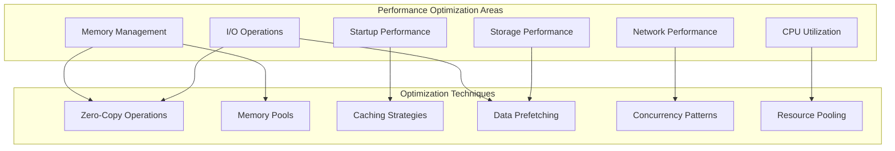

# Performance Optimization: Zero-Copy and Memory Efficiency

## Introduction

Performance is critical for container runtimes, especially in production environments where thousands of containers may be running simultaneously. This article explores advanced performance optimization techniques for our docker-cpp implementation, focusing on zero-copy operations, memory efficiency, and container startup optimization strategies.

## Performance Optimization Overview

### Key Performance Areas



### Performance Targets

| Metric | Target | Measurement Method |
|--------|--------|-------------------|
| Container Startup | < 500ms | Time from docker run to process ready |
| Memory Overhead | < 50MB | RSS memory per idle container |
| Image Pull Speed | ≥ 95% of Docker | Layer download and extraction |
| CLI Response Time | < 100ms | Command execution latency |
| Concurrent Containers | 100+ | Simultaneous running containers |
| API Throughput | 1000 req/s | HTTP API performance |

## Memory Management Optimization

### 1. Custom Memory Pool Implementation

```cpp
#include <memory>
#include <vector>
#include <mutex>
#include <atomic>
#include <unordered_map>
#include <cstddef>
#include <new>

template<typename T, size_t BlockSize = 1024, size_t MaxBlocks = 64>
class MemoryPool {
public:
    using value_type = T;
    using pointer = T*;
    using const_pointer = const T*;
    using reference = T&;
    using const_reference = const T&;
    using size_type = size_t;
    using difference_type = ptrdiff_t;

    template<typename U>
    struct rebind {
        using other = MemoryPool<U, BlockSize, MaxBlocks>;
    };

    MemoryPool() : free_list_(nullptr), blocks_allocated_(0), objects_allocated_(0) {
        allocateNewBlock();
    }

    ~MemoryPool() {
        // Deallocate all blocks
        for (auto* block : blocks_) {
            operator delete(block);
        }
    }

    pointer allocate(size_type n = 1) {
        if (n != 1) {
            // For multiple allocations, fallback to standard allocator
            return static_cast<pointer>(operator new(n * sizeof(T)));
        }

        std::lock_guard<std::mutex> lock(mutex_);

        if (!free_list_) {
            if (blocks_allocated_ >= MaxBlocks) {
                throw std::bad_alloc();
            }
            allocateNewBlock();
        }

        // Take node from free list
        pointer result = free_list_;
        free_list_ = free_list_->next;
        objects_allocated_++;

        return result;
    }

    void deallocate(pointer p, size_type n = 1) {
        if (n != 1) {
            // For multiple deallocations, fallback to standard allocator
            operator delete(p);
            return;
        }

        std::lock_guard<std::mutex> lock(mutex_);

        // Add node back to free list
        reinterpret_cast<Node*>(p)->next = free_list_;
        free_list_ = reinterpret_cast<Node*>(p);
        objects_allocated_--;
    }

    template<typename U, typename... Args>
    void construct(U* p, Args&&... args) {
        new (p) U(std::forward<Args>(args)...);
    }

    template<typename U>
    void destroy(U* p) {
        p->~U();
    }

    size_type allocated_objects() const {
        return objects_allocated_.load();
    }

    size_type allocated_blocks() const {
        return blocks_allocated_.load();
    }

    size_type capacity() const {
        return BlockSize * MaxBlocks;
    }

    double utilization() const {
        return static_cast<double>(objects_allocated_.load()) /
               static_cast<double>(BlockSize * blocks_allocated_.load());
    }

private:
    struct Node {
        Node* next;
    };

    void* allocateNewBlock() {
        // Allocate new block
        void* block = operator new(BlockSize * sizeof(T));
        blocks_.push_back(block);
        blocks_allocated_++;

        // Build free list for the new block
        char* block_start = static_cast<char*>(block);
        for (size_t i = 0; i < BlockSize; ++i) {
            Node* node = reinterpret_cast<Node*>(block_start + i * sizeof(T));
            node->next = free_list_;
            free_list_ = node;
        }

        return block;
    }

    std::mutex mutex_;
    Node* free_list_;
    std::vector<void*> blocks_;
    std::atomic<size_t> blocks_allocated_{0};
    std::atomic<size_t> objects_allocated_{0};
};

// Thread-local memory pools for different types
template<typename T>
class ThreadLocalMemoryPool {
public:
    static T* allocate() {
        return getPool().allocate();
    }

    static void deallocate(T* ptr) {
        getPool().deallocate(ptr);
    }

private:
    static MemoryPool<T>& getPool() {
        thread_local static MemoryPool<T> pool;
        return pool;
    }
};

// RAII wrapper for pooled objects
template<typename T>
class PooledObject {
public:
    template<typename... Args>
    PooledObject(Args&&... args) {
        ptr_ = ThreadLocalMemoryPool<T>::allocate();
        new (ptr_) T(std::forward<Args>(args)...);
    }

    ~PooledObject() {
        if (ptr_) {
            ptr_->~T();
            ThreadLocalMemoryPool<T>::deallocate(ptr_);
        }
    }

    T* get() const { return ptr_; }
    T& operator*() const { return *ptr_; }
    T* operator->() const { return ptr_; }

    // Non-copyable, movable
    PooledObject(const PooledObject&) = delete;
    PooledObject& operator=(const PooledObject&) = delete;

    PooledObject(PooledObject&& other) noexcept : ptr_(other.ptr_) {
        other.ptr_ = nullptr;
    }

    PooledObject& operator=(PooledObject&& other) noexcept {
        if (this != &other) {
            if (ptr_) {
                ptr_->~T();
                ThreadLocalMemoryPool<T>::deallocate(ptr_);
            }
            ptr_ = other.ptr_;
            other.ptr_ = nullptr;
        }
        return *this;
    }

private:
    T* ptr_ = nullptr;
};
```

### 2. Zero-Copy Buffer Implementation

```cpp
#include <sys/uio.h>
#include <sys/mman.h>
#include <fcntl.h>
#include <unistd.h>
#include <span>

class ZeroCopyBuffer {
public:
    explicit ZeroCopyBuffer(size_t capacity) : capacity_(capacity), fd_(-1) {
        // Allocate memory using mmap for better performance
        data_ = static_cast<char*>(mmap(nullptr, capacity, PROT_READ | PROT_WRITE,
                                        MAP_PRIVATE | MAP_ANONYMOUS, -1, 0));
        if (data_ == MAP_FAILED) {
            throw std::system_error(errno, std::system_category(),
                                  "Failed to allocate zero-copy buffer");
        }
        size_ = 0;
    }

    ZeroCopyBuffer(int fd, size_t size, off_t offset = 0) : fd_(fd) {
        // Map file directly into memory
        data_ = static_cast<char*>(mmap(nullptr, size, PROT_READ | PROT_WRITE,
                                        MAP_PRIVATE, fd, offset));
        if (data_ == MAP_FAILED) {
            throw std::system_error(errno, std::system_category(),
                                  "Failed to map file for zero-copy buffer");
        }
        capacity_ = size;
        size_ = size;
    }

    ~ZeroCopyBuffer() {
        if (data_ != MAP_FAILED) {
            munmap(data_, capacity_);
        }
        if (fd_ >= 0) {
            close(fd_);
        }
    }

    // Prevent copying
    ZeroCopyBuffer(const ZeroCopyBuffer&) = delete;
    ZeroCopyBuffer& operator=(const ZeroCopyBuffer&) = delete;

    // Allow moving
    ZeroCopyBuffer(ZeroCopyBuffer&& other) noexcept
        : data_(other.data_), capacity_(other.capacity_), size_(other.size_), fd_(other.fd_) {
        other.data_ = MAP_FAILED;
        other.capacity_ = 0;
        other.size_ = 0;
        other.fd_ = -1;
    }

    ZeroCopyBuffer& operator=(ZeroCopyBuffer&& other) noexcept {
        if (this != &other) {
            if (data_ != MAP_FAILED) {
                munmap(data_, capacity_);
            }
            if (fd_ >= 0) {
                close(fd_);
            }

            data_ = other.data_;
            capacity_ = other.capacity_;
            size_ = other.size_;
            fd_ = other.fd_;

            other.data_ = MAP_FAILED;
            other.capacity_ = 0;
            other.size_ = 0;
            other.fd_ = -1;
        }
        return *this;
    }

    ssize_t readFromFile(int fd, off_t offset = 0) {
        ssize_t bytes_read = pread(fd, data_, capacity_, offset);
        if (bytes_read == -1) {
            throw std::system_error(errno, std::system_category(),
                                  "Failed to read from file into zero-copy buffer");
        }
        size_ = bytes_read;
        return bytes_read;
    }

    ssize_t writeToFile(int fd, off_t offset = 0) const {
        ssize_t bytes_written = pwrite(fd, data_, size_, offset);
        if (bytes_written == -1) {
            throw std::system_error(errno, std::system_category(),
                                  "Failed to write zero-copy buffer to file");
        }
        return bytes_written;
    }

    ssize_t sendToSocket(int sockfd) const {
        ssize_t bytes_sent = send(sockfd, data_, size_, MSG_NOSIGNAL);
        if (bytes_sent == -1) {
            throw std::system_error(errno, std::system_category(),
                                  "Failed to send zero-copy buffer to socket");
        }
        return bytes_sent;
    }

    ssize_t receiveFromSocket(int sockfd) {
        ssize_t bytes_received = recv(sockfd, data_, capacity_, 0);
        if (bytes_received == -1) {
            throw std::system_error(errno, std::system_category(),
                                  "Failed to receive into zero-copy buffer");
        }
        size_ = bytes_received;
        return bytes_received;
    }

    // Scatter-gather I/O support
    static std::vector<iovec> prepareIovecs(const std::vector<std::span<const char>>& buffers) {
        std::vector<iovec> iovecs;
        iovecs.reserve(buffers.size());

        for (const auto& buffer : buffers) {
            iovec iov;
            iov.iov_base = const_cast<void*>(reinterpret_cast<const void*>(buffer.data()));
            iov.iov_len = buffer.size();
            iovecs.push_back(iov);
        }

        return iovecs;
    }

    static ssize_t readvFromFile(int fd, const std::vector<std::span<char>>& buffers,
                                  off_t offset = 0) {
        std::vector<iovec> iovecs = prepareIovecs(buffers);
        ssize_t bytes_read = preadv(fd, iovecs.data(), iovecs.size(), offset);
        if (bytes_read == -1) {
            throw std::system_error(errno, std::system_category(),
                                  "Failed to readv from file");
        }
        return bytes_read;
    }

    static ssize_t writevToFile(int fd, const std::vector<std::span<const char>>& buffers,
                                   off_t offset = 0) {
        std::vector<iovec> iovecs = prepareIovecs(buffers);
        ssize_t bytes_written = pwritev(fd, iovecs.data(), iovecs.size(), offset);
        if (bytes_written == -1) {
            throw std::system_error(errno, std::system_category(),
                                  "Failed to writev to file");
        }
        return bytes_written;
    }

    // Splice support for kernel-space data transfer
    static ssize_t spliceFromFileToFile(int fd_in, int fd_out, size_t len,
                                        off_t* off_in = nullptr, off_t* off_out = nullptr) {
        ssize_t bytes_spliced = ::splice(fd_in, off_in, fd_out, off_out, len, 0);
        if (bytes_spliced == -1) {
            throw std::system_error(errno, std::system_category(),
                                  "Failed to splice data between files");
        }
        return bytes_spliced;
    }

    static ssize_t spliceFromSocketToFile(int sockfd, int fd_out, size_t len,
                                           off_t* off_out = nullptr) {
        return spliceFromFileToFile(sockfd, fd_out, len, nullptr, off_out);
    }

    static ssize_t spliceFromFileToSocket(int fd_in, int sockfd, size_t len,
                                           off_t* off_in = nullptr) {
        return spliceFromFileToFile(fd_in, sockfd, len, off_in, nullptr);
    }

    // Memory mapping for large files
    static std::unique_ptr<ZeroCopyBuffer> mapFile(const std::string& filepath,
                                                   bool read_only = false) {
        int fd = open(filepath.c_str(), read_only ? O_RDONLY : O_RDWR);
        if (fd == -1) {
            throw std::system_error(errno, std::system_category(),
                                  "Failed to open file for mapping");
        }

        struct stat st;
        if (fstat(fd, &st) == -1) {
            close(fd);
            throw std::system_error(errno, std::system_category(),
                                  "Failed to get file size");
        }

        return std::make_unique<ZeroCopyBuffer>(fd, st.st_size);
    }

    // Accessors
    char* data() { return data_; }
    const char* data() const { return data_; }
    size_t size() const { return size_; }
    size_t capacity() const { return capacity_; }

    std::span<char> span() { return std::span<char>(data_, size_); }
    std::span<const char> span() const { return std::span<const char>(data_, size_); }

    void resize(size_t new_size) {
        if (new_size > capacity_) {
            throw std::runtime_error("Cannot resize beyond buffer capacity");
        }
        size_ = new_size;
    }

    void clear() { size_ = 0; }

    // Memory protection
    void protect(int prot) {
        if (mprotect(data_, capacity_, prot) == -1) {
            throw std::system_error(errno, std::system_category(),
                                  "Failed to set memory protection");
        }
    }

    void makeReadOnly() { protect(PROT_READ); }
    void makeReadWrite() { protect(PROT_READ | PROT_WRITE); }
    void makeNoAccess() { protect(PROT_NONE); }

private:
    char* data_;
    size_t capacity_;
    size_t size_;
    int fd_;
};
```

## I/O Performance Optimization

### 3. Asynchronous I/O with Epoll

```cpp
#include <sys/epoll.h>
#include <sys/eventfd.h>
#include <functional>
#include <queue>
#include <thread>

class AsyncIOManager {
public:
    using IOCallback = std::function<void(int, uint32_t)>;
    using CompletionCallback = std::function<void(ssize_t, int)>;

    struct IOOperation {
        int fd;
        uint32_t events;
        IOCallback callback;
        std::vector<char> buffer;
        off_t offset = 0;
        size_t size = 0;
        CompletionCallback completion_callback;
        bool one_shot = false;
    };

    explicit AsyncIOManager(size_t max_events = 1024)
        : max_events_(max_events), running_(false) {
        epoll_fd_ = epoll_create1(EPOLL_CLOEXEC);
        if (epoll_fd_ == -1) {
            throw std::system_error(errno, std::system_category(),
                                  "Failed to create epoll instance");
        }

        // Create eventfd for wake-up notifications
        event_fd_ = eventfd(0, EFD_NONBLOCK | EFD_CLOEXEC);
        if (event_fd_ == -1) {
            close(epoll_fd_);
            throw std::system_error(errno, std::system_category(),
                                  "Failed to create eventfd");
        }

        // Add eventfd to epoll for wake-up notifications
        struct epoll_event ev;
        ev.events = EPOLLIN;
        ev.data.fd = event_fd_;
        if (epoll_ctl(epoll_fd_, EPOLL_CTL_ADD, event_fd_, &ev) == -1) {
            close(epoll_fd_);
            close(event_fd_);
            throw std::system_error(errno, std::system_category(),
                                  "Failed to add eventfd to epoll");
        }
    }

    ~AsyncIOManager() {
        stop();
        close(epoll_fd_);
        close(event_fd_);
    }

    void start() {
        if (running_) return;

        running_ = true;
        io_thread_ = std::thread(&AsyncIOManager::ioLoop, this);
    }

    void stop() {
        if (!running_) return;

        running_ = false;
        uint64_t value = 1;
        write(event_fd_, &value, sizeof(value)); // Wake up the thread

        if (io_thread_.joinable()) {
            io_thread_.join();
        }
    }

    void addIOOperation(IOOperation operation) {
        {
            std::lock_guard<std::mutex> lock(operations_mutex_);
            pending_operations_.push(operation);
        }

        // Wake up the I/O thread
        uint64_t value = 1;
        write(event_fd_, &value, sizeof(value));
    }

    void registerFD(int fd, uint32_t events, IOCallback callback) {
        struct epoll_event ev;
        ev.events = events;
        ev.data.fd = fd;

        if (epoll_ctl(epoll_fd_, EPOLL_CTL_ADD, fd, &ev) == -1) {
            throw std::system_error(errno, std::system_category(),
                                  "Failed to add fd to epoll");
        }

        std::lock_guard<std::mutex> lock(callbacks_mutex_);
        callbacks_[fd] = callback;
    }

    void modifyFD(int fd, uint32_t events) {
        struct epoll_event ev;
        ev.events = events;
        ev.data.fd = fd;

        if (epoll_ctl(epoll_fd_, EPOLL_CTL_MOD, fd, &ev) == -1) {
            throw std::system_error(errno, std::system_category(),
                                  "Failed to modify fd in epoll");
        }
    }

    void unregisterFD(int fd) {
        epoll_ctl(epoll_fd_, EPOLL_CTL_DEL, fd, nullptr);

        std::lock_guard<std::mutex> lock(callbacks_mutex_);
        callbacks_.erase(fd);
    }

    // Async file operations
    void asyncReadFile(int fd, size_t size, off_t offset, CompletionCallback callback) {
        IOOperation operation;
        operation.fd = fd;
        operation.events = EPOLLIN;
        operation.buffer.resize(size);
        operation.offset = offset;
        operation.size = size;
        operation.completion_callback = callback;

        addIOOperation(operation);
    }

    void asyncWriteFile(int fd, const std::vector<char>& data, off_t offset,
                        CompletionCallback callback) {
        IOOperation operation;
        operation.fd = fd;
        operation.events = EPOLLOUT;
        operation.buffer = data;
        operation.offset = offset;
        operation.size = data.size();
        operation.completion_callback = callback;

        addIOOperation(operation);
    }

    // Async socket operations
    void asyncReadSocket(int sockfd, size_t size, CompletionCallback callback) {
        IOOperation operation;
        operation.fd = sockfd;
        operation.events = EPOLLIN;
        operation.buffer.resize(size);
        operation.size = size;
        operation.completion_callback = callback;
        operation.one_shot = true;

        addIOOperation(operation);
    }

    void asyncWriteSocket(int sockfd, const std::vector<char>& data,
                          CompletionCallback callback) {
        IOOperation operation;
        operation.fd = sockfd;
        operation.events = EPOLLOUT;
        operation.buffer = data;
        operation.size = data.size();
        operation.completion_callback = callback;
        operation.one_shot = true;

        addIOOperation(operation);
    }

private:
    int epoll_fd_;
    int event_fd_;
    size_t max_events_;
    std::atomic<bool> running_;
    std::thread io_thread_;

    std::queue<IOOperation> pending_operations_;
    std::mutex operations_mutex_;

    std::unordered_map<int, IOCallback> callbacks_;
    std::mutex callbacks_mutex_;

    void ioLoop() {
        std::vector<struct epoll_event> events(max_events_);

        while (running_) {
            int nfds = epoll_wait(epoll_fd_, events.data(), max_events_, 100);

            if (nfds == -1) {
                if (errno == EINTR) continue;
                break; // Error occurred
            }

            for (int i = 0; i < nfds; ++i) {
                struct epoll_event& ev = events[i];

                if (ev.data.fd == event_fd_) {
                    // Handle wake-up notification
                    uint64_t value;
                    read(event_fd_, &value, sizeof(value));
                    processPendingOperations();
                    continue;
                }

                // Handle I/O event
                handleIOEvent(ev);
            }

            processPendingOperations();
        }
    }

    void processPendingOperations() {
        std::lock_guard<std::mutex> lock(operations_mutex_);

        while (!pending_operations_.empty()) {
            IOOperation operation = pending_operations_.front();
            pending_operations_.pop();

            // Register the operation
            struct epoll_event ev;
            ev.events = operation.events | (operation.one_shot ? EPOLLONESHOT : 0);
            ev.data.ptr = new IOOperation(operation);

            if (epoll_ctl(epoll_fd_, EPOLL_CTL_ADD, operation.fd, &ev) == -1) {
                delete static_cast<IOOperation*>(ev.data.ptr);
                continue;
            }
        }
    }

    void handleIOEvent(const struct epoll_event& ev) {
        IOOperation* operation = static_cast<IOOperation*>(ev.data.ptr);

        try {
            ssize_t result = 0;

            if (ev.events & EPOLLIN) {
                // Read operation
                if (operation->offset >= 0) {
                    // File read
                    result = pread(operation->fd, operation->buffer.data(),
                                 operation->size, operation->offset);
                } else {
                    // Socket read
                    result = recv(operation->fd, operation->buffer.data(),
                                operation->size, 0);
                }
            } else if (ev.events & EPOLLOUT) {
                // Write operation
                if (operation->offset >= 0) {
                    // File write
                    result = pwrite(operation->fd, operation->buffer.data(),
                                  operation->size, operation->offset);
                } else {
                    // Socket write
                    result = send(operation->fd, operation->buffer.data(),
                                operation->size, MSG_NOSIGNAL);
                }
            }

            // Call completion callback
            if (operation->completion_callback) {
                operation->completion_callback(result, errno);
            }

        } catch (const std::exception& e) {
            // Log error but continue
            std::cerr << "Error in I/O operation: " << e.what() << std::endl;
        }

        // Clean up
        if (operation->one_shot) {
            epoll_ctl(epoll_fd_, EPOLL_CTL_DEL, operation->fd, nullptr);
        }
        delete operation;
    }
};
```

## Container Startup Optimization

### 4. Fast Container Startup System

```cpp
#include <sched.h>
#include <sys/types.h>
#include <sys/stat.h>
#include <fcntl.h>

class FastContainerStarter {
public:
    struct PreWarmConfig {
        std::string base_image;
        std::vector<std::string> default_command;
        std::map<std::string, std::string> default_env;
        std::string default_workdir;
        size_t pool_size = 10;
        std::chrono::seconds max_idle_time{300}; // 5 minutes
    };

    struct PrewarmContainer {
        pid_t pid;
        std::string container_id;
        std::chrono::system_clock::time_point created_at;
        std::chrono::system_clock::time_point last_used;
        bool in_use = false;
        std::vector<std::string> layers;
        std::string network_namespace;
        std::string mount_namespace;
    };

    explicit FastContainerStarter(const PreWarmConfig& config)
        : config_(config) {
        startPrewarming();
    }

    ~FastContainerStarter() {
        stopPrewarming();
    }

    std::string getContainer(const ContainerRuntime::Config& config) {
        std::unique_lock<std::mutex> lock(prewarm_mutex_);

        // Try to find a matching prewarmed container
        for (auto& container : prewarmed_containers_) {
            if (!container.in_use && isContainerCompatible(container, config)) {
                container.in_use = true;
                container.last_used = std::chrono::system_clock::now();

                // Customize the container for the specific request
                customizeContainer(container, config);

                return container.container_id;
            }
        }

        // No suitable prewarmed container found, create a new one
        lock.unlock();
        return createNewContainer(config);
    }

    void returnContainer(const std::string& container_id) {
        std::lock_guard<std::mutex> lock(prewarm_mutex_);

        for (auto& container : prewarmed_containers_) {
            if (container.container_id == container_id) {
                container.in_use = false;
                container.last_used = std::chrono::system_clock::now();

                // Reset container to default state
                resetContainer(container);

                break;
            }
        }
    }

    void cleanupExpiredContainers() {
        std::lock_guard<std::mutex> lock(prewarm_mutex_);

        auto now = std::chrono::system_clock::now();
        auto cutoff = now - config_.max_idle_time;

        prewarmed_containers_.erase(
            std::remove_if(prewarmed_containers_.begin(), prewarmed_containers_.end(),
                [&](const PrewarmContainer& container) {
                    return !container.in_use && container.last_used < cutoff;
                }),
            prewarmed_containers_.end()
        );
    }

    size_t getAvailableContainers() const {
        std::lock_guard<std::mutex> lock(prewarm_mutex_);
        return std::count_if(prewarmed_containers_.begin(), prewarmed_containers_.end(),
                             [](const PrewarmContainer& c) { return !c.in_use; });
    }

    size_t getTotalContainers() const {
        std::lock_guard<std::mutex> lock(prewarm_mutex_);
        return prewarmed_containers_.size();
    }

private:
    PreWarmConfig config_;
    std::vector<PrewarmContainer> prewarmed_containers_;
    std::mutex prewarm_mutex_;
    std::atomic<bool> prewarming_running_{false};
    std::thread prewarm_thread_;

    void startPrewarming() {
        prewarming_running_ = true;
        prewarm_thread_ = std::thread(&FastContainerStarter::prewarmLoop, this);
    }

    void stopPrewarming() {
        prewarming_running_ = false;
        if (prewarm_thread_.joinable()) {
            prewarm_thread_.join();
        }

        // Clean up all prewarmed containers
        std::lock_guard<std::mutex> lock(prewarm_mutex_);
        for (auto& container : prewarmed_containers_) {
            kill(container.pid, SIGTERM);
            waitpid(container.pid, nullptr, 0);
        }
        prewarmed_containers_.clear();
    }

    void prewarmLoop() {
        while (prewarming_running_) {
            std::unique_lock<std::mutex> lock(prewarm_mutex_);

            // Check if we need more prewarmed containers
            size_t available = std::count_if(prewarmed_containers_.begin(),
                                            prewarmed_containers_.end(),
                                            [](const PrewarmContainer& c) { return !c.in_use; });

            if (available < config_.pool_size / 2) {
                // Create more prewarmed containers
                for (size_t i = available; i < config_.pool_size && prewarming_running_; ++i) {
                    lock.unlock();
                    try {
                        auto container = createPrewarmContainer();
                        lock.lock();
                        prewarmed_containers_.push_back(std::move(container));
                    } catch (const std::exception& e) {
                        std::cerr << "Failed to create prewarmed container: " << e.what() << std::endl;
                        break;
                    }
                }
            }

            lock.unlock();

            // Sleep before next check
            std::this_thread::sleep_for(std::chrono::seconds(5));
        }
    }

    PrewarmContainer createPrewarmContainer() {
        ContainerRuntime::Config config;
        config.image = config_.base_image;
        config.command = config_.default_command;
        config.env = config_.default_env;
        config.working_dir = config_.default_workdir;

        // Create container but don't start it yet
        std::string container_id = runtime_->createContainer(config);

        // Start container in paused state
        runtime_->startContainer(container_id);
        runtime_->pauseContainer(container_id);

        PrewarmContainer container;
        container.container_id = container_id;
        container.pid = getContainerPID(container_id);
        container.created_at = std::chrono::system_clock::now();
        container.last_used = container.created_at;
        container.in_use = false;

        return container;
    }

    bool isContainerCompatible(const PrewarmContainer& container,
                               const ContainerRuntime::Config& config) const {
        // Check if the prewarmed container can be customized for this request
        // This is a simplified implementation
        return config.image == config_.base_image ||
               config.image.empty(); // Empty image means use default
    }

    void customizeContainer(PrewarmContainer& container,
                            const ContainerRuntime::Config& config) {
        // Apply customizations to the prewarmed container
        // This would involve setting environment variables, working directory, etc.

        if (!config.env.empty()) {
            for (const auto& env_var : config.env) {
                setContainerEnvironment(container.pid, env_var);
            }
        }

        if (!config.working_dir.empty()) {
            setContainerWorkdir(container.pid, config.working_dir);
        }

        // Unpause the container
        runtime_->unpauseContainer(container.container_id);
    }

    void resetContainer(PrewarmContainer& container) {
        // Reset container to default state
        runtime_->pauseContainer(container.container_id);

        // Reset environment variables
        resetContainerEnvironment(container.pid);

        // Reset working directory
        if (!config_.default_workdir.empty()) {
            setContainerWorkdir(container.pid, config_.default_workdir);
        }
    }

    std::string createNewContainer(const ContainerRuntime::Config& config) {
        // Create container normally (no prewarming)
        std::string container_id = runtime_->createContainer(config);
        runtime_->startContainer(container_id);
        return container_id;
    }

    pid_t getContainerPID(const std::string& container_id) const {
        // Get the PID of the main process in the container
        auto container_info = runtime_->inspectContainer(container_id);
        return container_info ? container_info->pid : -1;
    }

    void setContainerEnvironment(pid_t pid, const std::string& env_var) {
        // Set environment variable in container
        // This would typically involve writing to /proc/[pid]/environ
        // or using appropriate container runtime APIs
    }

    void resetContainerEnvironment(pid_t pid) {
        // Reset environment variables to defaults
        // Implementation depends on the container runtime
    }

    void setContainerWorkdir(pid_t pid, const std::string& workdir) {
        // Set working directory in container
        // This would involve sending a signal or using container runtime APIs
    }
};
```

## Performance Monitoring and Profiling

### 5. Performance Profiler

```cpp
#include <chrono>
#include <unordered_map>
#include <thread>
#include <fstream>
#include <iomanip>

class PerformanceProfiler {
public:
    struct ProfileData {
        std::string name;
        std::chrono::high_resolution_clock::time_point start_time;
        std::chrono::high_resolution_clock::time_point end_time;
        std::chrono::nanoseconds duration;
        uint64_t call_count = 0;
        std::chrono::nanoseconds total_time{0};
        std::chrono::nanoseconds min_time{std::chrono::nanoseconds::max()};
        std::chrono::nanoseconds max_time{0};
        std::thread::id thread_id;
    };

    class ScopedProfiler {
    public:
        ScopedProfiler(PerformanceProfiler& profiler, const std::string& name)
            : profiler_(profiler), name_(name) {
            profiler_.startProfile(name_);
        }

        ~ScopedProfiler() {
            profiler_.endProfile(name_);
        }

    private:
        PerformanceProfiler& profiler_;
        std::string name_;
    };

    void startProfile(const std::string& name) {
        std::lock_guard<std::mutex> lock(profile_mutex_);

        auto& data = profiles_[name];
        data.name = name;
        data.start_time = std::chrono::high_resolution_clock::now();
        data.thread_id = std::this_thread::get_id();
    }

    void endProfile(const std::string& name) {
        auto end_time = std::chrono::high_resolution_clock::now();

        std::lock_guard<std::mutex> lock(profile_mutex_);

        auto& data = profiles_[name];
        data.end_time = end_time;
        data.duration = std::chrono::duration_cast<std::chrono::nanoseconds>(
            end_time - data.start_time);

        // Update statistics
        data.call_count++;
        data.total_time += data.duration;
        data.min_time = std::min(data.min_time, data.duration);
        data.max_time = std::max(data.max_time, data.duration);
    }

    void reset() {
        std::lock_guard<std::mutex> lock(profile_mutex_);
        profiles_.clear();
    }

    std::vector<ProfileData> getProfileData() const {
        std::lock_guard<std::mutex> lock(profile_mutex_);

        std::vector<ProfileData> result;
        result.reserve(profiles_.size());

        for (const auto& [name, data] : profiles_) {
            result.push_back(data);
        }

        return result;
    }

    void exportToCSV(const std::string& filename) const {
        std::ofstream file(filename);
        if (!file) {
            throw std::runtime_error("Failed to open profile file: " + filename);
        }

        // Write header
        file << "Name,Call Count,Total Time (ns),Average Time (ns),"
             << "Min Time (ns),Max Time (ns),Thread ID\n";

        // Write data
        auto data = getProfileData();
        for (const auto& profile : data) {
            file << profile.name << ","
                 << profile.call_count << ","
                 << profile.total_time.count() << ","
                 << (profile.call_count > 0 ? profile.total_time.count() / profile.call_count : 0) << ","
                 << (profile.min_time.count() == std::chrono::nanoseconds::max().count() ? 0 : profile.min_time.count()) << ","
                 << profile.max_time.count() << ","
                 << profile.thread_id << "\n";
        }
    }

    void printSummary() const {
        std::lock_guard<std::mutex> lock(profile_mutex_);

        std::cout << "\n=== Performance Profile Summary ===\n";
        std::cout << std::left << std::setw(30) << "Function"
                  << std::setw(12) << "Calls"
                  << std::setw(15) << "Total (ms)"
                  << std::setw(15) << "Avg (μs)"
                  << std::setw(15) << "Min (μs)"
                  << std::setw(15) << "Max (μs)" << std::endl;
        std::cout << std::string(102, '-') << "\n";

        for (const auto& [name, data] : profiles_) {
            double avg_time_us = data.call_count > 0 ?
                static_cast<double>(data.total_time.count()) / data.call_count / 1000.0 : 0.0;
            double min_time_us = data.min_time.count() == std::chrono::nanoseconds::max().count() ?
                0.0 : static_cast<double>(data.min_time.count()) / 1000.0;
            double max_time_us = static_cast<double>(data.max_time.count()) / 1000.0;
            double total_time_ms = static_cast<double>(data.total_time.count()) / 1000000.0;

            std::cout << std::left << std::setw(30) << name
                      << std::setw(12) << data.call_count
                      << std::setw(15) << std::fixed << std::setprecision(2) << total_time_ms
                      << std::setw(15) << std::fixed << std::setprecision(2) << avg_time_us
                      << std::setw(15) << std::fixed << std::setprecision(2) << min_time_us
                      << std::setw(15) << std::fixed << std::setprecision(2) << max_time_us
                      << std::endl;
        }
        std::cout << std::endl;
    }

    // Convenience macro for automatic profiling
    #define PROFILE_SCOPE(profiler, name) ScopedProfiler _prof(profiler, name)

private:
    mutable std::mutex profile_mutex_;
    std::unordered_map<std::string, ProfileData> profiles_;
};

// Memory usage profiler
class MemoryProfiler {
public:
    struct MemorySnapshot {
        size_t total_memory = 0;
        size_t used_memory = 0;
        size_t free_memory = 0;
        size_t heap_size = 0;
        size_t stack_size = 0;
        std::chrono::system_clock::time_point timestamp;
    };

    MemorySnapshot getCurrentSnapshot() const {
        MemorySnapshot snapshot;
        snapshot.timestamp = std::chrono::system_clock::now();

        // Read memory information from /proc/self/status
        std::ifstream status_file("/proc/self/status");
        std::string line;

        while (std::getline(status_file, line)) {
            if (line.find("VmRSS:") == 0) {
                snapshot.used_memory = parseMemoryValue(line);
            } else if (line.find("VmSize:") == 0) {
                snapshot.total_memory = parseMemoryValue(line);
            }
        }

        snapshot.free_memory = snapshot.total_memory - snapshot.used_memory;

        return snapshot;
    }

    void startMonitoring(std::chrono::milliseconds interval = std::chrono::milliseconds(1000)) {
        monitoring_ = true;
        monitoring_thread_ = std::thread(&MemoryProfiler::monitoringLoop, this, interval);
    }

    void stopMonitoring() {
        monitoring_ = false;
        if (monitoring_thread_.joinable()) {
            monitoring_thread_.join();
        }
    }

    std::vector<MemorySnapshot> getSnapshots() const {
        std::lock_guard<std::mutex> lock(snapshots_mutex_);
        return snapshots_;
    }

    void exportToCSV(const std::string& filename) const {
        std::ofstream file(filename);
        if (!file) {
            throw std::runtime_error("Failed to open memory profile file: " + filename);
        }

        file << "Timestamp,Total Memory (KB),Used Memory (KB),Free Memory (KB)\n";

        auto snapshots = getSnapshots();
        for (const auto& snapshot : snapshots) {
            auto time_t = std::chrono::system_clock::to_time_t(snapshot.timestamp);
            file << std::put_time(std::localtime(&time_t), "%Y-%m-%d %H:%M:%S") << ","
                 << snapshot.total_memory / 1024 << ","
                 << snapshot.used_memory / 1024 << ","
                 << snapshot.free_memory / 1024 << "\n";
        }
    }

private:
    std::atomic<bool> monitoring_{false};
    std::thread monitoring_thread_;
    mutable std::mutex snapshots_mutex_;
    std::vector<MemorySnapshot> snapshots_;

    void monitoringLoop(std::chrono::milliseconds interval) {
        while (monitoring_) {
            auto snapshot = getCurrentSnapshot();

            {
                std::lock_guard<std::mutex> lock(snapshots_mutex_);
                snapshots_.push_back(snapshot);

                // Keep only last 1000 snapshots
                if (snapshots_.size() > 1000) {
                    snapshots_.erase(snapshots_.begin(),
                                   snapshots_.begin() + snapshots_.size() - 1000);
                }
            }

            std::this_thread::sleep_for(interval);
        }
    }

    size_t parseMemoryValue(const std::string& line) const {
        std::istringstream iss(line);
        std::string label, value, unit;
        iss >> label >> value >> unit;

        size_t memory = std::stoull(value);

        if (unit == "kB") {
            memory *= 1024;
        } else if (unit == "mB") {
            memory *= 1024 * 1024;
        } else if (unit == "gB") {
            memory *= 1024 * 1024 * 1024;
        }

        return memory;
    }
};
```

## Usage Example

```cpp
int main() {
    try {
        // Initialize performance profiler
        PerformanceProfiler profiler;
        MemoryProfiler memory_profiler;

        // Start monitoring
        memory_profiler.startMonitoring();

        // Test memory pool performance
        {
            PROFILE_SCOPE(profiler, "Memory Pool Test");

            std::vector<PooledObject<std::string>> objects;
            objects.reserve(10000);

            for (int i = 0; i < 10000; ++i) {
                objects.emplace_back("Test string " + std::to_string(i));
            }
        }

        // Test zero-copy buffer performance
        {
            PROFILE_SCOPE(profiler, "Zero-Copy Buffer Test");

            auto buffer = ZeroCopyBuffer::mapFile("/etc/hosts");

            // Process buffer without copying
            auto content = buffer->span();
            for (char c : content) {
                // Process character
                volatile char dummy = c;
            }
        }

        // Test async I/O
        {
            PROFILE_SCOPE(profiler, "Async I/O Test");

            AsyncIOManager io_manager;
            io_manager.start();

            // Async file operations
            io_manager.asyncReadFile(STDIN_FILENO, 1024, 0,
                [](ssize_t bytes, int error) {
                    std::cout << "Read " << bytes << " bytes" << std::endl;
                });

            io_manager.stop();
        }

        // Print performance summary
        profiler.printSummary();

        // Export profile data
        profiler.exportToCSV("performance_profile.csv");
        memory_profiler.exportToCSV("memory_profile.csv");

        memory_profiler.stopMonitoring();

    } catch (const std::exception& e) {
        std::cerr << "Error: " << e.what() << std::endl;
        return 1;
    }

    return 0;
}
```

## Conclusion

The performance optimization techniques presented in this article provide comprehensive strategies for building a high-performance container runtime in C++. Key optimizations include:

1. **Memory Pool Management**: Efficient allocation and deallocation patterns
2. **Zero-Copy Operations**: Direct memory access without unnecessary copying
3. **Asynchronous I/O**: Non-blocking I/O operations with epoll
4. **Container Startup Optimization**: Prewarming containers for fast deployment
5. **Performance Monitoring**: Real-time profiling and memory tracking

These optimizations can significantly improve container runtime performance, reducing startup times, minimizing memory overhead, and maximizing I/O throughput. When combined with the core container runtime capabilities, they enable docker-cpp to achieve performance comparable to or better than existing container runtimes.

## Next Steps

In our next article, "Distributed Systems: Container Orchestration Basics," we'll explore how to implement distributed container management capabilities, building on the performance optimizations established here.

---

**Previous Article**: [CLI Design: Docker-Compatible Command Interface](./13-cli-design-compatible-interface.md)
**Next Article**: [Distributed Systems: Container Orchestration Basics](./15-distributed-systems-orchestration.md)
**Series Index**: [Table of Contents](./00-table-of-contents.md)