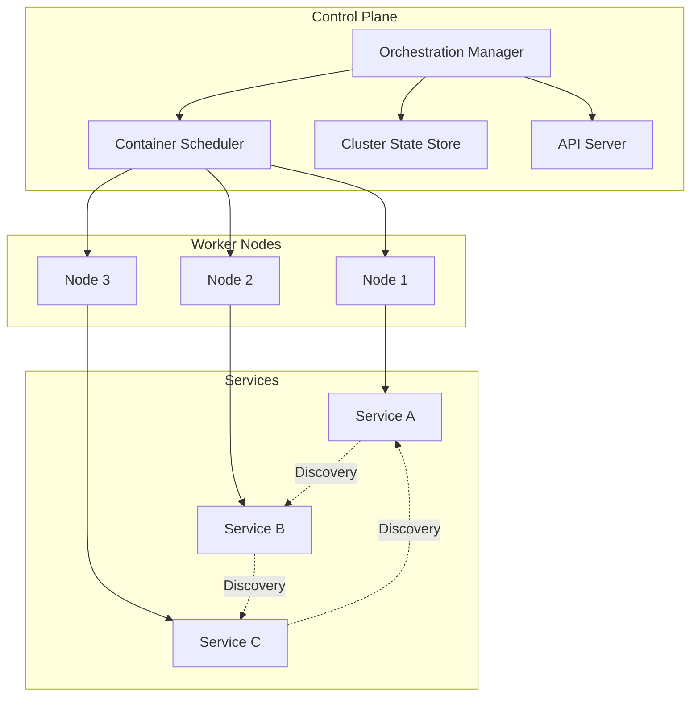

# Distributed Systems: Container Orchestration Basics

## Introduction

As containerized applications scale from single containers to distributed systems, orchestration becomes essential for managing deployment, scaling, and lifecycle management. This article explores the implementation of distributed container orchestration capabilities in C++, covering service discovery, load balancing, health checking, and cluster management.

## Orchestration Architecture Overview

### Distributed Container System Architecture



### Core Orchestration Components

1. **Service Discovery**: Automatic registration and lookup of container services
2. **Load Balancing**: Distribution of traffic across container instances
3. **Health Checking**: Monitoring container health and automatic recovery
4. **Cluster Management**: Node registration and resource allocation
5. **Configuration Management**: Centralized configuration and secret management

## Service Discovery System

### 1. Service Registry Implementation

```cpp
#include <string>
#include <vector>
#include <memory>
#include <unordered_map>
#include <thread>
#include <mutex>
#include <chrono>
#include <functional>
#include <netinet/in.h>
#include <sys/socket.h>
#include <arpa/inet.h>

class ServiceRegistry {
public:
    struct ServiceEndpoint {
        std::string service_id;
        std::string service_name;
        std::string host;
        uint16_t port;
        std::map<std::string, std::string> metadata;
        std::chrono::system_clock::time_point registered_at;
        std::chrono::system_clock::time_point last_heartbeat;
        bool healthy = true;
        std::vector<std::string> tags;
        int weight = 1;
    };

    struct ServiceQuery {
        std::string service_name;
        std::vector<std::string> tags;
        std::map<std::string, std::string> metadata_filter;
        bool healthy_only = true;
        size_t max_results = 0;
    };

    explicit ServiceRegistry(uint16_t port = 8500)
        : port_(port), running_(false) {
        health_check_interval_ = std::chrono::seconds(30);
        cleanup_interval_ = std::chrono::minutes(1);
    }

    ~ServiceRegistry() {
        stop();
    }

    void start() {
        if (running_) return;

        running_ = true;

        // Start discovery server
        discovery_server_ = std::thread(&ServiceRegistry::runDiscoveryServer, this);

        // Start health check thread
        health_check_thread_ = std::thread(&ServiceRegistry::runHealthChecks, this);

        // Start cleanup thread
        cleanup_thread_ = std::thread(&ServiceRegistry::runCleanup, this);
    }

    void stop() {
        if (!running_) return;

        running_ = false;

        // Wait for threads to finish
        if (discovery_server_.joinable()) {
            discovery_server_.join();
        }
        if (health_check_thread_.joinable()) {
            health_check_thread_.join();
        }
        if (cleanup_thread_.joinable()) {
            cleanup_thread_.join();
        }
    }

    std::string registerService(const std::string& service_name,
                               const std::string& host,
                               uint16_t port,
                               const std::map<std::string, std::string>& metadata = {},
                               const std::vector<std::string>& tags = {}) {
        std::string service_id = generateServiceId();

        ServiceEndpoint endpoint;
        endpoint.service_id = service_id;
        endpoint.service_name = service_name;
        endpoint.host = host;
        endpoint.port = port;
        endpoint.metadata = metadata;
        endpoint.tags = tags;
        endpoint.registered_at = std::chrono::system_clock::now();
        endpoint.last_heartbeat = endpoint.registered_at;
        endpoint.healthy = true;

        {
            std::lock_guard<std::mutex> lock(registry_mutex_);
            services_[service_id] = endpoint;
            service_name_index_[service_name].push_back(service_id);
        }

        notifyServiceChange(service_name, "register", endpoint);

        return service_id;
    }

    void deregisterService(const std::string& service_id) {
        std::lock_guard<std::mutex> lock(registry_mutex_);

        auto it = services_.find(service_id);
        if (it == services_.end()) {
            return;
        }

        std::string service_name = it->second.service_name;
        ServiceEndpoint endpoint = it->second;

        services_.erase(it);

        // Remove from service name index
        auto name_it = service_name_index_.find(service_name);
        if (name_it != service_name_index_.end()) {
            auto& service_ids = name_it->second;
            service_ids.erase(std::remove(service_ids.begin(), service_ids.end(), service_id),
                            service_ids.end());

            if (service_ids.empty()) {
                service_name_index_.erase(name_it);
            }
        }

        notifyServiceChange(service_name, "deregister", endpoint);
    }

    void updateHeartbeat(const std::string& service_id) {
        std::lock_guard<std::mutex> lock(registry_mutex_);

        auto it = services_.find(service_id);
        if (it != services_.end()) {
            it->second.last_heartbeat = std::chrono::system_clock::now();
            if (!it->second.healthy) {
                it->second.healthy = true;
                notifyServiceChange(it->second.service_name, "healthy", it->second);
            }
        }
    }

    std::vector<ServiceEndpoint> discoverServices(const ServiceQuery& query) {
        std::lock_guard<std::mutex> lock(registry_mutex_);

        std::vector<ServiceEndpoint> results;

        auto name_it = service_name_index_.find(query.service_name);
        if (name_it == service_name_index_.end()) {
            return results;
        }

        for (const std::string& service_id : name_it->second) {
            auto service_it = services_.find(service_id);
            if (service_it == services_.end()) {
                continue;
            }

            const auto& endpoint = service_it->second;

            // Apply filters
            if (query.healthy_only && !endpoint.healthy) {
                continue;
            }

            if (!query.tags.empty()) {
                bool has_all_tags = true;
                for (const std::string& required_tag : query.tags) {
                    if (std::find(endpoint.tags.begin(), endpoint.tags.end(), required_tag) == endpoint.tags.end()) {
                        has_all_tags = false;
                        break;
                    }
                }
                if (!has_all_tags) {
                    continue;
                }
            }

            if (!query.metadata_filter.empty()) {
                bool matches_filters = true;
                for (const auto& [key, value] : query.metadata_filter) {
                    auto it = endpoint.metadata.find(key);
                    if (it == endpoint.metadata.end() || it->second != value) {
                        matches_filters = false;
                        break;
                    }
                }
                if (!matches_filters) {
                    continue;
                }
            }

            results.push_back(endpoint);

            if (query.max_results > 0 && results.size() >= query.max_results) {
                break;
            }
        }

        return results;
    }

    std::optional<ServiceEndpoint> getService(const std::string& service_id) {
        std::lock_guard<std::mutex> lock(registry_mutex_);

        auto it = services_.find(service_id);
        if (it != services_.end()) {
            return it->second;
        }

        return std::nullopt;
    }

    void setServiceHealthStatus(const std::string& service_id, bool healthy) {
        std::lock_guard<std::mutex> lock(registry_mutex_);

        auto it = services_.find(service_id);
        if (it != services_.end() && it->second.healthy != healthy) {
            it->second.healthy = healthy;
            notifyServiceChange(it->second.service_name, healthy ? "healthy" : "unhealthy", it->second);
        }
    }

    // Watch for service changes
    using ServiceWatchCallback = std::function<void(const std::string&, const std::string&, const ServiceEndpoint&)>;

    std::string watchService(const std::string& service_name, ServiceWatchCallback callback) {
        std::string watch_id = generateWatchId();

        std::lock_guard<std::mutex> lock(watches_mutex_);
        watches_[watch_id] = {service_name, callback};

        return watch_id;
    }

    void stopWatching(const std::string& watch_id) {
        std::lock_guard<std::mutex> lock(watches_mutex_);
        watches_.erase(watch_id);
    }

    std::vector<std::string> getServiceNames() const {
        std::lock_guard<std::mutex> lock(registry_mutex_);

        std::vector<std::string> names;
        for (const auto& [name, _] : service_name_index_) {
            names.push_back(name);
        }

        return names;
    }

    std::vector<ServiceEndpoint> getAllServices() const {
        std::lock_guard<std::mutex> lock(registry_mutex_);

        std::vector<ServiceEndpoint> all_services;
        for (const auto& [_, endpoint] : services_) {
            all_services.push_back(endpoint);
        }

        return all_services;
    }

    // Statistics
    size_t getServiceCount() const {
        std::lock_guard<std::mutex> lock(registry_mutex_);
        return services_.size();
    }

    size_t getHealthyServiceCount() const {
        std::lock_guard<std::mutex> lock(registry_mutex_);

        return std::count_if(services_.begin(), services_.end(),
                             [](const auto& pair) { return pair.second.healthy; });
    }

private:
    uint16_t port_;
    std::atomic<bool> running_;

    std::unordered_map<std::string, ServiceEndpoint> services_;
    std::unordered_map<std::string, std::vector<std::string>> service_name_index_;
    mutable std::mutex registry_mutex_;

    struct ServiceWatch {
        std::string service_name;
        ServiceWatchCallback callback;
    };
    std::unordered_map<std::string, ServiceWatch> watches_;
    mutable std::mutex watches_mutex_;

    std::thread discovery_server_;
    std::thread health_check_thread_;
    std::thread cleanup_thread_;
    std::chrono::seconds health_check_interval_;
    std::chrono::minutes cleanup_interval_;

    void runDiscoveryServer() {
        // Simple HTTP server for service discovery API
        int server_fd = socket(AF_INET, SOCK_STREAM, 0);
        if (server_fd == -1) {
            std::cerr << "Failed to create discovery server socket" << std::endl;
            return;
        }

        int opt = 1;
        setsockopt(server_fd, SOL_SOCKET, SO_REUSEADDR, &opt, sizeof(opt));

        struct sockaddr_in address;
        address.sin_family = AF_INET;
        address.sin_addr.s_addr = INADDR_ANY;
        address.sin_port = htons(port_);

        if (bind(server_fd, (struct sockaddr*)&address, sizeof(address)) < 0) {
            std::cerr << "Failed to bind discovery server" << std::endl;
            close(server_fd);
            return;
        }

        if (listen(server_fd, 10) < 0) {
            std::cerr << "Failed to listen on discovery server" << std::endl;
            close(server_fd);
            return;
        }

        std::cout << "Service discovery server started on port " << port_ << std::endl;

        while (running_) {
            struct sockaddr_in client_address;
            socklen_t client_len = sizeof(client_address);

            int client_fd = accept(server_fd, (struct sockaddr*)&client_address, &client_len);
            if (client_fd < 0) {
                if (errno == EINTR || errno == EAGAIN) {
                    continue;
                }
                break;
            }

            // Handle client request in separate thread
            std::thread(&ServiceRegistry::handleDiscoveryRequest, this, client_fd).detach();
        }

        close(server_fd);
    }

    void handleDiscoveryRequest(int client_fd) {
        char buffer[4096];
        ssize_t bytes_read = read(client_fd, buffer, sizeof(buffer) - 1);

        if (bytes_read <= 0) {
            close(client_fd);
            return;
        }

        buffer[bytes_read] = '\0';
        std::string request(buffer);

        // Parse HTTP request
        std::istringstream iss(request);
        std::string method, path, version;
        iss >> method >> path >> version;

        try {
            if (method == "GET" && path.find("/v1/health") == 0) {
                // Health check endpoint
                std::string response = "HTTP/1.1 200 OK\r\nContent-Length: 2\r\n\r\nOK";
                write(client_fd, response.c_str(), response.length());
            } else if (method == "GET" && path.find("/v1/services") == 0) {
                // Service discovery endpoint
                handleGetServices(client_fd, path);
            } else if (method == "PUT" && path.find("/v1/heartbeat") == 0) {
                // Heartbeat endpoint
                handleHeartbeat(client_fd, request);
            } else if (method == "POST" && path.find("/v1/register") == 0) {
                // Service registration endpoint
                handleRegisterService(client_fd, request);
            } else if (method == "DELETE" && path.find("/v1/deregister") == 0) {
                // Service deregistration endpoint
                handleDeregisterService(client_fd, request);
            } else {
                // 404 Not Found
                std::string response = "HTTP/1.1 404 Not Found\r\nContent-Length: 9\r\n\r\nNot Found";
                write(client_fd, response.c_str(), response.length());
            }
        } catch (const std::exception& e) {
            std::string response = "HTTP/1.1 500 Internal Server Error\r\nContent-Length: 0\r\n\r\n";
            write(client_fd, response.c_str(), response.length());
        }

        close(client_fd);
    }

    void handleGetServices(int client_fd, const std::string& path) {
        // Parse query parameters
        ServiceQuery query;
        std::string::size_t query_pos = path.find('?');
        if (query_pos != std::string::npos) {
            std::string query_string = path.substr(query_pos + 1);
            parseQueryParameters(query_string, query);
        } else {
            // Default query - list all services
            query.service_name = "";
        }

        std::vector<ServiceEndpoint> services;
        if (query.service_name.empty()) {
            services = getAllServices();
        } else {
            services = discoverServices(query);
        }

        // Convert to JSON
        nlohmann::json json_services = nlohmann::json::array();
        for (const auto& service : services) {
            nlohmann::json json_service;
            json_service["id"] = service.service_id;
            json_service["name"] = service.service_name;
            json_service["host"] = service.host;
            json_service["port"] = service.port;
            json_service["metadata"] = service.metadata;
            json_service["tags"] = service.tags;
            json_service["healthy"] = service.healthy;
            json_service["registered_at"] = formatTimestamp(service.registered_at);
            json_service["last_heartbeat"] = formatTimestamp(service.last_heartbeat);
            json_services.push_back(json_service);
        }

        nlohmann::json response_json;
        response_json["services"] = json_services;
        response_json["count"] = services.size();

        std::string json_str = response_json.dump(2);
        std::string http_response = "HTTP/1.1 200 OK\r\n"
                                "Content-Type: application/json\r\n"
                                "Content-Length: " + std::to_string(json_str.length()) + "\r\n"
                                "\r\n" + json_str;

        write(client_fd, http_response.c_str(), http_response.length());
    }

    void handleHeartbeat(int client_fd, const std::string& request) {
        // Parse request body
        size_t body_pos = request.find("\r\n\r\n");
        if (body_pos == std::string::npos) {
            std::string response = "HTTP/1.1 400 Bad Request\r\nContent-Length: 0\r\n\r\n";
            write(client_fd, response.c_str(), response.length());
            return;
        }

        std::string body = request.substr(body_pos + 4);
        nlohmann::json heartbeat_json = nlohmann::json::parse(body);

        std::string service_id = heartbeat_json["service_id"];
        updateHeartbeat(service_id);

        std::string response = "HTTP/1.1 200 OK\r\nContent-Length: 2\r\n\r\nOK";
        write(client_fd, response.c_str(), response.length());
    }

    void handleRegisterService(int client_fd, const std::string& request) {
        // Parse request body
        size_t body_pos = request.find("\r\n\r\n");
        if (body_pos == std::string::npos) {
            std::string response = "HTTP/1.1 400 Bad Request\r\nContent-Length: 0\r\n\r\n";
            write(client_fd, response.c_str(), response.length());
            return;
        }

        std::string body = request.substr(body_pos + 4);
        nlohmann::json registration_json = nlohmann::json::parse(body);

        std::string service_name = registration_json["service_name"];
        std::string host = registration_json["host"];
        uint16_t port = registration_json["port"];
        std::map<std::string, std::string> metadata = registration_json["metadata"];
        std::vector<std::string> tags = registration_json["tags"];

        std::string service_id = registerService(service_name, host, port, metadata, tags);

        nlohmann::json response_json;
        response_json["service_id"] = service_id;
        response_json["status"] = "registered";

        std::string json_str = response_json.dump();
        std::string http_response = "HTTP/1.1 201 Created\r\n"
                                "Content-Type: application/json\r\n"
                                "Content-Length: " + std::to_string(json_str.length()) + "\r\n"
                                "\r\n" + json_str;

        write(client_fd, http_response.c_str(), http_response.length());
    }

    void handleDeregisterService(int client_fd, const std::string& request) {
        // Parse request body
        size_t body_pos = request.find("\r\n\r\n");
        if (body_pos == std::string::npos) {
            std::string response = "HTTP/1.1 400 Bad Request\r\nContent-Length: 0\r\n\r\n";
            write(client_fd, response.c_str(), response.length());
            return;
        }

        std::string body = request.substr(body_pos + 4);
        nlohmann::json deregistration_json = nlohmann::json::parse(body);

        std::string service_id = deregistration_json["service_id"];
        deregisterService(service_id);

        std::string response = "HTTP/1.1 200 OK\r\nContent-Length: 2\r\n\r\nOK";
        write(client_fd, response.c_str(), response.length());
    }

    void parseQueryParameters(const std::string& query_string, ServiceQuery& query) {
        std::istringstream iss(query_string);
        std::string param;

        while (std::getline(iss, param, '&')) {
            size_t equal_pos = param.find('=');
            if (equal_pos != std::string::npos) {
                std::string key = param.substr(0, equal_pos);
                std::string value = param.substr(equal_pos + 1);

                if (key == "service") {
                    query.service_name = value;
                } else if (key == "healthy") {
                    query.healthy_only = (value == "true");
                } else if (key == "limit") {
                    query.max_results = std::stoull(value);
                } else if (key == "tag") {
                    query.tags.push_back(value);
                }
            }
        }
    }

    void runHealthChecks() {
        while (running_) {
            auto now = std::chrono::system_clock::now();
            auto timeout = now - health_check_interval_;

            std::vector<std::string> unhealthy_services;

            {
                std::lock_guard<std::mutex> lock(registry_mutex_);

                for (const auto& [service_id, endpoint] : services_) {
                    if (endpoint.last_heartbeat < timeout && endpoint.healthy) {
                        unhealthy_services.push_back(service_id);
                    }
                }
            }

            // Mark unhealthy services
            for (const std::string& service_id : unhealthy_services) {
                setServiceHealthStatus(service_id, false);
            }

            std::this_thread::sleep_for(health_check_interval_);
        }
    }

    void runCleanup() {
        while (running_) {
            auto now = std::chrono::system_clock::now();
            auto timeout = now - cleanup_interval_ * 5; // Remove services after 5 cleanup intervals

            std::vector<std::string> expired_services;

            {
                std::lock_guard<std::mutex> lock(registry_mutex_);

                for (const auto& [service_id, endpoint] : services_) {
                    if (endpoint.last_heartbeat < timeout && !endpoint.healthy) {
                        expired_services.push_back(service_id);
                    }
                }
            }

            // Remove expired services
            for (const std::string& service_id : expired_services) {
                deregisterService(service_id);
            }

            std::this_thread::sleep_for(cleanup_interval_);
        }
    }

    void notifyServiceChange(const std::string& service_name,
                             const std::string& change_type,
                             const ServiceEndpoint& endpoint) {
        std::lock_guard<std::mutex> lock(watches_mutex_);

        for (const auto& [watch_id, watch] : watches_) {
            if (watch.service_name == service_name || watch.service_name.empty()) {
                try {
                    watch.callback(service_name, change_type, endpoint);
                } catch (const std::exception& e) {
                    std::cerr << "Service watch callback error: " << e.what() << std::endl;
                }
            }
        }
    }

    std::string generateServiceId() const {
        static std::atomic<uint64_t> counter{0};
        return "svc_" + std::to_string(std::time(nullptr)) + "_" +
               std::to_string(counter.fetch_add(1));
    }

    std::string generateWatchId() const {
        static std::atomic<uint64_t> counter{0};
        return "watch_" + std::to_string(counter.fetch_add(1));
    }

    std::string formatTimestamp(const std::chrono::system_clock::time_point& time_point) const {
        auto time_t = std::chrono::system_clock::to_time_t(time_point);
        std::stringstream ss;
        ss << std::put_time(std::gmtime(&time_t), "%Y-%m-%dT%H:%M:%SZ");
        return ss.str();
    }
};
```

## Load Balancing System

### 2. Load Balancer Implementation

```cpp
#include <algorithm>
#include <random>
#include <numeric>

class LoadBalancer {
public:
    enum class Algorithm {
        ROUND_ROBIN,
        LEAST_CONNECTIONS,
        WEIGHTED_ROUND_ROBIN,
        RANDOM,
        IP_HASH,
        CONSISTENT_HASH
    };

    struct BackendServer {
        std::string id;
        std::string host;
        uint16_t port;
        int weight = 1;
        int current_connections = 0;
        std::chrono::system_clock::time_point last_used;
        bool healthy = true;
        std::map<std::string, std::string> metadata;
    };

    explicit LoadBalancer(Algorithm algorithm = Algorithm::ROUND_ROBIN)
        : algorithm_(algorithm), current_index_(0) {
        // Initialize random number generator
        rng_.seed(std::chrono::high_resolution_clock::now().time_since_epoch().count());
    }

    void addBackend(const BackendServer& backend) {
        std::lock_guard<std::mutex> lock(backends_mutex_);
        backends_.push_back(backend);
    }

    void removeBackend(const std::string& backend_id) {
        std::lock_guard<std::mutex> lock(backends_mutex_);

        backends_.erase(std::remove_if(backends_.begin(), backends_.end(),
            [&backend_id](const BackendServer& backend) {
                return backend.id == backend_id;
            }), backends_.end());
    }

    void updateBackendHealth(const std::string& backend_id, bool healthy) {
        std::lock_guard<std::mutex> lock(backends_mutex_);

        auto it = std::find_if(backends_.begin(), backends_.end(),
            [&backend_id](const BackendServer& backend) {
                return backend.id == backend_id;
            });

        if (it != backends_.end()) {
            it->healthy = healthy;
        }
    }

    void incrementConnections(const std::string& backend_id) {
        std::lock_guard<std::mutex> lock(backends_mutex_);

        auto it = std::find_if(backends_.begin(), backends_.end(),
            [&backend_id](const BackendServer& backend) {
                return backend.id == backend_id;
            });

        if (it != backends_.end()) {
            it->current_connections++;
            it->last_used = std::chrono::system_clock::now();
        }
    }

    void decrementConnections(const std::string& backend_id) {
        std::lock_guard<std::mutex> lock(backends_mutex_);

        auto it = std::find_if(backends_.begin(), backends_.end(),
            [&backend_id](const BackendServer& backend) {
                return backend.id == backend_id;
            });

        if (it != backends_.end() && it->current_connections > 0) {
            it->current_connections--;
        }
    }

    std::optional<BackendServer> selectBackend() {
        return selectBackend("");
    }

    std::optional<BackendServer> selectBackend(const std::string& client_ip) {
        std::lock_guard<std::mutex> lock(backends_mutex_);

        // Filter healthy backends
        std::vector<const BackendServer*> healthy_backends;
        for (const auto& backend : backends_) {
            if (backend.healthy) {
                healthy_backends.push_back(&backend);
            }
        }

        if (healthy_backends.empty()) {
            return std::nullopt;
        }

        const BackendServer* selected = nullptr;

        switch (algorithm_) {
            case Algorithm::ROUND_ROBIN:
                selected = selectRoundRobin(healthy_backends);
                break;

            case Algorithm::LEAST_CONNECTIONS:
                selected = selectLeastConnections(healthy_backends);
                break;

            case Algorithm::WEIGHTED_ROUND_ROBIN:
                selected = selectWeightedRoundRobin(healthy_backends);
                break;

            case Algorithm::RANDOM:
                selected = selectRandom(healthy_backends);
                break;

            case Algorithm::IP_HASH:
                selected = selectIPHash(healthy_backends, client_ip);
                break;

            case Algorithm::CONSISTENT_HASH:
                selected = selectConsistentHash(healthy_backends, client_ip);
                break;
        }

        if (selected) {
            return *selected;
        }

        return std::nullopt;
    }

    void setAlgorithm(Algorithm algorithm) {
        std::lock_guard<std::mutex> lock(backends_mutex_);
        algorithm_ = algorithm;
        current_index_ = 0;
    }

    Algorithm getAlgorithm() const {
        return algorithm_;
    }

    std::vector<BackendServer> getBackends() const {
        std::lock_guard<std::mutex> lock(backends_mutex_);
        return backends_;
    }

    std::vector<BackendServer> getHealthyBackends() const {
        std::lock_guard<std::mutex> lock(backends_mutex_);

        std::vector<BackendServer> healthy_backends;
        for (const auto& backend : backends_) {
            if (backend.healthy) {
                healthy_backends.push_back(backend);
            }
        }

        return healthy_backends;
    }

    size_t getBackendCount() const {
        std::lock_guard<std::mutex> lock(backends_mutex_);
        return backends_.size();
    }

    size_t getHealthyBackendCount() const {
        return getHealthyBackends().size();
    }

    // Load balancer statistics
    struct Statistics {
        size_t total_requests = 0;
        size_t total_connections = 0;
        std::map<std::string, size_t> backend_requests;
        std::map<std::string, size_t> backend_connections;
    };

    Statistics getStatistics() const {
        std::lock_guard<std::mutex> lock(stats_mutex_);
        return statistics_;
    }

    void recordRequest(const std::string& backend_id) {
        std::lock_guard<std::mutex> lock(stats_mutex_);
        statistics_.total_requests++;
        statistics_.backend_requests[backend_id]++;
    }

private:
    Algorithm algorithm_;
    mutable std::mutex backends_mutex_;
    std::vector<BackendServer> backends_;
    size_t current_index_;

    mutable std::mutex stats_mutex_;
    mutable Statistics statistics_;

    mutable std::mutex rng_mutex_;
    std::mt19937 rng_;

    const BackendServer* selectRoundRobin(const std::vector<const BackendServer*>& backends) {
        if (backends.empty()) return nullptr;

        const BackendServer* backend = backends[current_index_ % backends.size()];
        current_index_++;
        return backend;
    }

    const BackendServer* selectLeastConnections(const std::vector<const BackendServer*>& backends) {
        if (backends.empty()) return nullptr;

        auto min_it = std::min_element(backends.begin(), backends.end(),
            [](const BackendServer* a, const BackendServer* b) {
                return a->current_connections < b->current_connections;
            });

        return *min_it;
    }

    const BackendServer* selectWeightedRoundRobin(const std::vector<const BackendServer*>& backends) {
        if (backends.empty()) return nullptr;

        // Calculate total weight
        int total_weight = std::accumulate(backends.begin(), backends.end(), 0,
            [](int sum, const BackendServer* backend) {
                return sum + backend->weight;
            });

        if (total_weight == 0) return nullptr;

        // Select random weight
        std::uniform_int_distribution<int> dist(1, total_weight);
        int random_weight = dist(rng_);

        // Find backend based on weight
        int current_weight = 0;
        for (const BackendServer* backend : backends) {
            current_weight += backend->weight;
            if (random_weight <= current_weight) {
                return backend;
            }
        }

        return backends[0];
    }

    const BackendServer* selectRandom(const std::vector<const BackendServer*>& backends) {
        if (backends.empty()) return nullptr;

        std::uniform_int_distribution<size_t> dist(0, backends.size() - 1);
        return backends[dist(rng_)];
    }

    const BackendServer* selectIPHash(const std::vector<const BackendServer*>& backends,
                                        const std::string& client_ip) {
        if (backends.empty()) return nullptr;

        // Simple hash of client IP
        std::hash<std::string> hasher;
        size_t hash_value = hasher(client_ip);
        return backends[hash_value % backends.size()];
    }

    const BackendServer* selectConsistentHash(const std::vector<const BackendServer*>& backends,
                                              const std::string& client_ip) {
        if (backends.empty()) return nullptr;

        // Consistent hashing with virtual nodes
        const int virtual_nodes = 150;
        std::map<size_t, std::pair<std::string, size_t>> ring; // hash -> {backend_id, virtual_node}

        for (size_t i = 0; i < backends.size(); ++i) {
            for (int j = 0; j < virtual_nodes; ++j) {
                std::string key = backends[i]->id + ":" + std::to_string(j);
                std::hash<std::string> hasher;
                size_t hash_value = hasher(key);
                ring[hash_value] = {backends[i]->id, j};
            }
        }

        // Hash client IP
        std::hash<std::string> hasher;
        size_t client_hash = hasher(client_ip);

        // Find the first node on the ring with hash >= client_hash
        auto it = ring.lower_bound(client_hash);
        if (it == ring.end()) {
            it = ring.begin(); // Wrap around
        }

        // Find backend by ID
        for (const BackendServer* backend : backends) {
            if (backend->id == it->second.first) {
                return backend;
            }
        }

        return backends[0];
    }
};
```

## Health Checking System

### 3. Health Checker Implementation

```cpp
#include <curl/curl.h>
#include <atomic>
#include <future>

class HealthChecker {
public:
    enum class CheckType {
        HTTP,
        TCP,
        CMD,
        GRPC
    };

    struct HealthCheck {
        std::string service_id;
        CheckType type;
        std::string endpoint; // URL for HTTP, host:port for TCP, command for CMD
        std::chrono::milliseconds interval{30000}; // 30 seconds default
        std::chrono::milliseconds timeout{5000}; // 5 seconds default
        int retries = 3;
        int success_threshold = 1;
        int failure_threshold = 3;
        std::map<std::string, std::string> headers;
        std::string expected_response;
        std::map<std::string, std::string> expected_body;
    };

    struct HealthStatus {
        std::string service_id;
        bool healthy = false;
        std::chrono::system_clock::time_point last_check;
        std::chrono::milliseconds last_check_duration{0};
        std::string last_error;
        int consecutive_failures = 0;
        int consecutive_successes = 0;
        int total_checks = 0;
        int successful_checks = 0;
    };

    using HealthChangeCallback = std::function<void(const std::string&, bool, const HealthStatus&)>;

    explicit HealthChecker(size_t check_threads = 4)
        : check_threads_(check_threads), running_(false) {
        // Initialize curl
        curl_global_init(CURL_GLOBAL_DEFAULT);
    }

    ~HealthChecker() {
        stop();
        curl_global_cleanup();
    }

    void start() {
        if (running_) return;

        running_ = true;

        // Start check dispatcher thread
        dispatcher_thread_ = std::thread(&HealthChecker::runDispatcher, this);

        // Start worker threads
        for (size_t i = 0; i < check_threads_; ++i) {
            worker_threads_.emplace_back(&HealthChecker::runWorker, this);
        }
    }

    void stop() {
        if (!running_) return;

        running_ = false;

        // Wake up dispatcher
        dispatcher_cv_.notify_one();

        // Wait for threads to finish
        if (dispatcher_thread_.joinable()) {
            dispatcher_thread_.join();
        }

        for (auto& thread : worker_threads_) {
            if (thread.joinable()) {
                thread.join();
            }
        }
        worker_threads_.clear();
    }

    std::string addHealthCheck(const HealthCheck& check) {
        std::string check_id = generateCheckId();
        HealthStatus status;
        status.service_id = check.service_id;

        {
            std::lock_guard<std::mutex> lock(checks_mutex_);
            checks_[check_id] = check;
            status_[check_id] = status;
        }

        // Schedule immediate check
        scheduleCheck(check_id);

        return check_id;
    }

    void removeHealthCheck(const std::string& check_id) {
        std::lock_guard<std::mutex> lock(checks_mutex_);
        checks_.erase(check_id);
        status_.erase(check_id);
    }

    void updateHealthCheck(const std::string& check_id, const HealthCheck& check) {
        {
            std::lock_guard<std::mutex> lock(checks_mutex_);
            auto it = checks_.find(check_id);
            if (it != checks_.end()) {
                it->second = check;
            }
        }

        // Schedule immediate check
        scheduleCheck(check_id);
    }

    std::optional<HealthStatus> getHealthStatus(const std::string& check_id) const {
        std::lock_guard<std::mutex> lock(checks_mutex_);
        auto it = status_.find(check_id);
        if (it != status_.end()) {
            return it->second;
        }
        return std::nullopt;
    }

    std::vector<HealthStatus> getAllHealthStatus() const {
        std::lock_guard<std::mutex> lock(checks_mutex_);
        std::vector<HealthStatus> all_status;
        for (const auto& [_, status] : status_) {
            all_status.push_back(status);
        }
        return all_status;
    }

    void setHealthChangeCallback(HealthChangeCallback callback) {
        health_change_callback_ = callback;
    }

    // Perform immediate health check
    std::future<HealthStatus> performCheck(const std::string& check_id) {
        return std::async(std::launch::async, [this, check_id]() {
            return doHealthCheck(check_id);
        });
    }

private:
    size_t check_threads_;
    std::atomic<bool> running_;

    std::unordered_map<std::string, HealthCheck> checks_;
    std::unordered_map<std::string, HealthStatus> status_;
    mutable std::mutex checks_mutex_;

    std::thread dispatcher_thread_;
    std::vector<std::thread> worker_threads_;

    std::queue<std::pair<std::string, std::chrono::steady_clock::time_point>> check_queue_;
    std::mutex queue_mutex_;
    std::condition_variable queue_cv_;

    std::condition_variable dispatcher_cv_;
    std::mutex dispatcher_mutex_;
    std::map<std::string, std::chrono::steady_clock::time_point> scheduled_checks_;

    HealthChangeCallback health_change_callback_;

    void runDispatcher() {
        while (running_) {
            std::unique_lock<std::mutex> lock(dispatcher_mutex_);

            // Calculate next check time
            auto next_check_time = getNextCheckTime();
            if (next_check_time) {
                dispatcher_cv_.wait_until(lock, *next_check_time);
            } else {
                dispatcher_cv_.wait(lock);
            }

            if (!running_) break;

            // Collect checks that need to be performed
            auto now = std::chrono::steady_clock::now();
            std::vector<std::string> checks_to_schedule;

            {
                std::lock_guard<std::mutex> checks_lock(checks_mutex_);
                for (const auto& [check_id, check] : checks_) {
                    auto scheduled_it = scheduled_checks_.find(check_id);
                    if (scheduled_it == scheduled_checks_.end() || scheduled_it->second <= now) {
                        checks_to_schedule.push_back(check_id);
                        scheduled_checks_[check_id] = now + check.interval;
                    }
                }
            }

            // Schedule checks
            {
                std::lock_guard<std::mutex> queue_lock(queue_mutex_);
                for (const std::string& check_id : checks_to_schedule) {
                    check_queue_.emplace(check_id, now);
                    queue_cv_.notify_one();
                }
            }
        }
    }

    void runWorker() {
        while (running_) {
            std::unique_lock<std::mutex> lock(queue_mutex_);
            queue_cv_.wait(lock, [this] { return !check_queue_.empty() || !running_; });

            if (!running_) break;

            auto check_task = check_queue_.front();
            check_queue_.pop();
            lock.unlock();

            // Perform health check
            HealthStatus result = doHealthCheck(check_task.first);

            // Update status
            {
                std::lock_guard<std::mutex> checks_lock(checks_mutex_);
                auto it = status_.find(check_task.first);
                if (it != status_.end()) {
                    bool old_healthy = it->second.healthy;
                    it->second = result;

                    // Notify callback if health status changed
                    if (health_change_callback_ && old_healthy != result.healthy) {
                        health_change_callback_(result.service_id, result.healthy, result);
                    }
                }
            }

            // Schedule next check if needed
            auto next_check_time = std::chrono::steady_clock::now() +
                                   getCheckInterval(check_task.first);
            {
                std::lock_guard<std::mutex> lock(dispatcher_mutex_);
                scheduled_checks_[check_task.first] = next_check_time;
            }
        }
    }

    HealthStatus doHealthCheck(const std::string& check_id) {
        HealthCheck check;
        {
            std::lock_guard<std::mutex> lock(checks_mutex_);
            auto it = checks_.find(check_id);
            if (it == checks_.end()) {
                return {};
            }
            check = it->second;
        }

        HealthStatus status;
        status.service_id = check.service_id;
        status.last_check = std::chrono::system_clock::now();

        bool check_passed = false;
        std::string error_message;

        switch (check.type) {
            case CheckType::HTTP:
                std::tie(check_passed, error_message) = performHTTPCheck(check);
                break;

            case CheckType::TCP:
                std::tie(check_passed, error_message) = performTCPCheck(check);
                break;

            case CheckType::CMD:
                std::tie(check_passed, error_message) = performCommandCheck(check);
                break;

            case CheckType::GRPC:
                std::tie(check_passed, error_message) = performGRPCCheck(check);
                break;
        }

        auto check_duration = std::chrono::duration_cast<std::chrono::milliseconds>(
            std::chrono::system_clock::now() - status.last_check);
        status.last_check_duration = check_duration;

        status.total_checks++;

        if (check_passed) {
            status.consecutive_successes++;
            status.consecutive_failures = 0;
            status.successful_checks++;
        } else {
            status.consecutive_failures++;
            status.consecutive_successes = 0;
            status.last_error = error_message;
        }

        // Determine health status
        if (status.consecutive_successes >= check.success_threshold &&
            status.consecutive_failures == 0) {
            status.healthy = true;
        } else if (status.consecutive_failures >= check.failure_threshold) {
            status.healthy = false;
        }

        return status;
    }

    std::pair<bool, std::string> performHTTPCheck(const HealthCheck& check) {
        CURL* curl = curl_easy_init();
        if (!curl) {
            return {false, "Failed to initialize curl"};
        }

        std::string response_data;
        long response_code = 0;

        curl_easy_setopt(curl, CURLOPT_URL, check.endpoint.c_str());
        curl_easy_setopt(curl, CURLOPT_TIMEOUT, check.timeout.count() / 1000);
        curl_easy_setopt(curl, CURLOPT_FOLLOWLOCATION, 1L);
        curl_easy_setopt(curl, CURLOPT_WRITEFUNCTION, WriteCallback);
        curl_easy_setopt(curl, CURLOPT_WRITEDATA, &response_data);

        // Set headers
        struct curl_slist* headers = nullptr;
        for (const auto& [name, value] : check.headers) {
            std::string header = name + ": " + value;
            headers = curl_slist_append(headers, header.c_str());
        }
        if (headers) {
            curl_easy_setopt(curl, CURLOPT_HTTPHEADER, headers);
        }

        CURLcode res = curl_easy_perform(curl);
        curl_easy_getinfo(curl, CURLINFO_RESPONSE_CODE, &response_code);

        curl_easy_cleanup(curl);
        curl_slist_free_all(headers);

        if (res != CURLE_OK) {
            return {false, "CURL error: " + std::string(curl_easy_strerror(res))};
        }

        if (response_code < 200 || response_code >= 300) {
            return {false, "HTTP error: " + std::to_string(response_code)};
        }

        // Check expected response
        if (!check.expected_response.empty() && response_data.find(check.expected_response) == std::string::npos) {
            return {false, "Response does not contain expected content"};
        }

        // Check expected body
        for (const auto& [key, value] : check.expected_body) {
            if (response_data.find(value) == std::string::npos) {
                return {false, "Response does not contain expected " + key};
            }
        }

        return {true, ""};
    }

    std::pair<bool, std::string> performTCPCheck(const HealthCheck& check) {
        // Parse host and port
        size_t colon_pos = check.endpoint.find(':');
        if (colon_pos == std::string::npos) {
            return {false, "Invalid endpoint format. Expected host:port"};
        }

        std::string host = check.endpoint.substr(0, colon_pos);
        int port = std::stoi(check.endpoint.substr(colon_pos + 1));

        int sockfd = socket(AF_INET, SOCK_STREAM, 0);
        if (sockfd < 0) {
            return {false, "Failed to create socket"};
        }

        // Set timeout
        struct timeval tv;
        tv.tv_sec = check.timeout.count() / 1000;
        tv.tv_usec = (check.timeout.count() % 1000) * 1000;
        setsockopt(sockfd, SOL_SOCKET, SO_RCVTIMEO, &tv, sizeof(tv));
        setsockopt(sockfd, SOL_SOCKET, SO_SNDTIMEO, &tv, sizeof(tv));

        struct sockaddr_in server_addr;
        server_addr.sin_family = AF_INET;
        server_addr.sin_port = htons(port);

        if (inet_pton(AF_INET, host.c_str(), &server_addr.sin_addr) <= 0) {
            close(sockfd);
            return {false, "Invalid host address"};
        }

        if (connect(sockfd, (struct sockaddr*)&server_addr, sizeof(server_addr)) < 0) {
            close(sockfd);
            return {false, "Connection failed"};
        }

        close(sockfd);
        return {true, ""};
    }

    std::pair<bool, std::string> performCommandCheck(const HealthCheck& check) {
        // Execute command and check exit code
        int result = system(check.endpoint.c_str());

        if (result == 0) {
            return {true, ""};
        } else {
            return {false, "Command failed with exit code " + std::to_string(result)};
        }
    }

    std::pair<bool, std::string> performGRPCCheck(const HealthCheck& check) {
        // This would require gRPC library integration
        // For now, simulate the check
        return {true, ""};
    }

    void scheduleCheck(const std::string& check_id) {
        std::lock_guard<std::mutex> lock(dispatcher_mutex_);
        scheduled_checks_[check_id] = std::chrono::steady_clock::now();
        dispatcher_cv_.notify_one();
    }

    std::chrono::steady_clock::time_point getNextCheckTime() const {
        std::lock_guard<std::mutex> lock(dispatcher_mutex_);
        if (scheduled_checks_.empty()) {
            return std::nullopt;
        }

        auto min_it = std::min_element(scheduled_checks_.begin(), scheduled_checks_.end(),
            [](const auto& a, const auto& b) {
                return a.second < b.second;
            });

        return min_it->second;
    }

    std::chrono::steady_clock::duration getCheckInterval(const std::string& check_id) const {
        std::lock_guard<std::mutex> lock(checks_mutex_);
        auto it = checks_.find(check_id);
        if (it != checks_.end()) {
            return it->second.interval;
        }
        return std::chrono::seconds(30); // Default interval
    }

    std::string generateCheckId() const {
        static std::atomic<uint64_t> counter{0};
        return "check_" + std::to_string(counter.fetch_add(1));
    }

    static size_t WriteCallback(void* contents, size_t size, size_t nmemb, void* userp) {
        size_t total_size = size * nmemb;
        std::string* response = static_cast<std::string*>(userp);
        response->append(static_cast<char*>(contents), total_size);
        return total_size;
    }
};
```

## Usage Example

```cpp
int main() {
    try {
        // Initialize service registry
        ServiceRegistry service_registry(8500);
        service_registry.start();

        // Initialize load balancer
        LoadBalancer load_balancer(LoadBalancer::Algorithm::ROUND_ROBIN);

        // Add backend servers
        load_balancer.addBackend({
            .id = "web-1",
            .host = "192.168.1.10",
            .port = 8080,
            .weight = 1
        });

        load_balancer.addBackend({
            .id = "web-2",
            .host = "192.168.1.11",
            .port = 8080,
            .weight = 1
        });

        load_balancer.addBackend({
            .id = "web-3",
            .host = "192.168.1.12",
            .port = 8080,
            .weight = 2 // Higher weight
        });

        // Initialize health checker
        HealthChecker health_checker(4);
        health_checker.start();

        // Register services
        std::string web_service_id = service_registry.registerService(
            "web-service", "192.168.1.10", 8080,
            {{"version", "1.0.0"}, {"env", "production"}},
            {"web", "frontend"});

        // Add health check for web service
        HealthChecker::HealthCheck web_health_check;
        web_health_check.service_id = web_service_id;
        web_health_check.type = HealthChecker::CheckType::HTTP;
        web_health_check.endpoint = "http://192.168.1.10:8080/health";
        web_health_check.interval = std::chrono::seconds(10);
        web_health_check.timeout = std::chrono::seconds(5);
        web_health_check.expected_response = "OK";

        std::string health_check_id = health_checker.addHealthCheck(web_health_check);

        // Set health change callback
        health_checker.setHealthChangeCallback([](const std::string& service_id, bool healthy, const HealthChecker::HealthStatus& status) {
            std::cout << "Service " << service_id << " is now " << (healthy ? "healthy" : "unhealthy") << std::endl;
            std::cout << "Last error: " << status.last_error << std::endl;
        });

        // Simulate some load balancing requests
        for (int i = 0; i < 10; ++i) {
            auto backend = load_balancer.selectBackend("192.168.1.100"); // Client IP
            if (backend) {
                std::cout << "Request " << i + 1 << " routed to: " << backend->host << ":" << backend->port << std::endl;
                load_balancer.recordRequest(backend->id);
                load_balancer.incrementConnections(backend->id);

                // Simulate processing
                std::this_thread::sleep_for(std::chrono::milliseconds(100));

                load_balancer.decrementConnections(backend->id);
            }
        }

        // Discover services
        ServiceRegistry::ServiceQuery query;
        query.service_name = "web-service";
        query.healthy_only = true;

        auto services = service_registry.discoverServices(query);
        std::cout << "Found " << services.size() << " healthy web-service instances:" << std::endl;
        for (const auto& service : services) {
            std::cout << "  " << service.host << ":" << service.port << " (ID: " << service.service_id << ")" << std::endl;
        }

        // Get health status
        auto health_status = health_checker.getHealthStatus(health_check_id);
        if (health_status) {
            std::cout << "Health status: " << (health_status->healthy ? "Healthy" : "Unhealthy") << std::endl;
            std::cout << "Total checks: " << health_status->total_checks << std::endl;
            std::cout << "Successful checks: " << health_status->successful_checks << std::endl;
        }

        // Clean up
        health_checker.stop();
        service_registry.stop();

    } catch (const std::exception& e) {
        std::cerr << "Error: " << e.what() << std::endl;
        return 1;
    }

    return 0;
}
```

## Conclusion

The distributed systems implementation presented in this article provides comprehensive orchestration capabilities for containerized applications, including:

1. **Service Discovery**: Automatic registration and lookup with health-aware routing
2. **Load Balancing**: Multiple algorithms with support for weighted and consistent hashing
3. **Health Checking**: Asynchronous health monitoring with multiple check types
4. **Cluster Awareness**: Foundation for multi-node container management
5. **Extensibility**: Plugin architecture for custom discovery and load balancing

These distributed capabilities form the foundation for container orchestration, enabling scalable, resilient containerized applications that can automatically adapt to failures and traffic patterns.

## Next Steps

In our next article, "Monitoring and Observability: Metrics, Logs, and Tracing," we'll explore how to implement comprehensive monitoring and observability systems for distributed container applications, building on the orchestration capabilities established here.

---

**Previous Article**: [Performance Optimization: Zero-Copy and Memory Efficiency](./14-performance-optimization-techniques.md)
**Next Article**: [Monitoring and Observability: Metrics, Logs, and Tracing](./16-monitoring-observability-metrics-logs-tracing.md)
**Series Index**: [Table of Contents](./00-table-of-contents.md)