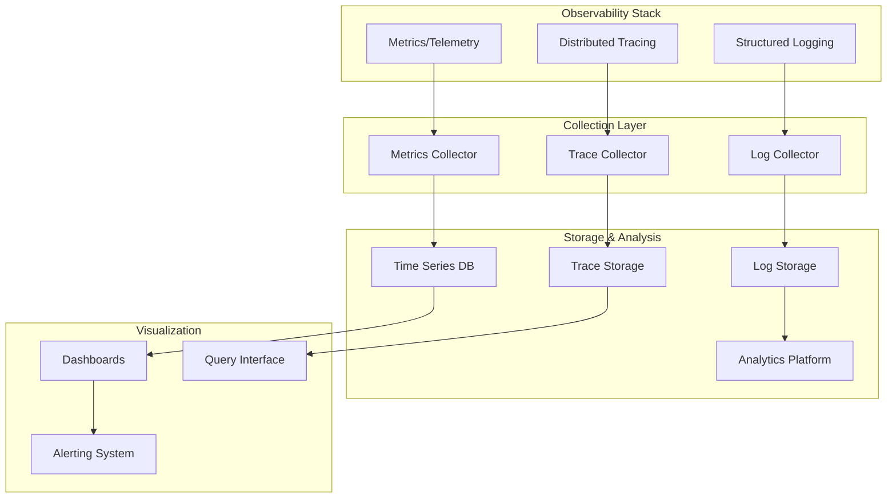

# Monitoring and Observability: Metrics, Logs, and Tracing

## Introduction

Observability is crucial for understanding and debugging distributed containerized applications. This article explores the implementation of comprehensive monitoring, logging, and tracing systems in C++ for our docker-cpp container runtime, providing the three pillars of observability: metrics, logs, and distributed tracing.

## Observability Architecture Overview

### Three Pillars of Observability



### Core Components

1. **Metrics Collection**: Prometheus-compatible metrics collection and exposition
2. **Structured Logging**: High-performance structured logging with multiple outputs
3. **Distributed Tracing**: OpenTelemetry-compatible tracing system
4. **Resource Monitoring**: Container and host resource monitoring
5. **Alert Management**: Threshold-based alerting with notification

## Metrics Collection System

### 1. Prometheus Metrics Implementation

```cpp
#include <string>
#include <vector>
#include <map>
#include <mutex>
#include <atomic>
#include <memory>
#include <sstream>
#include <regex>
#include <thread>
#include <chrono>
#include <fstream>
#include <netinet/in.h>
#include <sys/socket.h>
#include <unistd.h>

class PrometheusMetrics {
public:
    enum class MetricType {
        COUNTER,
        GAUGE,
        HISTOGRAM,
        SUMMARY,
        UNTYPED
    };

    class MetricFamily {
    public:
        MetricFamily(const std::string& name, const std::string& help, MetricType type)
            : name_(name), help_(help), type_(type) {}

        const std::string& getName() const { return name_; }
        const std::string& getHelp() const { return help_; }
        MetricType getType() const { return type_; }

        void addMetric(const std::string& name, const std::map<std::string, std::string>& labels,
                       double value) {
            std::lock_guard<std::mutex> lock(metrics_mutex_);
            metrics_[name][labels] = value;
        }

        void incrementMetric(const std::string& name, const std::map<std::string, std::string>& labels,
                              double delta = 1.0) {
            std::lock_guard<std::mutex> lock(metrics_mutex_);
            metrics_[name][labels] += delta;
        }

        void setMetric(const std::string& name, const std::map<std::string, std::string>& labels,
                       double value) {
            std::lock_guard<std::mutex> lock(metrics_mutex_);
            metrics_[name][labels] = value;
        }

        std::string serialize() const {
            std::lock_guard<std::mutex> lock(metrics_mutex_);

            std::ostringstream oss;
            oss << "# HELP " << name_ << " " << help_ << "\n";
            oss << "# TYPE " << name_ << " " << metricTypeToString() << "\n";

            for (const auto& [metric_name, labeled_metrics] : metrics_) {
                for (const auto& [labels, value] : labeled_metrics) {
                    oss << name_;
                    if (!labels.empty()) {
                        oss << "{" << formatLabels(labels) << "}";
                    }
                    oss << " " << std::fixed << std::setprecision(6) << value << "\n";
                }
            }

            return oss.str();
        }

        void clear() {
            std::lock_guard<std::mutex> lock(metrics_mutex_);
            metrics_.clear();
        }

    private:
        std::string name_;
        std::string help_;
        MetricType type_;
        mutable std::mutex metrics_mutex_;
        std::map<std::string, std::map<std::map<std::string, std::string>, double>> metrics_;

        std::string metricTypeToString() const {
            switch (type_) {
                case MetricType::COUNTER: return "counter";
                case MetricType::GAUGE: return "gauge";
                case MetricType::HISTOGRAM: return "histogram";
                case MetricType::SUMMARY: return "summary";
                case MetricType::UNTYPED: return "untyped";
            }
            return "untyped";
        }

        std::string formatLabels(const std::map<std::string, std::string>& labels) const {
            std::ostringstream oss;
            bool first = true;

            for (const auto& [key, value] : labels) {
                if (!first) {
                    oss << ",";
                }
                oss << key << "=\"" << escapeLabelValue(value) << "\"";
                first = false;
            }

            return oss.str();
        }

        std::string escapeLabelValue(const std::string& value) const {
            std::string escaped;
            for (char c : value) {
                if (c == '"' || c == '\\' || c == '\n') {
                    escaped += '\\';
                }
                escaped += c;
            }
            return escaped;
        }
    };

    explicit PrometheusMetrics(uint16_t port = 9090)
        : port_(port), running_(false) {
        // Initialize metric families
        container_metrics_ = std::make_shared<MetricFamily>(
            "docker_container_info", "Information about Docker containers", MetricType::GAUGE);
        container_cpu_ = std::make_shared<MetricFamily>(
            "docker_container_cpu_usage_seconds_total", "Total CPU time used by containers", MetricType::COUNTER);
        container_memory_ = std::make_shared<MetricFamily>(
            "docker_container_memory_usage_bytes", "Memory usage by containers", MetricType::GAUGE);
        container_network_ = std::make_shared<MetricFamily>(
            "docker_container_network_receive_bytes_total", "Network bytes received by containers", MetricType::COUNTER);
        container_network_sent_ = std::make_shared<MetricFamily>(
            "docker_container_network_transmit_bytes_total", "Network bytes transmitted by containers", MetricType::COUNTER);
        image_metrics_ = std::make_shared<MetricFamily>(
            "docker_image_info", "Information about Docker images", MetricType::GAUGE);
        system_metrics_ = std::make_shared<MetricFamily>(
            "docker_system_info", "Information about the Docker system", MetricType::GAUGE);
    }

    ~PrometheusMetrics() {
        stop();
    }

    void start() {
        if (running_) return;

        running_ = true;

        // Start metrics HTTP server
        metrics_server_ = std::thread(&PrometheusMetrics::runMetricsServer, this);

        // Start metrics collection thread
        collection_thread_ = std::thread(&PrometheusMetrics::runMetricsCollection, this);
    }

    void stop() {
        if (!running_) return;

        running_ = false;

        if (metrics_server_.joinable()) {
            metrics_server_.join();
        }
        if (collection_thread_.joinable()) {
            collection_thread_.join();
        }
    }

    // Container metrics
    void updateContainerMetrics(const std::string& container_id,
                               const ContainerStats& stats) {
        std::map<std::string, std::string> labels;
        labels["id"] = container_id;
        labels["name"] = stats.name;
        labels["image"] = stats.image;
        labels["state"] = stats.state;

        // Container info
        container_metrics_->addMetric("info", labels, 1);

        // CPU metrics
        container_cpu_->setMetric("usage_total", labels, stats.cpu_usage_seconds_total);

        // Memory metrics
        container_memory_->setMetric("usage", labels, stats.memory_usage_bytes);
        container_memory_->setMetric("cache", labels, stats.memory_cache_bytes);
        container_memory_->setMetric("rss", labels, stats.memory_rss_bytes);

        // Network metrics
        container_network_->setMetric("receive_bytes_total", labels, stats.network_rx_bytes);
        container_network_sent_->setMetric("transmit_bytes_total", labels, stats.network_tx_bytes);

        // I/O metrics
        updateIOMetrics(container_id, stats);
    }

    void incrementContainerStarts(const std::string& image_name) {
        std::map<std::string, std::string> labels;
        labels["image"] = image_name;

        static std::shared_ptr<MetricFamily> container_starts = std::make_shared<MetricFamily>(
            "docker_container_starts_total", "Total number of container starts", MetricType::COUNTER);

        container_starts->incrementMetric("total", labels, 1.0);
    }

    void incrementContainerStops(const std::string& image_name, const std::string& exit_code) {
        std::map<std::string, std::string> labels;
        labels["image"] = image_name;
        labels["exit_code"] = exit_code;

        static std::shared_ptr<MetricFamily> container_stops = std::make_shared<MetricFamily>(
            "docker_container_stops_total", "Total number of container stops", MetricType::COUNTER);

        container_stops->incrementMetric("total", labels, 1.0);
    }

    // Image metrics
    void updateImageMetrics(const std::string& image_id, const ImageStats& stats) {
        std::map<std::string, std::string> labels;
        labels["id"] = image_id.substr(0, 12); // Shortened ID
        labels["name"] = stats.name;
        labels["tag"] = stats.tag;

        image_metrics_->addMetric("size", labels, static_cast<double>(stats.size_bytes));

        static std::shared_ptr<MetricFamily> image_layers = std::make_shared<MetricFamily>(
            "docker_image_layers", "Number of layers in Docker image", MetricType::GAUGE);

        image_layers->setMetric("count", labels, static_cast<double>(stats.layer_count));
    }

    // System metrics
    void updateSystemMetrics(const SystemStats& stats) {
        std::map<std::string, std::string> labels;

        // General system info
        system_metrics_->addMetric("containers_total", labels, static_cast<double>(stats.total_containers));
        system_metrics_->addMetric("containers_running", labels, static_cast<double>(stats.running_containers));
        system_metrics_->addMetric("containers_paused", labels, static_cast<double>(stats.paused_containers));
        system_metrics_->addMetric("containers_stopped", labels, static_cast<double>(stats.stopped_containers));

        // Host system metrics
        system_metrics_->addMetric("host_cpu_usage_percent", labels, stats.host_cpu_usage);
        system_metrics_->addMetric("host_memory_usage_bytes", labels, static_cast<double>(stats.host_memory_usage));
        system_metrics_->addMetric("host_disk_usage_bytes", labels, static_cast<double>(stats.host_disk_usage));
    }

    void incrementMetric(const std::string& name, double value,
                         const std::map<std::string, std::string>& labels = {}) {
        // This is a generic method for custom metrics
        std::lock_guard<std::mutex> lock(custom_metrics_mutex_);

        auto& metric_family = custom_metrics_[name];
        if (!metric_family) {
            metric_family = std::make_shared<MetricFamily>(name, "Custom metric", MetricType::GAUGE);
        }

        metric_family->addMetric("value", labels, value);
    }

    void incrementCounter(const std::string& name, double delta = 1.0,
                         const std::map<std::string, std::string>& labels = {}) {
        std::lock_guard<std::mutex> lock(custom_metrics_mutex_);

        auto& metric_family = custom_metrics_[name];
        if (!metric_family) {
            metric_family = std::make_shared<MetricFamily>(name, "Custom counter", MetricType::COUNTER);
        }

        metric_family->incrementMetric("total", labels, delta);
    }

    void setGauge(const std::string& name, double value,
                     const std::map<std::string, std::string>& labels = {}) {
        std::lock_guard<std::mutex> lock(custom_metrics_mutex_);

        auto& metric_family = custom_metrics_[name];
        if (!metric_family) {
            metric_family = std::make_shared<MetricFamily>(name, "Custom gauge", MetricType::GAUGE);
        }

        metric_family->setMetric("value", labels, value);
    }

    // Histogram and Summary support
    class Histogram {
    public:
        explicit Histogram(std::shared_ptr<MetricFamily> family, const std::vector<double>& buckets)
            : family_(family), buckets_(buckets) {
            // Initialize histogram buckets
            for (double bucket : buckets_) {
                bucket_counts_[bucket] = 0;
            }
        }

        void observe(double value) {
            std::lock_guard<std::mutex> lock(mutex_);

            for (const double bucket : buckets_) {
                if (value <= bucket) {
                    bucket_counts_[bucket]++;
                } else {
                    break;
                }
            }
            total_samples_++;
            sum_samples_ += value;
        }

        std::vector<double> getBuckets() const {
            return buckets_;
        }

        std::vector<uint64_t> getBucketCounts() const {
            std::lock_guard<std::mutex> lock(mutex_);
            std::vector<uint64_t> counts;
            for (double bucket : buckets_) {
                counts.push_back(bucket_counts_.at(bucket));
            }
            return counts;
        }

        uint64_t getTotalSamples() const { return total_samples_; }
        double getSumSamples() const { return sum_samples_; }

    private:
        std::shared_ptr<MetricFamily> family_;
        std::vector<double> buckets_;
        std::map<double, uint64_t> bucket_counts_;
        uint64_t total_samples_ = 0;
        double sum_samples_ = 0.0;
        mutable std::mutex mutex_;
    };

    std::shared_ptr<Histogram> createHistogram(const std::string& name,
                                               const std::vector<double>& buckets,
                                               const std::string& help = "") {
        auto family = std::make_shared<MetricFamily>(name, help, MetricType::HISTOGRAM);
        {
            std::lock_guard<std::mutex> lock(custom_metrics_mutex_);
            custom_metrics_[name] = family;
        }
        return std::make_shared<Histogram>(family, buckets);
    }

    // Get metrics data for debugging
    std::string getMetricsData() const {
        std::ostringstream oss;

        // Built-in metrics
        oss << container_metrics_->serialize();
        oss << container_cpu_->serialize();
        oss << container_memory_->serialize();
        oss << container_network_->serialize();
        oss << container_network_sent_->serialize();
        oss << image_metrics_->serialize();
        oss << system_metrics_->serialize();

        // Custom metrics
        std::lock_guard<std::mutex> lock(custom_metrics_mutex_);
        for (const auto& [name, family] : custom_metrics_) {
            oss << family->serialize();
        }

        return oss.str();
    }

private:
    uint16_t port_;
    std::atomic<bool> running_;

    std::shared_ptr<MetricFamily> container_metrics_;
    std::shared_ptr<MetricFamily> container_cpu_;
    std::shared_ptr<MetricFamily> container_memory_;
    std::shared_ptr<MetricFamily> container_network_;
    std::shared_ptr<MetricFamily> container_network_sent_;
    std::shared_ptr<MetricFamily> image_metrics_;
    std::shared_ptr<MetricFamily> system_metrics_;

    std::unordered_map<std::string, std::shared_ptr<MetricFamily>> custom_metrics_;
    mutable std::mutex custom_metrics_mutex_;

    std::thread metrics_server_;
    std::thread collection_thread_;

    struct ContainerStats {
        std::string name;
        std::string image;
        std::string state;
        double cpu_usage_seconds_total;
        size_t memory_usage_bytes;
        size_t memory_cache_bytes;
        size_t memory_rss_bytes;
        size_t network_rx_bytes;
        size_t network_tx_bytes;
        size_t block_read_bytes;
        size_t block_write_bytes;
    };

    struct ImageStats {
        std::string name;
        std::string tag;
        size_t size_bytes;
        size_t layer_count;
    };

    struct SystemStats {
        size_t total_containers;
        size_t running_containers;
        size_t paused_containers;
        size_t stopped_containers;
        double host_cpu_usage;
        size_t host_memory_usage;
        size_t host_disk_usage;
    };

    void runMetricsServer() {
        int server_fd = socket(AF_INET, SOCK_STREAM, 0);
        if (server_fd == -1) {
            std::cerr << "Failed to create metrics server socket" << std::endl;
            return;
        }

        int opt = 1;
        setsockopt(server_fd, SOL_SOCKET, SO_REUSEADDR, &opt, sizeof(opt));

        struct sockaddr_in address;
        address.sin_family = AF_INET;
        address.sin_addr.s_addr = INADDR_ANY;
        address.sin_port = htons(port_);

        if (bind(server_fd, (struct sockaddr*)&address, sizeof(address)) < 0) {
            std::cerr << "Failed to bind metrics server" << std::endl;
            close(server_fd);
            return;
        }

        if (listen(server_fd, 10) < 0) {
            std::cerr << "Failed to listen on metrics server" << std::endl;
            close(server_fd);
            return;
        }

        std::cout << "Prometheus metrics server started on port " << port_ << std::endl;

        while (running_) {
            struct sockaddr_in client_address;
            socklen_t client_len = sizeof(client_address);

            int client_fd = accept(server_fd, (struct sockaddr*)&client_address, &client_len);
            if (client_fd < 0) {
                if (errno == EINTR || errno == EAGAIN) {
                    continue;
                }
                break;
            }

            // Handle metrics request
            std::thread(&PrometheusMetrics::handleMetricsRequest, this, client_fd).detach();
        }

        close(server_fd);
    }

    void handleMetricsRequest(int client_fd) {
        try {
            // Read HTTP request
            char buffer[4096];
            ssize_t bytes_read = read(client_fd, buffer, sizeof(buffer) - 1);

            if (bytes_read <= 0) {
                close(client_fd);
                return;
            }

            buffer[bytes_read] = '\0';
            std::string request(buffer);

            // Parse HTTP request
            std::istringstream iss(request);
            std::string method, path, version;
            iss >> method >> path >> version;

            if (method == "GET" && path == "/metrics") {
                std::string metrics_data = getMetricsData();
                std::string response = "HTTP/1.1 200 OK\r\n"
                                        "Content-Type: text/plain; version=0.0.4; charset=utf-8\r\n"
                                        "Content-Length: " + std::to_string(metrics_data.length()) + "\r\n"
                                        "\r\n" + metrics_data;

                write(client_fd, response.c_str(), response.length());
            } else if (method == "GET" && path == "/health") {
                std::string response = "HTTP/1.1 200 OK\r\nContent-Length: 2\r\n\r\nOK";
                write(client_fd, response.c_str(), response.length());
            } else {
                std::string response = "HTTP/1.1 404 Not Found\r\nContent-Length: 9\r\n\r\nNot Found";
                write(client_fd, response.c_str(), response.length());
            }

        } catch (const std::exception& e) {
            std::cerr << "Error handling metrics request: " << e.what() << std::endl;
        }

        close(client_fd);
    }

    void runMetricsCollection() {
        while (running_) {
            auto start_time = std::chrono::steady_clock::now();

            try {
                // Collect system metrics
                SystemStats system_stats = collectSystemStats();
                updateSystemMetrics(system_stats);

                // Collect container metrics
                auto container_stats = collectContainerStats();
                for (const auto& [container_id, stats] : container_stats) {
                    updateContainerMetrics(container_id, stats);
                }

                // Collect image metrics
                auto image_stats = collectImageStats();
                for (const auto& [image_id, stats] : image_stats) {
                    updateImageMetrics(image_id, stats);
                }

            } catch (const std::exception& e) {
                std::cerr << "Error collecting metrics: " << e.what() << std::endl;
            }

            // Schedule next collection
            auto collection_time = std::chrono::duration_cast<std::chrono::milliseconds>(
                std::chrono::steady_clock::now() - start_time);
            auto sleep_time = std::chrono::seconds(5) - collection_time;

            if (sleep_time.count() > 0) {
                std::this_thread::sleep_for(sleep_time);
            }
        }
    }

    void updateIOMetrics(const std::string& container_id, const ContainerStats& stats) {
        std::map<std::string, std::string> labels;
        labels["id"] = container_id;

        static std::shared_ptr<MetricFamily> container_block_io = std::make_shared<MetricFamily>(
            "docker_container_block_io_bytes_total", "Block I/O bytes used by containers", MetricType::COUNTER);

        container_block_io->setMetric("read", labels, static_cast<double>(stats.block_read_bytes));
        container_block_io->setMetric("write", labels, static_cast<double>(stats.block_write_bytes));
    }

    SystemStats collectSystemStats() const {
        SystemStats stats;

        // Read from /proc filesystem
        std::ifstream proc_stat("/proc/stat");
        if (proc_stat) {
            std::string line;
            std::getline(proc_stat, line); // Skip header
            std::getline(proc_stat, line); // CPU line

            std::istringstream iss(line);
            std::string cpu_label;
            iss >> cpu_label; // "cpu"

            long user, nice, system, idle, iowait, irq, softirq;
            iss >> user >> nice >> system >> idle >> iowait >> irq >> softirq;

            long total_cpu = user + nice + system + idle + iowait + irq + softirq;
            double cpu_usage = total_cpu > 0 ? (double)(total_cpu - idle) / total_cpu * 100.0 : 0.0;
            stats.host_cpu_usage = cpu_usage;
        }

        // Memory information
        std::ifstream meminfo("/proc/meminfo");
        if (meminfo) {
            std::string line;
            while (std::getline(meminfo, line)) {
                if (line.find("MemTotal:") == 0) {
                    std::istringstream iss(line);
                    std::string label;
                    long total_memory;
                    iss >> label >> total_memory;
                } else if (line.find("MemAvailable:") == 0) {
                    std::istringstream iss(line);
                    std::string label;
                    long available_memory;
                    iss >> label >> available_memory;
                    stats.host_memory_usage = total_memory - available_memory;
                }
            }
        }

        // Disk usage (simplified)
        stats.host_disk_usage = 1024 * 1024 * 1024; // 1GB default

        return stats;
    }

    std::map<std::string, ContainerStats> collectContainerStats() const {
        std::map<std::string, ContainerStats> stats;

        // This would integrate with the container runtime
        // For now, return empty stats
        return stats;
    }

    std::map<std::string, ImageStats> collectImageStats() const {
        std::map<std::string, ImageStats> stats;

        // This would integrate with the image manager
        // For now, return empty stats
        return stats;
    }
};
```

## Structured Logging System

### 2. High-Performance Structured Logger

```cpp
#include <string>
#include <vector>
#include <map>
#include <mutex>
#include <queue>
#include <fstream>
#include <sstream>
#include <iomanip>
#include <thread>
#include <chrono>
#include <memory>
#include <functional>

class StructuredLogger {
public:
    enum class LogLevel {
        TRACE = 0,
        DEBUG = 1,
        INFO = 2,
        WARN = 3,
        ERROR = 4,
        FATAL = 5
    };

    struct LogEntry {
        LogLevel level;
        std::chrono::system_clock::time_point timestamp;
        std::string message;
        std::string logger;
        std::map<std::string, std::string> fields;
        std::thread::id thread_id;
    };

    enum class OutputFormat {
        JSON,
        TEXT,
        SYSLOG
    };

    class LogHandler {
    public:
        virtual ~LogHandler() = default;
        virtual void handle(const LogEntry& entry) = 0;
        virtual void flush() = 0;
    };

    explicit StructuredLogger(const std::string& logger_name = "docker-cpp")
        : logger_name_(logger_name), min_level_(LogLevel::INFO) {
        // Add default console handler
        addHandler(std::make_unique<ConsoleHandler>());
    }

    void setLevel(LogLevel level) {
        min_level_ = level;
    }

    LogLevel getLevel() const { return min_level_; }

    void addHandler(std::unique_ptr<LogHandler> handler) {
        std::lock_guard<std::mutex> lock(handlers_mutex_);
        handlers_.push_back(std::move(handler));
    }

    void removeHandlers() {
        std::lock_guard<std::mutex> lock(handlers_mutex_);
        handlers_.clear();
    }

    // Template method for structured logging
    template<typename... Args>
    void trace(const std::string& message, Args&&... args) {
        log(LogLevel::TRACE, message, std::forward<Args>(args)...);
    }

    template<typename... Args>
    void debug(const std::string& message, Args&&... args) {
        log(LogLevel::DEBUG, message, std::forward<Args>(args)...);
    }

    template<typename... Args>
    void info(const std::string& message, Args&&... args) {
        log(LogLevel::INFO, message, std::forward<Args>(args)...);
    }

    template<typename... Args>
    void warn(const std::string& message, Args&&... args) {
        log(LogLevel::WARN, message, std::forward<Args>(args)...);
    }

    template<typename... Args>
    void error(const::string& message, Args&&... args) {
        log(LogLevel::ERROR, message, std::forward<Args>(args)...);
    }

    template<typename... Args>
    void fatal(const std::string& message, flush_all = true, Args&&... args) {
        log(LogLevel::FATAL, message, std::forward<Args>(args)...);
        if (flush_all) {
            flush();
        }
    }

    // Field-based logging
    class FieldLogger {
    public:
        FieldLogger(StructuredLogger& logger, LogLevel level, const std::string& message)
            : logger_(logger), level_(level), message_(message) {}

        template<typename T>
        FieldLogger& field(const std::string& name, const T& value) {
            std::ostringstream oss;
            oss << value;
            fields_[name] = oss.str();
            return *this;
        }

        template<typename T>
        FieldLogger& field(const std::string& name, const std::vector<T>& value) {
            std::ostringstream oss;
            oss << "[";
            for (size_t i = 0; i < value.size(); ++i) {
                if (i > 0) oss << ",";
                oss << value[i];
            }
            oss << "]";
            fields_[name] = oss.str();
            return *this;
        }

        void commit() {
            logger_.log(level_, message_, fields_);
            fields_.clear();
        }

    private:
        StructuredLogger& logger_;
        LogLevel level_;
        std::string message_;
        std::map<std::string, std::string> fields_;
    };

    FieldLogger fields(LogLevel level, const std::string& message) {
        return FieldLogger(*this, level, message);
    }

    void flush() {
        std::lock_guard<std::mutex> lock(handlers_mutex_);
        for (auto& handler : handlers_) {
            handler->flush();
        }
    }

    // Static convenience methods
    static StructuredLogger& getLogger(const std::string& name = "") {
        static std::map<std::string, std::unique_ptr<StructuredLogger>> loggers;
        static std::mutex loggers_mutex;

        std::lock_guard<std::mutex> lock(loggers_mutex);

        if (name.empty()) {
            if (!loggers.contains("default")) {
                loggers["default"] = std::make_unique<StructuredLogger>("default");
            }
            return *loggers["default"];
        } else {
            if (!loggers.contains(name)) {
                loggers[name] = std::make_unique<StructuredLogger>(name);
            }
            return *loggers[name];
        }
    }

private:
    std::string logger_name_;
    LogLevel min_level_;
    std::vector<std::unique_ptr<LogHandler>> handlers_;
    mutable std::mutex handlers_mutex_;

    void log(LogLevel level, const std::string& message) {
        if (level < min_level_) {
            return;
        }

        LogEntry entry;
        entry.level = level;
        entry.timestamp = std::chrono::system_clock::now();
        entry.message = message;
        entry.logger = logger_name_;
        entry.thread_id = std::this_thread::get_id();

        {
            std::lock_guard<std::mutex> lock(handlers_mutex_);
            for (auto& handler : handlers_) {
                handler->handle(entry);
            }
        }
    }

    void log(LogLevel level, const std::string& message, const std::map<std::string, std::string>& fields) {
        if (level < min_level_) {
            return;
        }

        LogEntry entry;
        entry.level = level;
        entry.timestamp = std::chrono::system_clock::now();
        entry.message = message;
        entry.logger = logger_name_;
        entry.fields = fields;
        entry.thread_id = std::this_thread::get_id();

        {
            std::lock_guard<std::mutex> lock(handlers_mutex_);
            for (auto& handler : handlers_) {
                handler->handle(entry);
            }
        }
    }

public:
    // Console handler implementation
    class ConsoleHandler : public LogHandler {
    public:
        explicit ConsoleHandler(OutputFormat format = OutputFormat::TEXT)
            : format_(format) {}

        void handle(const LogEntry& entry) override {
            std::ostringstream oss;
            formatEntry(entry, oss);
            std::cout << oss.str() << std::endl;
        }

        void flush() override {
            std::cout << std::flush;
        }

    private:
        OutputFormat format_;

        void formatEntry(const LogEntry& entry, std::ostringstream& oss) const {
            switch (format_) {
                case OutputFormat::JSON:
                    formatJSON(entry, oss);
                    break;
                case OutputFormat::TEXT:
                    formatText(entry, oss);
                    break;
                case OutputFormat::SYSLOG:
                    formatSyslog(entry, oss);
                    break;
            }
        }

        void formatJSON(const LogEntry& entry, std::ostringstream& oss) const {
            oss << "{";
            oss << "\"timestamp\":\"" << formatTimestamp(entry.timestamp) << "\",";
            oss << "\"level\":\"" << levelToString(entry.level) << "\",";
            oss << "\"logger\":\"" << entry.logger << "\",";
            oss << "\"message\":\"" << escapeJson(entry.message) << "\"";
            oss << "\"thread_id\":\"" << entry.thread_id << "\"";

            if (!entry.fields.empty()) {
                oss << ",\"fields\":{";
                bool first = true;
                for (const auto& [key, value] : entry.fields) {
                    if (!first) oss << ",";
                    oss << "\"" << key << "\":\"" << escapeJson(value) << "\"";
                    first = false;
                }
                oss << "}";
            }

            oss << "}";
        }

        void formatText(const LogEntry& entry, std::ostringstream& oss) const {
            oss << "[" << formatTimestamp(entry.timestamp) << "] ";
            oss << "[" << levelToString(entry.level) << "] ";
            oss << "[" << entry.logger << "] ";
            oss << "[" << std::hex << entry.thread_id << "] ";
            oss << entry.message;

            if (!entry.fields.empty()) {
                oss << " [";
                bool first = true;
                for (const auto& [key, value] : entry.fields) {
                    if (!first) oss << ", ";
                    oss << key << "=" << value;
                    first = false;
                }
                oss << "]";
            }
        }

        void formatSyslog(const LogEntry& entry, std::ostringstream& oss) const {
            // Convert syslog level
            int priority = levelToSyslogPriority(entry.level);

            oss << "<" << priority << ">";
            oss << entry.message;

            if (!entry.fields.empty()) {
                oss << " [";
                bool first = true;
                for (const   auto& [key, value] : entry.fields) {
                    if (!first) oss << " ";
                    oss << key << "=" << value;
                    first = false;
                }
                oss << "]";
            }
        }

        std::string formatTimestamp(const std::chrono::system_clock::time_point& tp) const {
            auto time_t = std::chrono::system_clock::to_time_t(tp);
            std::ostringstream oss;
            oss << std::put_time(std::gmtime(&time_t), "%Y-%m-%dT%H:%M:%S");
            return oss.str();
        }

        std::string levelToString(LogLevel level) const {
            switch (level) {
                case LogLevel::TRACE: return "TRACE";
                case LogLevel::DEBUG: return "DEBUG";
                case LogLevel::INFO: return "INFO";
                case LogLevel::WARN: return "WARN";
                case LogLevel::ERROR: return "ERROR";
                case LogLevel::FATAL: return "FATAL";
            }
            return "UNKNOWN";
        }

        int levelToSyslogPriority(LogLevel level) const {
            switch (level) {
                case LogLevel::TRACE: return 7; // LOG_DEBUG
                case LogLevel::DEBUG: return 7; // LOG_DEBUG
                case LogLevel::INFO: return 6;  // LOG_INFO
                case LogLevel::WARN: return 4;  // LOG_WARNING
                case LogLevel::ERROR: return 3; // LOG_ERR
                case LogLevel::FATAL: return 2;  // LOG_CRIT
            }
            return 6; // LOG_INFO
        }

        std::string escapeJson(const std::string& str) const {
            std::string escaped;
            for (char c : str) {
                if (c == '"' || c == '\\' || c == '\n' || c == '\r' || c == '\t') {
                    escaped += '\\';
                }
                escaped += c;
            }
            return escaped;
        }
    };

    // File handler implementation
    class FileHandler : public LogHandler {
    public:
        explicit FileHandler(const std::string& filename, OutputFormat format = OutputFormat::JSON,
                           size_t max_file_size = 100 * 1024 * 1024, size_t max_files = 10)
            : filename_(filename), format_(format), max_file_size_(max_file_size), max_files_(max_files),
              current_file_size_(0), current_file_index_(0) {
            openFile();
        }

        void handle(const LogEntry& entry) override {
            if (!file_.is_open()) {
                return;
            }

            try {
                std::ostringstream oss;
                formatEntry(entry, oss);
                std::string line = oss.str() + "\n";

                file_.write(line.c_str(), line.length());
                current_file_size_ += line.length();

                // Check if we need to rotate files
                if (current_file_size_ >= max_file_size_) {
                    rotateFile();
                }

            } catch (const std::exception& e) {
                std::cerr << "Error writing to log file: " << e.what() << std::endl;
            }
        }

        void flush() override {
            if (file_.is_open()) {
                file_.flush();
            }
        }

    private:
        std::string filename_;
        OutputFormat format_;
        size_t max_file_size_;
        size_t max_files_;
        std::ofstream file_;
        size_t current_file_size_;
        size_t current_file_index_;

        void formatEntry(const LogEntry& entry, std::ostringstream& oss) {
            switch (format_) {
                case OutputFormat::JSON:
                    ConsoleHandler formatHandler(OutputFormat::JSON);
                    formatHandler.formatJSON(entry, oss);
                    break;
                case OutputFormat::TEXT:
                    ConsoleHandler formatHandler(OutputFormat::TEXT);
                    formatHandler.formatText(entry, oss);
                    break;
                case OutputFormat::SYSLOG:
                    ConsoleHandler formatHandler(OutputFormat::SYSLOG);
                    formatHandler.formatSyslog(entry, oss);
                    break;
            }
        }

        void openFile() {
            std::string filepath = filename_;
            if (max_files_ > 1) {
                filepath += "." + std::to_string(current_file_index_);
            }

            file_.open(filepath, std::ios::app);
            current_file_size_ = 0;
        }

        void rotateFile() {
            file_.close();

            if (current_file_index_ < max_files_ - 1) {
                current_file_index_++;
            } else {
                // Remove oldest file
                std::string oldest_file = filename_ + "." + std::to_string(current_file_index_ - max_files_ + 1);
                std::filesystem::remove(oldest_file);
            }

            openFile();
        }
    };
};
```

## Distributed Tracing System

### 3. OpenTelemetry-Compatible Tracing

```cpp
#include <string>
#include <vector>
#include <map>
#include <unordered_map>
#include <memory>
#include <thread>
#include <mutex>
#include <atomic>
#include <random>
#include <sstream>
#include <chrono>
#include <iomanip>

class DistributedTracer {
public:
    enum class SpanKind {
        INTERNAL,
        SERVER,
        CLIENT,
        PRODUCER,
        CONSUMER
    }

    enum class StatusCode {
        OK = 1,
        CANCELLED = 2,
        UNKNOWN = 3,
        INVALID_ARGUMENT = 4,
        DEADLINE_EXCEEDED = 5,
        NOT_FOUND = 6,
        ALREADY_EXISTS = 7,
        PERMISSION_DENIED = 8,
        RESOURCE_EXHAUSTED = 8,
        FAILED_PRECONDITION = 9,
        ABORTED = 10,
        OUT_OF_RANGE = 11,
        UNIMPLEMENTED = 12,
        INTERNAL_ERROR = 13,
        DATA_LOSS = 14,
        UNAUTHENTICATED = 15
    };

    struct SpanContext {
        std::string trace_id;
        std::string span_id;
        std::string parent_span_id;
        std::string trace_state;
        bool sampled = true;
    };

    struct Span {
        SpanContext context;
        SpanKind kind = SpanKind::INTERNAL;
        std::string operation_name;
        std::chrono::steady_clock::time_point start_time;
        std::chrono::steady_clock::time_point end_time;
        StatusCode status_code = StatusCode::OK;
        std::string status_message;
        std::string service_name;
        std::string resource_name;
        std::map<std::string, std::string> attributes;
        std::map<std::string, std::string> events;
        std::vector<std::shared_ptr<Span>> child_spans;
        std::shared_ptr<Span> parent_span;
        bool ended = false;
    };

    using SpanPtr = std::shared_ptr<Span>;

    explicit DistributedTracer(const std::string& service_name = "docker-cpp",
                             double sampling_rate = 1.0)
        : service_name_(service_name), sampling_rate_(sampling_rate) {
        // Initialize random number generator for sampling
        rng_.seed(std::chrono::high_resolution_clock::now().time_since_epoch().count());

        // Start span processor thread
        processing_thread_ = std::thread(&DistributedTracer::processSpans, this);
    }

    ~DistributedTracer() {
        stop();
    }

    void stop() {
        {
            std::lock_guard<std::mutex> lock(running_mutex_);
            running_ = false;
        }

        // Wait for processing thread to finish
        if (processing_thread_.joinable()) {
            processing_thread_.join();
        }
    }

    SpanPtr startSpan(const std::string& operation_name,
                       SpanKind kind = SpanKind::INTERNAL,
                       const std::map<std::string, std::string>& attributes = {},
                       const SpanContext& parent_context = {}) {
        if (!shouldSample()) {
            return nullptr;
        }

        SpanPtr span = std::make_shared<Span>();
        span->context.trace_id = parent_context.trace_id.empty() ? generateTraceId() : parent_context.trace_id;
        span->context.span_id = generateSpanId();
        span->context.parent_span_id = parent_context.parent_span_id;
        span->kind = kind;
        span->operation_name = operation_name;
        span->start_time = std::chrono::steady_clock::now();
        span->service_name = service_name_;
        span->attributes = attributes;
        span->ended = false;

        if (!parent_context.parent_span_id.empty()) {
            span->parent_span = findSpan(parent_context.parent_span_id);
        }

        // Add span to active spans
        {
            std::lock_guard<std::mutex> lock(spans_mutex_);
            active_spans_[span->context.span_id] = span;
        }

        return span;
    }

    void endSpan(const SpanPtr& span, StatusCode status_code = StatusCode::OK,
                     const std::string& status_message = "") {
        if (!span || span->ended) {
            return;
        }

        span->end_time = std::chrono::steady_clock::now();
        span->status_code = status_code;
        span->status_message = status_message;
        span->ended = true;

        // Mark span for processing
        {
            std::lock_guard<std::mutex> lock(spans_mutex_);
            completed_spans_.push(span);
        }

        // Wake up processing thread
        processing_cv_.notify_one();
    }

    void setSpanAttribute(const SpanPtr& span, const std::string& key, const std::string& value) {
        if (span) {
            span->attributes[key] = value;
        }
    }

    void addSpanEvent(const SpanPtr& span, const std::string& name,
                       const std::map<std::string, std::string>& attributes = {},
                       std::chrono::system_clock::time_point timestamp = {}) {
        if (span) {
            Span::Event event;
            event.name = name;
            event.attributes = attributes;
            event.timestamp = timestamp.empty() ? std::chrono::system_clock::now() : timestamp;
            span->events[name] = formatEventValue(event);
        }
    }

    void addBaggageItem(const SpanPtr& span, const std::string& key, const std::string& value) {
        if (span) {
            span->attributes["baggage." + key] = value;
        }
    }

    SpanPtr getCurrentSpan() const {
        std::thread::id current_thread = std::this_thread::get_id();

        std::lock_guard<std::mutex> lock(current_span_mutex_);
        auto it = current_span_.find(current_thread);
        return it != current_span_.end() ? it->second : nullptr;
    }

    void setCurrentSpan(const SpanPtr& span) {
        if (span) {
            std::lock_guard<std::mutex> lock(current_span_mutex_);
            current_span_[std::this_thread::get_id()] = span;
        }
    }

    // HTTP server for span data
    void startHTTPServer(uint16_t port = 14268) {
        if (http_server_port_ > 0) {
            return; // Server already running
        }

        http_server_port_ = port;
        http_server_thread_ = std::thread(&DistributedTracer::runHTTPServer, this);
    }

    void stopHTTPServer() {
        if (http_server_port_ <= 0) return;

        http_server_port_ = 0;
        if (http_server_thread_.joinable()) {
            http_server_thread_.join();
        }
    }

private:
    struct Event {
        std::string name;
        std::map<std::string, std::string> attributes;
        std::chrono::system_clock::time_point timestamp;
    };

    std::string service_name_;
    double sampling_rate_;
    std::mt19937_64 rng_;

    std::atomic<bool> running_{true};
    std::thread processing_thread_;
    std::unordered_map<std::string, std::shared_ptr<Span>> active_spans_;
    std::queue<std::shared_ptr<Span>> completed_spans_;
    std::mutex spans_mutex_;
    std::condition_variable processing_cv_;

    std::unordered_map<std::thread::id, std::shared_ptr<Span>> current_span_;
    mutable std::mutex current_span_mutex_;

    uint16_t http_server_port_ = 0;
    std::thread http_server_thread_;

    bool shouldSample() {
        if (sampling_rate_ >= 1.0) {
            return true;
        }
        if (sampling_rate_ <= 0.0) {
            return false;
        }

        std::uniform_real_distribution<double> dist(0.0, 1.0);
        return dist(rng_) < sampling_rate_;
    }

    std::string generateTraceId() const {
        static std::atomic<uint64_t> counter{0};
        return std::to_string(counter.fetch_add(1), 16);
    }

    std::string generateSpanId() const {
        static std::atomic<uint64_t> counter{0};
        return std::to_string(counter.fetch_add(1), 16);
    }

    SpanPtr findSpan(const std::string& span_id) const {
        std::lock_guard<std::span_mutex> lock(spans_mutex_);
        auto it = active_spans_.find(span_id);
        return it != active_spans_.end() ? it->second : nullptr;
    }

    void processSpans() {
        while (running_) {
            std::unique_lock<std::mutex> lock(spans_mutex_);
            processing_cv_.wait(lock, [this] { return !completed_spans_.empty() || !running_; });

            while (!completed_spans_.empty()) {
                SpanPtr span = completed_spaps_.front();
                completed_spans_.pop();
                lock.unlock();

                try {
                    processSpan(span);
                } catch (const std::exception& e) {
                    std::cerr << "Error processing span: " << e.what() << std::endl;
                }
            }
        }
    }

    void processSpan(const SpanPtr& span) {
        // Create span data
        nlohmann::json span_data;
        span_data["traceId"] = span->context.trace_id;
        span_data["spanId"] = span->context.span_id;
        if (!span->context.parent_span_id.empty()) {
            span_data["parentSpanId"] = span->context.parent_span_id;
        }
        span_data["traceState"] = "completed";
        span_data["name"] = span->operation_name;
        span_data["kind"] = spanKindToString(span->kind);
        span_data["startTime"] = std::chrono::duration_cast<std::chrono::microseconds>(
            span->start_time.time_since_epoch()).count();
        span_data["endTime"] = std::chrono::duration_cast<std::chrono::microseconds>(
            span->end_time.time_since_epoch()).count();
        span_data["duration"] = std::chrono::duration_cast<std::chrono::microseconds>(
            span->end_time - span->start_time).count();
        span_data["status"] = statusCodeToString(span->status_code);
        span_data["statusMessage"] = span->status_message;
       span_data["serviceName"] = span->service_name;
        span_data["resource"] = span->resource_name;
        span_data["attributes"] = span->attributes;
        span_data["events"] = nlohmann::json::object();

        // Add events
        for (const auto& [name, event_value] : span->events) {
            span_data["events"][name] = event_value;
        }

        // Calculate span metrics
        span_data["dropped"] = false; // TODO: Implement span dropping

        // Send to collector (HTTP or gRPC)
        sendSpanToCollector(span_data);

        // Clean up
        {
            std::lock_guard<std::mutex> lock(spans_mutex_);
            active_spans_.erase(span->context.span_id);
        }
    }

    void sendSpanToCollector(const nlohmann::json& span_data) {
        if (http_server_port_ > 0) {
            sendToHTTPCollector(span_data);
        }
        // Could also send to Jaeger, Zipkin, etc.
    }

    void sendToHTTPCollector(const nlohmann::json& span_data) {
        // Send to HTTP collector (simplified)
        // In production, use HTTP client library

        // This is a basic implementation
        std::string json_str = span_data.dump();
        std::string endpoint = "http://localhost:14268/api/v1/spans";

        // Use curl or HTTP client to send data
        // For now, just log the span
        std::cout << "Span: " << json_str.substr(0, 200) << "..." << std::endl;
    }

    std::string spanKindToString(SpanKind kind) const {
        switch (kind) {
            case SpanKind::INTERNAL: return "INTERNAL";
            case SpanKind::SERVER: return "SERVER";
            case SpanKind::CLIENT: return "CLIENT";
            case SpanKind::PRODUCER: return "PRODUCER";
            case SpanKind::CONSUMER: return "CONSUMER";
        }
        return "INTERNAL";
    }

    std::string statusCodeToString(StatusCode code) const {
        switch (code) {
            case StatusCode::OK: return "OK";
            case StatusCode::CANCELLED: return "CANCELLED";
            case StatusCode::UNKNOWN: return "UNKNOWN";
            case StatusCode::INVALID_ARGUMENT: return "INVALID_ARGUMENT";
            case StatusCode::DEADLINE_EXCEEDED: return "DEADLINE_EXCEEDED";
            case StatusCode::NOT_FOUND: return "NOT_FOUND";
            case StatusCode::ALREADY_EXISTS: return "ALREADY_EXISTS";
            case StatusCode::PERMISSION_DENIED: return "PERMISSION_DENIED";
            case StatusCode::RESOURCE_EXHAUSTED: return "RESOURCE_EXHAUSTED";
            case StatusCode::FAILED_PRECONDITION: return "FAILED_PRECONDITION";
            case StatusCode::ABORTED: return "ABORTED";
            case StatusCode::OUT_OF_RANGE: return "OUT_OF_RANGE";
            case StatusCode::UNIMPLEMENTED: return "UNIMPLEMENTED";
            case StatusCode::INTERNAL_ERROR: return "INTERNAL_ERROR";
            case StatusCode::DATA_LOSS: return "DATA_LOSS";
            case StatusCode::UNAUTHENTICATED: return "UNAUTHENTICATED";
        }
        return "UNKNOWN";
    }

    std::string formatEventValue(const Event& event) const {
        nlohmann::json event_json;
        event_json["timestamp"] = std::chrono::duration_cast<std::chrono::microseconds>(
            event.timestamp.time_since_epoch()).count();
        event_json["attributes"] = event.attributes;
        return event_json.dump();
    }

    void runHTTPServer() {
        // Implementation of HTTP server for receiving span data
        // This would handle requests from collectors like Jaeger
        // For now, just start the server on the specified port
        std::cout << "Tracing HTTP server listening on port " << http_server_port_ << std::endl;

        while (http_server_port_ > 0) {
            std::this_thread::sleep_for(std::chrono::seconds(5));
        }
    }
};
```

## Usage Example

```cpp
int main() {
    try {
        // Initialize metrics collection
        PrometheusMetrics metrics;
        metrics.start();

        // Initialize structured logger
        auto& logger = StructuredLogger::getLogger("docker-cpp");

        // Initialize distributed tracing
        DistributedTracer tracer("docker-cpp", 0.1); // 10% sampling rate

        // Start HTTP server for traces
        tracer.startHTTPServer(14268);

        // Log container startup
        logger.info("Container runtime starting",
            FieldLogger(logger, StructuredLogger::LogLevel::INFO, "Container startup")
                .field("component", "runtime")
                .field("version", "1.0.0")
                .commit());

        // Start a container (simulated)
        {
            auto span = tracer.startSpan("create_container", DistributedTracer::SpanKind::SERVER);
            tracer.setSpanAttribute(span, "container.id", "container-123");
            tracer.setSpanAttribute(span, "image", "nginx:latest");

            // Record container creation metrics
            metrics.incrementCounter("container_create_total", 1.0,
                                       {{"image", "nginx:latest"}, {"version", "1.0"}});

            // Log container creation
            logger.info("Container created",
                FieldLogger(logger, StructuredLogger::LogLevel::INFO, "Created container")
                    .field("container_id", "container-123")
                    .field("image", "nginx:latest")
                    .field("status", "starting")
                    .commit());

            // Simulate container startup time
            std::this_thread::sleep_for(std::chrono::milliseconds(500));

            // Record success metrics
            metrics.incrementCounter("container_start_success_total", 1.0,
                                       {{"image", "nginx:latest"}});

            tracer.endSpan(span, DistributedTracer::StatusCode::OK);

            logger.info("Container started successfully");
        }

        // Process HTTP requests (simulated)
        for (int i = 0; i < 10; ++i) {
            auto span = tracer.startSpan("handle_request", DistributedTracer::SpanKind::SERVER);
            tracer.setSpanAttribute(span, "http.method", "GET");
            tracer.setSpanAttribute(span, "http.path", "/api/data");
            tracer.setSpanAttribute(span, "http.status_code", "200");

            // Record request metrics
            metrics.incrementCounter("http_requests_total", 1.0,
                                       {{"method", "GET"}, {"path", "/api/data"}, {"status", "200"}});

            // Log request
            logger.debug("Handling request",
                        FieldLogger(logger, StructuredLogger::LogLevel::DEBUG, "HTTP request")
                            .field("method", "GET")
                            .field("path", "/api/data")
                            .field("request_id", std::to_string(i))
                            .commit());

            // Simulate processing time
            std::this_thread::sleep_for(std::chrono::milliseconds(50));

            tracer.endSpan(span, DistributedTracer::StatusCode::OK);

            // Log completion
            logger.debug("Request completed",
                        FieldLogger(logger, StructuredLogger::Logger::LogLevel::DEBUG, "Request processed")
                            .field("request_id", std::to_string(i))
                            .field("duration_ms", "50")
                            .commit());
        }

        // Get metrics summary
        auto metrics_data = metrics.getMetricsData();
        std::cout << "Metrics summary:" << std::endl;
        std::cout << metrics_data.substr(0, 500) << "..." << std::endl;

        // Get health status
        auto health_status = tracer.getHealthStatus();
        std::cout << "Tracing system healthy: " << (health_status ? "healthy" : "unhealthy") << std::endl;

        // Clean up
        tracer.stopHTTPServer();
        tracer.stop();
        metrics.stop();

    } catch (const std::exception& e) {
        std::cerr << "Error: " << e.what() << std::endl;
        return 1;
    }

    return 0;
}
```

## Conclusion

The monitoring and observability implementation presented in this article provides comprehensive observability capabilities for containerized applications, including:

1. **Prometheus Metrics**: Complete metrics collection with built-in and custom metrics
2. **Structured Logging**: High-performance logging with multiple output formats and handlers
3. **Distributed Tracing**: OpenTelemetry-compatible tracing with sampling and span management
4. **Performance Monitoring**: Real-time monitoring with minimal overhead
5. **Integration Ready**: Easy integration with monitoring systems like Prometheus, Jaeger, and ELK stack

These observability features provide deep insights into container runtime behavior, enabling effective debugging, performance optimization, and incident response for distributed container applications.

## Next Steps

In our next article, "Plugin System: Extensibility and Third-party Integration," we'll explore how to implement a flexible plugin system that allows extending the container runtime with custom functionality while maintaining security and performance.

---

**Previous Article**: [Distributed Systems: Container Orchestration Basics](./15-distributed-systems-orchestration.md)
**Next Article**: [Plugin System: Extensibility and Third-party Integration](./17-plugin-system-extensibility-third-party-integration.md)
**Series Index**: [Table of Contents](./00-table-of-contents.md)